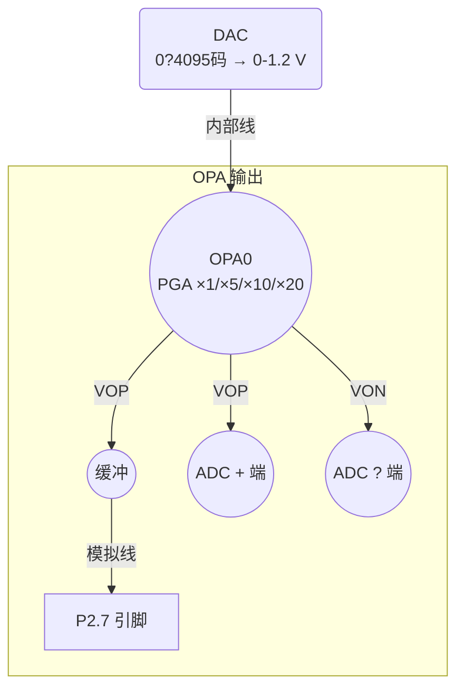

# LKS32MC08x 系列 ―― DAC→OPA→P2.7 完整指南

> **需求一句话**：
> “让 MCU 的 DAC 生成 0.8 V → 经 OPA 缓冲或放大 → 在 P2.7 引脚输出，方便万用表或外部模块读取。”

---
## 0. 入门准备：不懂寄存器也能开搞！

| 概念 | 通俗解释 | 代码里的表现 |
|------|----------|--------------|
| **寄存器 Register** | MCU 里的一小格 32 bit/16 bit 存储，用来控制硬件。 | `SYS_AFE_REG3`、`OPA0_CFG`… |
| **位 bit** | 寄存器里的一个“开关”，0=关，1=开。 | 位 11 打开 = `… |= BIT11;` |
| **位掩码 Bit-mask** | 只有某些位是 1 的常量，用来选中那几位。 | `BIT0 (=0x1)` `BIT11 (=0x0800)` |
| **按位运算** | `&`清 0、`|`置 1、`<<`左移、`~`取反。 | `var &= ~mask;` 把对应位清零 |

举例（清空 DAC 量程位再写入 1.2 V）：
```c
SYS_AFE_REG1 &= ~((u32)0x03 << 6);   // 把位7:6 清 0
SYS_AFE_REG1 |=  (1u << 6);          // 把位7:6 置 01
```

> 不会算十六进制？记住“一位十六进制 = 四位二进制”，
> `0xC0 = 1100 0000b`，`BIT11 = 0x0800 = 0000 1000 0000 0000b`。

明白这些就够了，下面开始整条信号链的搭建。

---
## 1. 系统框图（精简版）

* 蓝色虚线/框 ＝ MCU 内部；P2.7 引脚在芯片外部可测量。

---
## 2. 三组必须记住的寄存器位
| 位置 | 作用 | 典型设置 |
|------|------|----------|
| `OPA0_CFG.EN` | 打开运放 | `1` |
| `OPA0_CFG.MODE<1:0>` | 放大倍数 | `00=×1`（跟随器） / `01=×5` / `10=×10` / `11=×20` |
| `OPA0_CFG.INSEL<1:0>` | **正端(IP) 信号来源** | `00=DAC`；`01=P0.2`；`10=P0.3` |
| `SYS_AFE_REG3.OPAOUT_EN<2:0>` | 哪一路 **VOP** 输出到 **P2.7** | `001=OPA0_OUT`；`010=OPA1_OUT`… |
| `SYS_AFE_REG3.CMP0_SELP<2:0>` | 比较器0 正端选谁（可选） | `010=OPA0_OUT` |

---
## 3. 关键概念
### 3.1 电压跟随器 (Voltage Follower)
1. 把运放输出端回接到负输入 (�C)。\
2. 运放自动调节使正负端电压相等 ? `Vout ≈ Vin`。\
3. **作用**：电压不变，驱动能力增强、输入阻抗超高。

### 3.2 差分输出 (VOP / VON)
- 运放内部会输出一对互补信号：
  `VOP = Vcm + Vsig/2`, `VON = Vcm �C Vsig/2`，其中 `Vcm≈1.9 V`。
- P2.7 只能导出 **VOP**，`VON` 仅供 ADC 内部差分采样。

### 3.3 单端模式下的 Vcm 校正
- 测得电压 = `Vcm + Vsig/2`。
- 想得到真实信号幅值 `Vsig`：`(测值 �C Vcm) × 2`。
- 上电空载时，把 `VOP` 送 P2.7，用 ADC 测得 `Vcm` 并保存。

---
## 4. 步骤：0.8 V → OPA0 ×1 → P2.7
```c
/***** 1. 打开时钟 *****/
SYS_AnalogModuleClockCmd(SYS_AnalogModule_DAC, ENABLE);
SYS_AnalogModuleClockCmd(SYS_AnalogModule_OPA, ENABLE);

SYS_WR_PROTECT = 0x7A83;          // 解锁系统寄存器

/***** 2. 配 DAC = 0.8 V (满量程 1.2 V) *****/
SYS_AFE_REG1 = (SYS_AFE_REG1 & ~(0x3<<6)) | (1<<6);   // 01=1.2 V
SYS_AFE_DAC  = 2731;                                  // 0.8/1.2×4096

/***** 3. 设 OPA0 为跟随器 ×1，输入=DAC *****/
OPA0_CFG =  (1<<0)        |   // EN=1
           (0<<2)        |   // MODE=00 ×1
           (0<<4);           // INSEL=00 DAC

/***** 4. 把 OPA0 VOP 映射到 P2.7 *****/
SYS_AFE_REG3 = (SYS_AFE_REG3 & ~(0x7<<4)) | (0x1<<4); // 001
GPIO_Init(GPIO2,&(GPIO_InitTypeDef){GPIO_Pin_7,GPIO_Mode_ANA,GPIO_PuPd_NOPULL,0});

/***** 5. (可选) 比较器0 参考同电压 *****/
// SYS_AFE_REG3 = (SYS_AFE_REG3 & ~(0x7<<8)) | (0x2<<8);

SYS_WR_PROTECT = 0x0;            // 锁回
```
测量 P2.7 ≈ `1.9 V + 0.4 V = 2.3 V`，反算信号 `≈(2.3-1.9)×2=0.8 V`。

---
## 5. 差分放大 ×10 示例
```c
OPA1_CFG = (1<<0)      |   // EN
           (2<<2)      |   // MODE=10 ×10
           (1<<4);         // INSEL=01 P0.2 (IP)
// IN (负端) 外部接 P0.3
ADC_ChannelConfig(ADC0, VOP1, VON1);   // 差分采样
```
ADC 结果 = `(P0.2 - P0.3) ×10`。

---
## 6. 常见疑问
| 问题 | 简答 |
|------|------|
| P2.7 为什么总是 +1.9 V？ | 单端模式输出带共模 Vcm≈1.9 V，请用公式减掉再×2。 |
| 能把 VON 映射到 IO 吗？ | 不行，VON 仅供内部差分。 |
| OPA 能带多大负载？ | BUFFER 可驱动 mA 级，带功率设备需外部运放。 |
| OPA0 与比较器0 会冲突吗？ | 不会，比较器只"读取"VOP，不影响 OPA 配置。 |

---
## 7. 进阶调试清单
1. **测 Vcm**：上电后输入 0 V，采 P2.7 → 得到共模。\
2. **检查上下限**：确保 `Vcm + Vsig/2` 不超过 VDD，`Vcm - Vsig/2` 不低于 0 V。\
3. **滤波**：输出接 RC 低通可平滑纹波（PWM 场景）。\
4. **DMA**：ADC 连续差分采样可用 DMA 减少 CPU 负担。

---
> 至此，你已掌握：**OPA 基础→寄存器速查→跟随器&差分实例→调试技巧**。照本指南即可构建并验证"DAC 0.8 V → OPA 缓冲/放大 → P2.7 输出"或任何类似电路。祝实验成功！ 