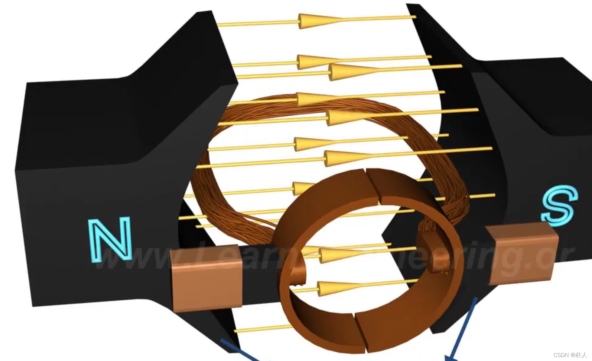

# 27 [有/无]刷，[直/交]流，[同/异]步，各种电机概念区分

> 朴人 已于 2024-01-30 13:22:59 修改 阅读量1w 收藏 61 点赞数 22
> 文章链接：https://blog.csdn.net/qq570437459/article/details/121962670

## 【本质上，所有的电机都是交流电机】

直、交流电机，通常是俗语。要想让电机转子转起来，任何电机的绕组都要不断地改变电流方向，电流大小呈正弦波或者方波（方波也可看做正弦波近似），只是不同种类电机的换相方式有所不同，所以出现了各种电机叫法。接下来，为了区分各种常用的电机名称，本文以电机俗语的名称来介绍一些电机的概念。

##### 1. 直流电机（有刷电机）

通常指的直流有刷电机，内部有永磁体，是一种比较便宜辣鸡的种类。其通电绕组的电流呈方波，也是交流形式的。为什么叫直流电机呢？因为电机的输入是直流电，电机内部有一个有碳刷专门用来换相，如图金色圆环。永磁体带动绕组旋转，绕组旋转后经过碳刷不断交替接通直流电正负极，使得绕组线圈出现方波型的方向不同的交替电流。
 

##### 2. 无刷电机

无刷电机通常指的是内部没有碳刷的电机，由于没有碳刷摩擦，性能比较好。纯粹的无刷电机就如本文开头所说【所有电机都是交流电机】，输入是交流电，可以单相交流，可以三相交流，可以N相交流（N太大没有必要，所以没人做）。
只要换相电路或者程序控制好各相电流按照正弦波或者方波变化，就能实现无刷电机转动。就行业俗语来说，无刷电机通常指的是交流电供电的纯无刷电机。

###### 2.1 直流无刷电机

但是有些人不想外加换相电路，于是市面上出现了无需外加换相电路的直流无刷电机。实际上这类电机只是把外加的换相电路塞进了电机壳子里。外部看起来，供电输入是直流电，输出到绕组的电流依然呈现正弦波或者方波（好电路是正弦波）。当经常看到把直流无刷电机分为交流电机时，就不用疑惑了，只是看起来直流输入而已，实际还是电子换相成交流电。

###### 2.2 同步电机？异步电机？

这两者都属于无刷电机，只有无刷电机里才有同步异步概念。
同步电机的转子是永磁体。转子在电机额定转速内可以牢牢地同步跟住绕组，所以俗称为同步电机或者永磁同步电机。同步就是永磁，永磁就是同步。
异步电机把永磁体换成了硅钢片，是靠绕组励磁硅钢片模拟出来的"磁体"，跟不住绕组，"磁体"会比绕组转的慢一些，因此没有同步电机精准，价格也比同步电机便宜。由于是励磁，异步电机也称为感应电机。
同步与异步这两个概念只在无刷电机里有，由于直流有刷电机是碳刷被动换相，将永磁体转子换成硅钢片后，无法进行主动励磁。
同步与异步电机同样可以往壳子里塞个换相电路。俗称的BLDC和PMSM就是直流无刷同步电机（这两个英文都是俗语，BLDC英文直译是“直流无刷电机”，PMSM英文直译是“永磁同步电机”，区别是BLDC方波驱动，PMSM正弦波驱动，电机物理结构上其实是一样的，很多情景下两者是同一个东西）。

###### 2.3 单相电机？三相电机？

三相电机，比较常见，就是字面意思，由三个交流电输入控制。
单相电机可以不带复杂的换相电路，只需带一个计算好大小的电容即可，这个电容可以实现火线与零线正弦波差90°相角，正好实现换相。也可以程序或者电路控制电流正负实现换相。

###### 2.4 步进电机

看到步进电机，很多人第一反应就是一个脉冲动一个角度，这是错误的。
步进电机依然属于无刷电机。但是属于同步还是异步呢？两种都有，常用的当然是性能好的永磁同步型。
步进电机转子永磁体形状比较特殊，绕组磁性转90°，转子只会转一点点角度。
步进电机可以看做四相电机，四相分别是A+，A-，B+，B-。和三相原理一样，多了一相而已。
经常说的步进脉冲，是因为外部控制器接收脉冲，将脉冲转为步进电机四相交流电去控制的，这个脉冲只和外部控制器有关。外部控制器也有PWM式的，SPI式的，只是脉冲式的比较常见，所以很多人把脉冲和步进电机混为一谈了。

##### 3. 总结

回到本文开头所说的【本质上，所有的电机都是交流电机】，我们现在知道了所谓直流电机都是通过不同的换相方式来实现交流电输入到绕组的，或者碳刷这种物理式换相，或者换相电路这种电子换相。
同步和异步无非就是转子是自带磁性的永磁铁还是被励磁的硅钢片。