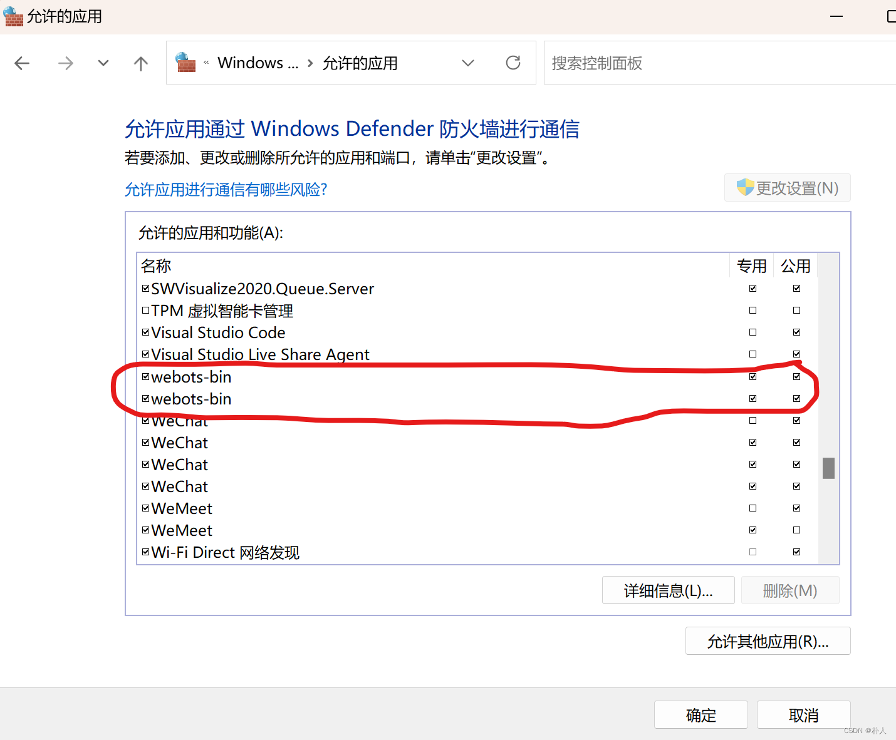

# 29 WSL2中的ROS2与windows中的webots通信失败的问题

> 朴人 于 2023-06-14 00:04:41 发布 阅读量572 收藏 1 点赞数
> 文章链接：https://blog.csdn.net/qq570437459/article/details/131198560

windows中在【控制面板\系统和安全\Windows Defender 防火墙\允许的应用】中，将webots-bin的专用和公用都勾选上，即可解决问题。
如图所示：

