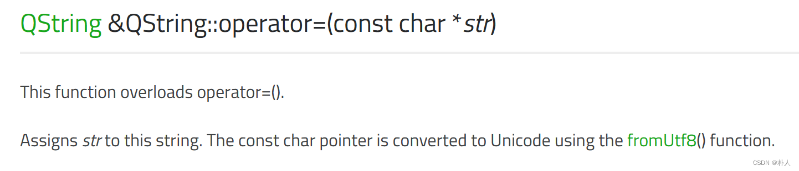
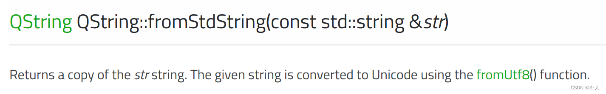
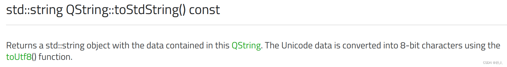

# 30 Windows平台Qt6中UTF8与GBK文本编码互相转换、理解文本编码本质

> 朴人 已于 2024-03-28 14:33:29 修改 阅读量4.1k 收藏 13 点赞数 4
> 文章链接：https://blog.csdn.net/qq570437459/article/details/133074736

####  *快速答案* 

1. UTF8转GBK

```cpp
QString utf8_str="中UTF文";
std::string gbk_str(utf8_str.toLocal8Bit().data());
```

1. GBK转UTF8

```cpp
std::string gbk_str_given_by_somewhere="中GBK文";
QString utf8_str=QString::fromLocal8Bit(gbk_str_given_by_somewhere.data());
```

---

## 正文

当你在搜寻【 `Windows平台Qt6中UTF8与GBK文本编码互相转换` 】的答案时，你实际上遇到的是【 `Windows平台Qt6与纯C++的字符串编码转换问题` 】。
Qt6框架内部默认使用UTF编码，Windows文件路径默认GBK（可以通过[控制面板]-[区域]-[管理]-[更改系统区域设置]-[勾选使用Unicode UTF-8]进行更改，但是截止到当前2023年正如勾选框所说这是Beta版本功能，会导致大量使用硬编码GBK的软件无法运行）。因此Qt本身不存在UTF8与GBK转换问题，Qt应用层输入输出都是UTF8，而纯C++本身不会进行编码转换，Windows系统调用只支持GBK，Windows平台下Qt与纯C++的交互会遇到转换问题，例如打印字符串、打开文件路径等。

#### 1. 文本编码原理

- 什么是文本编码
  计算机中，所有信息都以二进制形式储存在内存中，文本同样是一堆字节。
  直接抛给让两个人一串字节，两个人可能会理解出不同的文本信息，比如一串字节 `{0xd6,0xd0,0xce,0xc0}` ，你会认为代表什么文本呢？如果一个人只懂ASCII编码，他查了 [ASCII表](https://www.toolhelper.cn/Encoding/ASCII) 后会认为是 `[Ö,Ð,Î,À]` ；如果一个人只懂GBK编码，他查了 [GBK表](https://www.toolhelper.cn/Encoding/GBK) 后会认为是 `[中,文]` 。就是因为有这些表，就像二战时的电报一样，一串二进制可以被不同的解密方式解密出不同的语义信息。
  人类能看到的文本被加密（编码）后成为了一串二进制，一串二进制被解密（解码）后成为了人类看到的文本。因此小明用A规则去加密文本得到的二进制，再用B规则去解密得到的文本，必然不是小明当初看到的文本。对应地，文本用UTF编码得到的二进制，再用GBK解码得到的文本基本上是乱码，反之亦然。

- 计算机如何编码和解码
  由于汉字等需要占用2个或以上字节，所以解码后的信息均需要储存在宽字节(wchar)中，QString里保存的最小单元其实就是wchar，而std::string是单字节数组，相当于储存编码后的二进制。宽字节文本可以认为是 `const int16或int32等 byte[]` ，一个文本就是一个宽字节，一个文本占多个字节。
  所谓编解码就是单字节数组和宽字节数组的打散或组合关系。
  编码比较简单，按照编码表将宽字节数组转换为二进制。以GBK举例，如果在GBK表中当前宽字节对应的是英文字母之类的单字节，则只取宽字节高位字节；如果在GBK表中当前宽字节对应的是中文之类的多字节，则打散成对应个数的字节。
  解码就要麻烦一点了，程序并不知道接收到的一串二进制是什么编码，两种方法，一是硬解码，就像Qt，默认不管三七二十一直接按照UTF格式解，解码过程是将一串二进制按照UTF规定的方法放入宽字节中，其规则是遇到字节开头为0、110、1110、11110，分别一起将其后0、1、2、3个字节放入wchar中，并未满4个字节的位置填充为0，认为是一个有效字符；二是读取一串二进制的所有数据，统计分析这串二进制可能被什么格式编码，例如vscode里就有这个功能，但是可能有误判问题，所以需要人为确认。

- 计算机如何转换编码
  以GBK转UTF举例，由于汉字等的存在，计算机中的文本在宽字节数组这个数据结构储存，首先将GBK宽字节数组（GBK文本）GBK编码规则打散成一串二进制，然后按照UTF的规则将一串二进制组合成宽字节数组，即可得到UTF宽字节数组（UTF文本）。用表达式表示为 `U(G'(S))` 其中 `G'` 为GBK编码规则， `U` 为UTF解码规则。

- 乱码产生原理
  用GBK对中文进行编码后，再用UTF解码时，UTF就会遇到很多不符合自己解码规则的字节，此时UTF用0xef bf bd代为显示，即显示为一个乱码，此时只是显示出来，尚未保存，硬盘上的文件尚未写入。当用户按下保存键后，文件中不能被UTF识别的地方被修改为0xef bf bd，就永远恢复不了原来的信息了。当再用GBK格式打开这份文件时，就会看到锟斤拷（0xef bf bd ef bf bd对应GBK中的锟斤拷）。

#### 2. 默认下Qt6有意义的操作只支持UTF编码输入

- 何为有意义？例如
  – QString经常被拿来当作文件路径，QString变量创建时强制解析为UTF；
  – QFile的文件路径用来打开文件，强制解析为UTF；
  – qDebug()要与命令行交互，输入的字符串强制解析为UTF，这就是为什么在只支持GBK的命令终端用qDebug打印GBK文本会出现乱码；
  – QFile写入文件的字符串内容不会被Qt转码，因为文件内容字符串本身是没有意义的，只需要将原来的内容不用转码而直接搬运写入即可。

- 何为默认？例如以下：

```cpp
std::string std_str="中文";
QString s1=QString::fromStdString(std_str);
QString s2="中文";
qDebug()<<s1<<s2;
```

s1和s2的右侧内容均被默认按照UTF解码保存，见下图官方文档所述，用了fromUtf8()。代码中，如果你的cpp文件是GBK编码的，那输出乱码，因为GBK编码的字符串却被Qt默认按照UTF解码了；如果你的cpp文件是UTF编码的，那输出正常的中文，因为UTF编码的字符串被Qt默认按照UTF解码，对的上。 

 

Qt支持程序员指定的非默认的编码转换，例如以下：

```cpp
std::string std_str="中文";
QString s=QString::fromLocal8Bit(std_str.data());
qDebug()<<s;
```

代码做了这些操作：将文本原始字节数组按照Local(本地计算机，Windows默认GBK)的格式转码成UTF，QString再按照UTF格式进行解码，符合Qt的UTF入口要求，输出正常的中文。

#### 3. Qt输出是GBK还是UTF？

Qt在开放给程序员的api层面，是UTF，例如 `QString` 的 `toStdString()` 函数输出的就是UTF编码的字符串，官方文档描述见下图，自动用了toUtf8()；Qt内部直接与操作系统调用的部分，会自动toLocal操作，例如qDebug()，当它的输入为UTF编码的中文时，可以正确打印中文到只支持GBK的命令终端。
 

#### 4.GBK与UTF8互转的几种方法

- icu
  跨平台编码转换库，Qt底层有用到这个库。

- iconv
  Linux平台编码转换库。

- windows.h
  windows平台专用，使用函数MultiByteToWideChar和WideCharToMultiByte。

- std::codecvt
  C++标准库实现的编码转换，已经被标记为弃用，不建议使用。

- Qt toLocal8Bit和fromLocal8Bit
  Qt框架配合自己的数据结构QString等，使用Qt时首选。

- Qt QStringConvert
  内部调用与toLocal8Bit和fromLocal8Bit一样。

