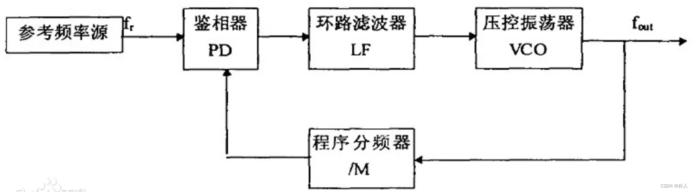

# 31 PLL锁相环倍频原理

> 朴人 已于 2024-01-21 20:10:01 修改 阅读量1.6k 收藏 14 点赞数 5
> 文章链接：https://blog.csdn.net/qq570437459/article/details/133603515

晶振8MHz，但是处理器输入可以达到72MHz，是因为PLL锁相环提供了72MHz。

锁相环由PD（鉴相器）、LP（滤波器）、VCO（压控振荡器）组成。
 

处理器获得的72MHz并非晶振提供，而是锁相环的VCO（压控振荡器）提供。
VCO自身可以直接输出随着电压变化而变化的频率，其频率可以达到非常高（G赫兹），但是自身是开环不稳定。
晶振的频率不是用来倍频提供给处理器，而是用作PLL的参考频率。VCO产生超高频率后进行分频，再与晶振频率进行比较，其误差闭环传递给VCO，VCO调节频率（可以用PID调节）到处理器需要的频率。
外部看到的PLL倍频数，比如8MHz倍频9倍到72MHz，实际上是PLL中的VCO分频到8MHz与晶振参考频率比较。所以严格来说，并不是晶振频率倍频了9倍，而是PLL中的VCO生成了一个闭环可控的高频频率在数值上与晶振频率是9倍关系。