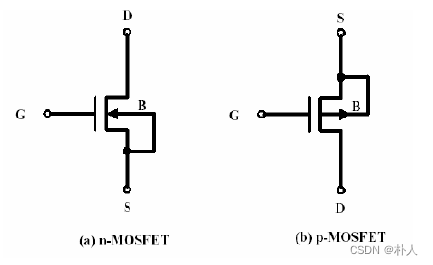
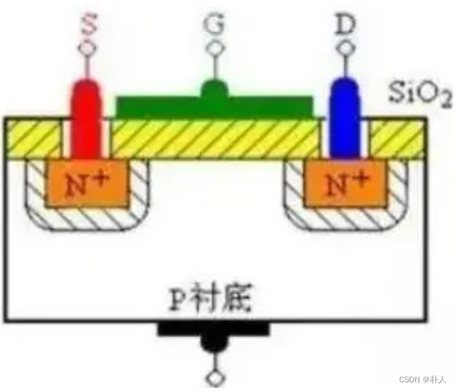
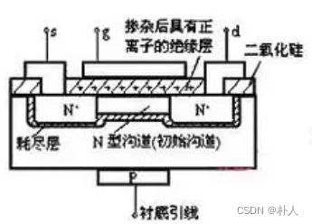
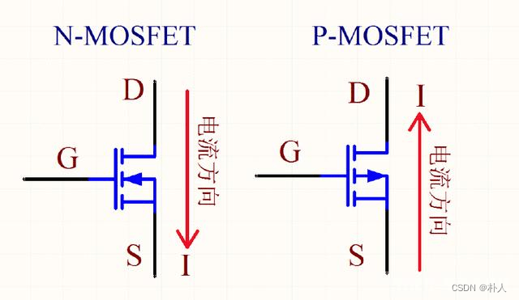
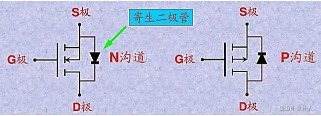
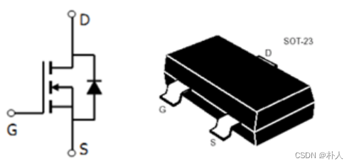
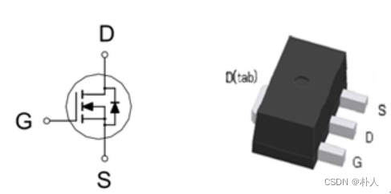
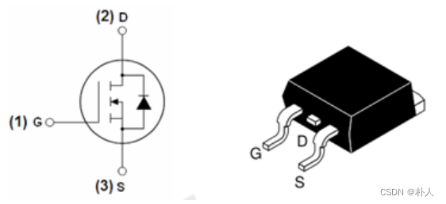
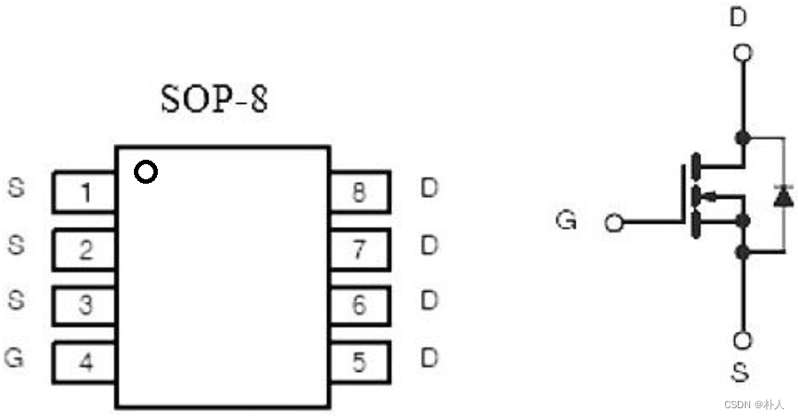

# 32 MOS管各种概念（三个极、沟道、衬底、电流方向、箭头方向、耗尽型和增强型、寄生二极管、封装引脚）

> 朴人 已于 2024-09-02 19:10:59 修改 阅读量3.1w 收藏 116 点赞数 27
> 文章链接：https://blog.csdn.net/qq570437459/article/details/133693417

## 三个极、沟道、衬底

D(Drain)漏极：载流子（NMOS为负电荷，PMOS为正电荷）离开端。
S(Source)源极：载流子发射端。
G(Gate)栅极：控制MOS开关的管脚。简单理解NMOS高电平导通，PMOS低电平导通。
沟道：D和S之间形成的导电通道。
衬底：向沟道提供电子或从沟道拿电子，与源极连接。
 

 

上图为NMOS。
 

## MOS符号中栅极的箭头含义

栅极进行操作时，电子如何在衬底和沟道区之间流动以形成一条沟道，箭头方向就是指的该电子流动方向。对于NMOS，栅极施加比衬底（S极）高的电压，衬底的电子流向栅极沟道方向，栅极处形成一条N沟道，NMOS导通；对于PMOS，栅极施加比衬底（S极）低的电压，栅极沟道的电子流向衬底，栅极处形成一条P沟道，PMOS导通。

## 电流方向

电流方向原因分析：对于NMOS，D和S都是N极性，要想D和S导通，D和S之间需要形成N沟道，要想形成N沟道，衬底的电子需要流向沟道，因此G电压要比衬底（S）高，所以通常做法是G施加高电压，将S极连接到GND；对于PMOS，D和S都是P极性，要想D和S导通，D和S之间需要形成P沟道，要想形成P沟道，沟道的电子需要流向衬底，因此G电压要比衬底（S）低，所以通常做法是G施加低电压，将S极连接到高电压。
 

## 增强型和耗尽型

符号上：耗尽型为实线，增强型为虚线。耗尽型栅极悬空时，就存在一条导电沟道，所以符号为实线。增强型只有栅极进行了操作才形成一条沟道，所以符号为虚线。G和S之间的电压VGS对于这两种类型MOS具有同方向的效果，可以认为耗尽型的起跑线比增强型高。由于耗尽型初始就可能导电，所以很多场景用初始导电确定性高的增强型。

## 二极管符号

很多时候电路图中MOS管旁边会带有一个二极管符号，这个不是人工加了一个二极管，而是MOS管自身的寄生二极管。对于NMOS，由于衬底（和S极相连）是P极，D极是N极，所以S到D相当于存在了一个二极管；对于PMOS，由于衬底（和S极相连）是N极，D极是P极，所以D到S相当于存在了一个二极管。在上文电流方向章节中有描述，对于NMOS，只要G大于S，MOS管就可以导通，并没有提到D，D是不是可以随便设置电压呢？从这个寄生二极管可以看出，要想MOS管作为开关作用，D不可以随便设置。NMOS的D电压一般不能比S电压低，因为会导致这个寄生二极管导通，G极不管怎么样，MOS管都看起来像是直接导通了，失去了MOS开关功能。PMOS则是D电压一般不能比S电压高。
 

## 器件封装管脚定义

背靠PCB的为漏极（D，Drain）。
 

 

 

 

