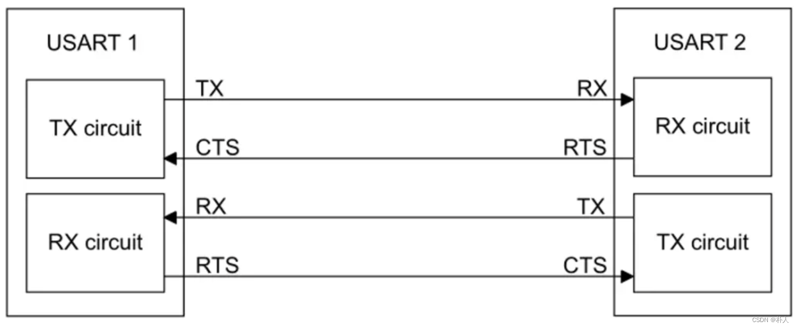

# 33 串口硬件流控RTS、CTS

> 朴人 已于 2023-10-11 16:45:22 修改 阅读量2.5k 收藏 5 点赞数 2
> 文章链接：https://blog.csdn.net/qq570437459/article/details/133761047

## 为什么有时候要在RXD和TXD的基础上增加RTS、CTS？

当接收端的串口处理速度过低时，会丢失数据，因此考虑增加一种通知的机制来告诉发送端是否可以发送，即增加了RTS（Require To Send）和CTS（Clear To Send）信号线。

#### 问题展示

假设双方约定波特率为每秒1000个字节，接收端由于读取串口数据后需要进行分析，其读取速度为每秒100个字节。如果发送端不停地发送，那么接收端将有90%的数据被新数据覆盖丢失。
当然接收端程序里也可以设置一个缓冲区数组，每次接收时直接将串口数据安排到缓冲区内，而非直接进行分析，由于将串口数据安排到缓冲区是CPU操作，CPU主频远高于串口波特率，所以该操作是非常迅速的。
在缓冲区未满之前，接收端用CPU频率对抗波特率，接收端没有速度压力。该操作可以延缓数据发生丢失的时间，在缓冲区满后，依然会产生不可避免的数据丢失。

#### 硬件流控机制

发送端在发送前检查自身的CTS，CTS低电平为可以发送。接收端RTS连接到发送端的CTS，接收端准备好接收后拉低自己的RTS即拉低发送端的CTS。
在发送端，如果自身CTS为高时，即使程序疯狂发送，硬件也不会发送。可以自行将CTS引脚手动跳线到VCC或者GND测试一下便知。
在接收端，读取串口数据寄存器后，会自动将RTS（对方的CST）变低，让发送方知道我的程序已经读取完毕，可以继续发送。串口寄存器set数据后，会自动将RTS（对方的CST）变高，让发送方知道我在等待程序读取寄存器，不要发送。
设置流控模式后，芯片内部自动完成以上机制，无需在程序中while判断CST的值，无需手动设置RST的值。