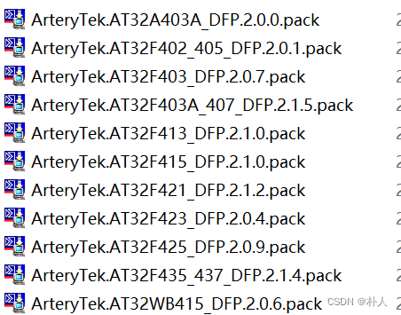
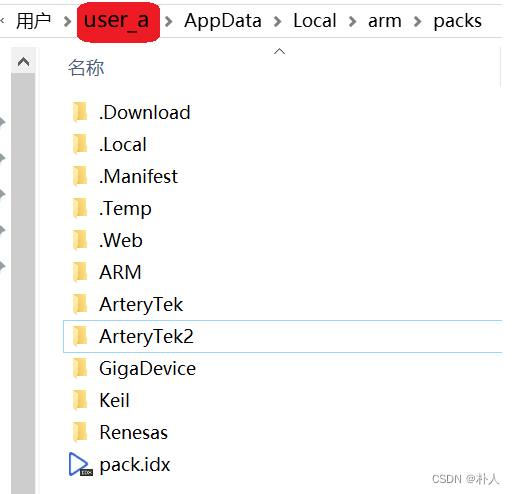
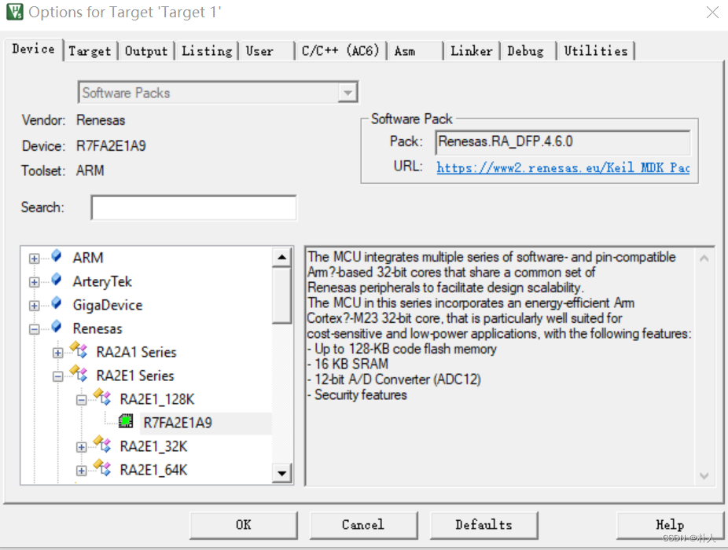
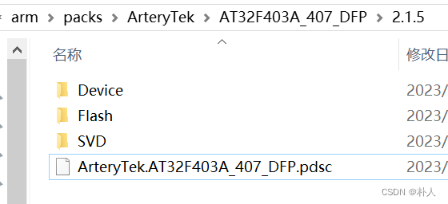

# 34 Keil 厂商DFP pack实现原理

> 朴人 于 2023-10-12 11:40:52 发布 阅读量748 收藏 6 点赞数 1
> 文章链接：https://blog.csdn.net/qq570437459/article/details/133787074

要想在Keil中方便地通过界面点击来导入芯片厂商提供的库，通常需要安装厂商提供的pack，如下图：
 

### 这个过程是如何实现的？

双击安装pack后，pack文件会将自身的内容解压到下图的目录，命名为厂商名字的文件夹，里面存放各种芯片信号的描述文件。直接复制别人的厂商文件夹到这里也是相同的效果，比如这里复制了一份ArteryTek的文件夹命名为ArteryTek2，打开Keil时会提示ArteryTek2相应的信息，说明Keil会扫描这个目录下的文件夹。
 

在Keil中用鼠标选择芯片型号操作的原理是读取解析厂商文件夹下对应型号文件夹中的pdsc文件（pack description），这个文件写着芯片的介绍文字、外设功能库的路径、debug时寄存器文件的路径等等芯片相关的信息，Keil读取出这些信息后显示到Keil界面上供程序员鼠标点选。
 

 

