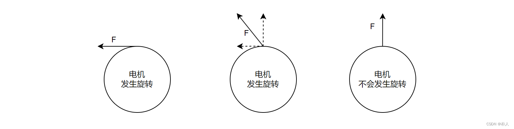
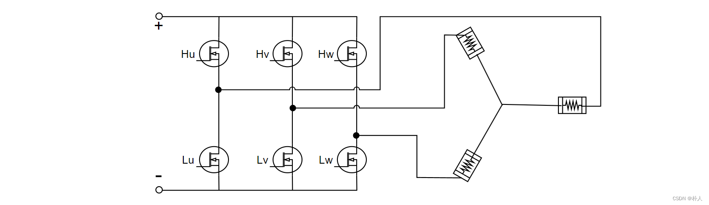
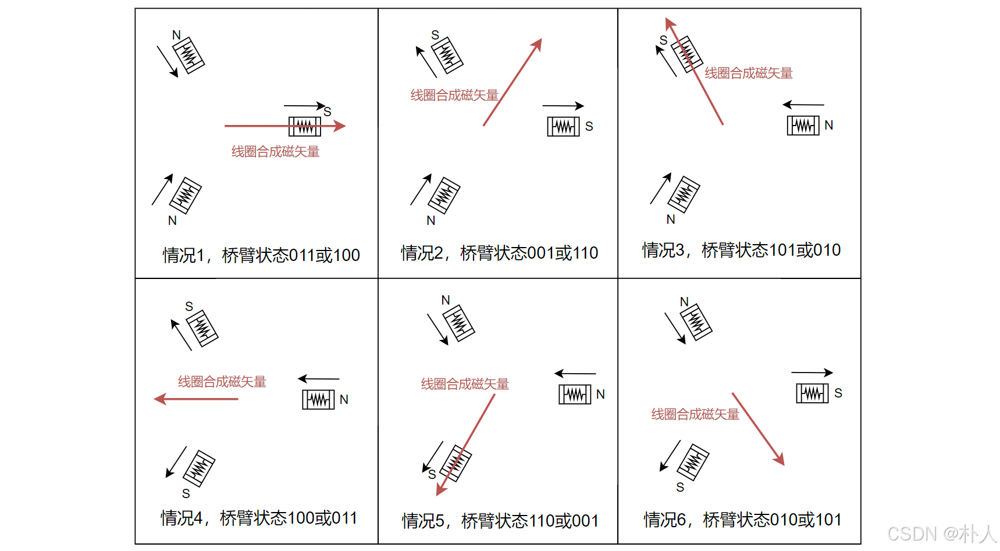
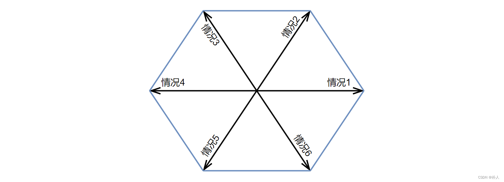

# 35 【从零开始实现stm32无刷电机FOC】【理论】【1/7 电机旋转本质】

> 朴人 已于 2025-06-04 23:06:11 修改 阅读量7.1k 收藏 171 点赞数 39
> 文章链接：https://blog.csdn.net/qq570437459/article/details/138800656

**目录**

[TOC]

## 电机旋转需要什么样的力？

电机切向存在受力，电机就会旋转。
 

进一步查看电机结构，分为转子和定子，大部分情况下，无刷电机的转子为永磁体，定子为多个等间距的线圈。我们先从最简化的三相无刷电机入手。
 

从图中可知，电机旋转问题进一步转化为转子旋转问题，电机切向受力转化为转子切向受力。
力具有方向和强度，我们将力看作一个矢量。
后文将混用永磁体与转子两个词语。

## 怎么产生力矢量？

力的产生来自于磁力。三相无刷电机有三个线圈，通电产生的磁性可以合成为一个磁矢量，与永磁体本身的磁矢量相互作用产生磁力。为了后续画图方便，约定磁矢量为N极指向S极。由于线圈在电路中是Y型连接，所以三个线圈磁性无法同时相同。
 

当这两个磁矢量不共线时，转子存在切向的分力，转子受力旋转。当两个磁矢量垂直时，转子切向受力最大。
力矢量的问题进一步转化为线圈磁矢量问题。

## 怎么产生任意的线圈磁矢量？

线圈通电会产生磁性，我们先来看一下线圈在电路中是怎么连接的。
 

在上图电路中，有三个桥臂，每个桥臂有上下两个mos管，上下两个mos管不能同时开通，最好也不同时关闭（这种情况下自行合成试试，两相合成的磁矢量强度比三相小）。为了方便书写，开上mos同时关下mos视为1；关上mos同时开下mos视为0，举例桥臂010代表u相电流流出、v相电流流入、w相电流流出，当然也可能是101，视电机绕组缠绕方向而定。

> 注：实际情况中，电机绕组是电感，而且电机旋转时永磁体切割绕组会产生感应电动势，电流不会直接跟随电压产生。本系列为入门阶段，暂时不考虑这些问题，否则啰里啰唆一大堆，容易分散注意力迷失方向。

经过mos管开关状态的排列组合，三个线圈的磁性以及合成的磁矢量只能是以下6种：
 

但是目标线圈磁矢量是任意角度的，这可以通过pwm方式实现。
可以想象，在10毫秒周期内，如果其中5毫秒用来触发情况4，5毫秒用来触发情况5，那么会得到一个[-210°]的磁矢量。由此我们可以知道，合理控制两个相邻的磁矢量的占空比，就可以得到这个区域内任意角度的磁矢量。同理，尝试将6种情况分别合成，下图就是pwm方式下线圈磁矢量能达到的范围，该图包含了矢量的角度和长度：
 

我们将6个区域称作6个扇区。
回想FOC的全称：Field-Oriented Control，正是磁场方向控制。
至此本节结束，我们从电机旋转受力本质出发，进一步转化为转子受力问题，再进一步转化为合成线圈磁矢量问题。而我们确实找到了一种控制线圈合成任意角度磁矢量的方法， ~~于是你成为了万磁王~~ ，可以让磁场指哪打哪，何况控制小小电机。接下来我们从数学模型落实该方法，该方法称为SVPWM（空间矢量pwm，正是我们画的正六边形空间pwm扇区图）。