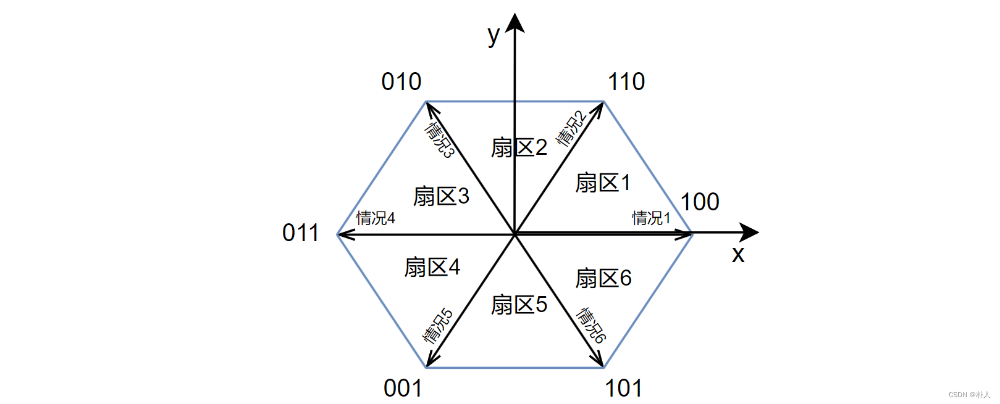
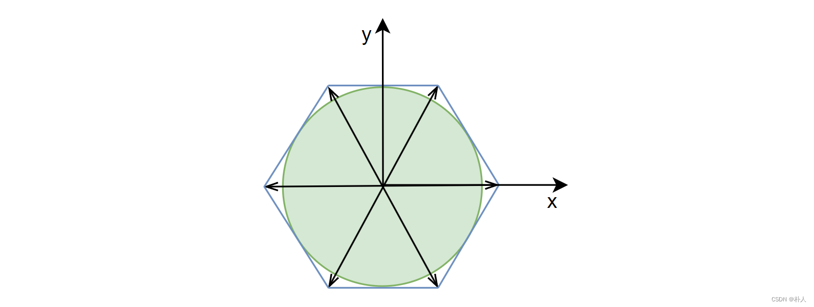
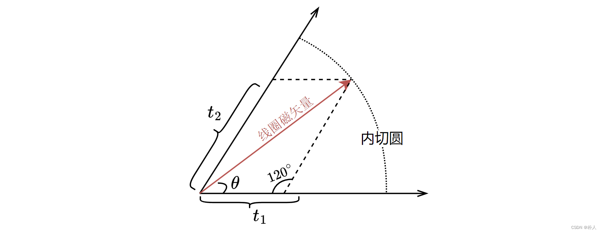
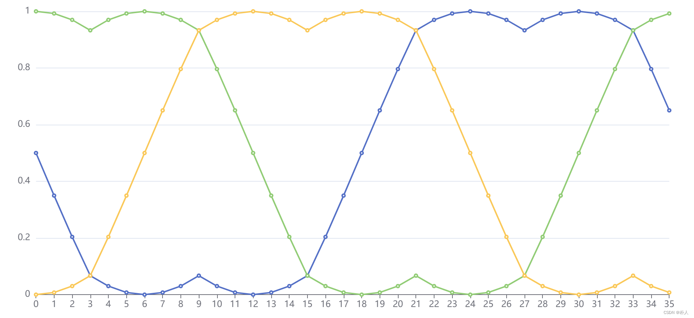
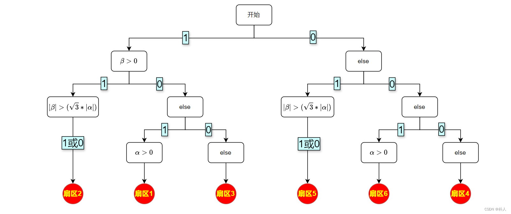

# 36 【从零开始实现stm32无刷电机FOC】【理论】【2/7 SVPWM数学模型】

> 朴人 已于 2025-03-04 15:55:50 修改 阅读量8.9k 收藏 108 点赞数 59
> 文章链接：https://blog.csdn.net/qq570437459/article/details/138871835

**目录**

[TOC]


[上一节](https://blog.csdn.net/qq570437459/article/details/138800656) ，我们找到了一种控制线圈合成磁矢量的方法— **SVPWM** ，但是仅停留在逻辑层面上。本节对SVPWM进行数学推导，给出最终的线圈控制函数。本节的目标为找到一个函数，输入目标线圈磁矢量，输出三相桥臂的pwm占空比。目标磁矢量可以有两种表示方式，一种是极坐标，一种是 [笛卡尔坐标](https://baike.baidu.com/item/%E7%AC%9B%E5%8D%A1%E5%84%BF%E5%9D%90%E6%A0%87) 。
极坐标形式：

$$
(D_u, D_v, D_w)\leftarrow svpwm(\theta:磁矢量方向, s:磁矢量强度)
$$

电机转子旋转靠的是切向受力，在极坐标形式下，磁矢量方向和磁矢量强度都会对切向分力有影响，存在耦合问题，以后难以进行电机控制，因此可以将磁矢量表达方式改为笛卡尔坐标，将磁矢量解耦为切向和直向。
笛卡尔坐标形式：

$$
(D_u, D_v, D_w)\leftarrow svpwm(d:磁矢量直向强度, q:磁矢量切向强度)
$$

由于极坐标形式下的推导非常简单清晰，因此本节先按照极坐标形式进行推导，形成大致的概念，再按照笛卡尔坐标形式进行推导。
本节推导过程不考虑物理单位，将各类数值归一化，比如扇区6个基础矢量长度视为1，pwm周期视为1，磁矢量强度最大为1，以后在推导结果上再乘物理量即可。

## 线性调制区

回顾上节的SVPWM扇区图，在此将坐标系建立在扇区图中心，扇区图中有6个基础矢量：
 

从图中可以看出，线圈磁矢量可以落在在扇形范围内任意位置，但是有一个问题，线圈磁矢量强度最大值不恒定，意味着电机转一圈的力矩有波动。所以我们将线圈磁矢量的范围限制为扇形内切圆，人为降低一些线圈磁矢量能达到的最大强度，让电机转动时力矩可以保持恒定，这称为线性调制（非线性过调制不在本文范围内）。
 

## 扇区pwm计算

从扇区图可知，如果目标线圈磁矢量落在扇区1，需要用pwm混合情况1和情况2；如果目标线圈磁矢量落在扇区2，需要用pwm混合情况2和情况3。同理，每个扇区都需要独立计算（你可能会想，为什么不把扇区1和扇区2合并起来用情况1和情况3进行混合？实际上这样混合出来的磁矢量强度较低）。
这里要注意，此处的主角是【线圈磁矢量】，而不是转子磁矢量。
**以扇区1的计算为例：** 
考虑到线性调制，线圈磁矢量最大强度为扇区内切圆半径，由于6个基础矢量长度为1，因此内切圆半径等于 $\frac{\sqrt{3}}{2}
$ 。
以下计算过程先按照线圈磁矢量最大强度进行，最后将占空比乘上强度系数就可以实现强度控制。
 

根据 [正弦定理](https://baike.baidu.com/item/%E6%AD%A3%E5%BC%A6%E5%AE%9A%E7%90%86) 可得：

$$
\frac{t_1}{sin{(60^{\circ}-\theta})}=\frac{t_2}{sin{\theta}}=\frac{\frac{\sqrt{3}}{2}}{sin{120^{\circ}}}

$$

得到基础矢量的占空比 $t_1$ 和 $t_2$ ：

$$
t_1 =\sin(60^\circ - \theta)，t_2 =\sin \theta\tag{1-1}
$$

注意，式(1-1)得到的占空比是基础矢量的在一个周期内的比例（权重），桥臂的占空比后续再计算。
其余扇区的几何形状与扇区1是相同的，比如扇区2的计算只需在式(1-1)的基础上将 $\theta$ 减去60°。把扇区顺时针方向的基础矢量记号为 $m$ ，逆时针方向的基础矢量记号为 $n$ ，结果为：

<center>表(1-1)</center>

| 扇区号 | 基础矢量占空比 |
|:---:|:---:|
| 1 |  $t_m =\sin(60^\circ - \theta)，t_n = \sin (\theta-0^\circ)$  |
| 2 |  $t_m=\sin(120^\circ - \theta)，t_n = \sin( \theta-60^\circ)$  |
| 3 |  $t_m =\sin(180^\circ - \theta)，t_n = \sin (\theta-120^\circ)$  |
| 4 |  $t_m =\sin(240^\circ - \theta)，t_n = \sin (\theta-180^\circ)$  |
| 5 |  $t_m = \sin(300^\circ - \theta)，t_n = \sin (\theta-240^\circ)$  |
| 6 |  $t_m = \sin(360^\circ - \theta)，t_n = \sin (\theta-300^\circ)$  |


总结： $t_m =\sin(扇区号*60^\circ - \theta)，t_n = \sin (\theta-(扇区号*60^\circ-60^\circ))$ 
以上均是按照线圈磁矢量最大强度计算得到的结果，要控制磁矢量强度，再乘上强度系数 $s$ 即可。
在此重复提醒，上面这张表有什么用？意思是目标线圈磁矢量落在哪个扇区，合成时就使用哪个扇区的基础矢量占空比结果。举例：目标线圈磁矢量角度是170°，强度是 $s$ ，属于落在第3扇区，那么在一个周期内，给情况3分配 $s*\sin(180^\circ - \theta)$ 比例，给情况4分配 $s*\sin (\theta-120^\circ)$ 比例，剩下的比例分配给零矢量，即可得到目标线圈磁矢量。

## 桥臂pwm计算

上部分我们获得了基础矢量的比例，我们的最终目标还是桥臂mos管占空比。
在一个周期内，分配完基础矢量后，剩下时间 $t_0=1-t_m-t_n$ 是分配给零矢量的。以扇区1为例，写成表达式：

$$
\left[\begin{matrix}D_u\\D_v\\D_w\\\end{matrix}\right]=t_1*\left[\begin{matrix}1\\0\\0\\\end{matrix}\right]+t_2*\left[\begin{matrix}1\\1\\0\\\end{matrix}\right]+t_0*零矢量桥臂
$$

**零矢量的选择：** 
111和000两种桥臂状态都可以产生零矢量，应该怎么安排呢？如果一个周期内零矢量由111和000【平分】，这称为七段式SVPWM。如果一个周期内零矢量只有一种，这称为五段式SVPWM。五段式SVPWM比七段式SVPWM电流谐波更大，但是mos管开关次数更少。五段式SVPWM有各种各样的矢量分配顺序和零矢量选择方法，难度较大。这里只选择七段式SVPWM。

不同扇区只需要更改不同的基础矢量即可，再乘上强度系数 $s$ ，6个扇区的三相桥臂占空比为：

$$
\left[\begin{matrix}D_u\\D_v\\D_w\\\end{matrix}\right]=s*t_m*\vec{m}+s*t_n*\vec{n}+\frac{t_0}{2}*\left[\begin{matrix}1\\1\\1\\\end{matrix}\right]\tag{1-2}

$$

其中， $t_0=1-t_m-t_n$ ，s是强度系数， $⃗\vec{m}$ 是顺时针方向的基础矢量， $⃗\vec{n}$ 是逆时针方向的基础矢量， $t_m$ 是 $⃗\vec{m}$ 在周期内的比例， $t_n$ 是 $⃗\vec{n}$ 在周期内的比例，以及：

<center>表(1-2)</center>

| 扇区号 |  $⃗\vec{m}$ 和 $⃗\vec{n}$ 的值 |
|:---:|:---:|
| 1 |  $\vec{m}=\left[\begin{matrix}1\\0\\0\\\end{matrix}\right]，\vec{n}=\left[\begin{matrix}1\\1\\0\\\end{matrix}\right]
$  |
| 2 |  $\vec{m}=\left[\begin{matrix}1\\1\\0\\\end{matrix}\right]，\vec{n}=\left[\begin{matrix}0\\1\\0\\\end{matrix}\right]
$  |
| 3 |  $\vec{m}=\left[\begin{matrix}0\\1\\0\\\end{matrix}\right]，\vec{n}=\left[\begin{matrix}0\\1\\1\\\end{matrix}\right]
$  |
| 4 |  $\vec{m}=\left[\begin{matrix}0\\1\\1\\\end{matrix}\right]，\vec{n}=\left[\begin{matrix}0\\0\\1\\\end{matrix}\right]
$  |
| 5 |  $\vec{m}=\left[\begin{matrix}0\\0\\1\\\end{matrix}\right]，\vec{n}=\left[\begin{matrix}1\\0\\1\\\end{matrix}\right]
$  |
| 6 |  $\vec{m}=\left[\begin{matrix}1\\0\\1\\\end{matrix}\right]，\vec{n}=\left[\begin{matrix}1\\0\\0\\\end{matrix}\right]
$  |


至此，将表(1-1)代入式(1-2)，我们得到了svpwm函数，输入为线圈磁矢量角度 $\theta$ 和强度 $s$ ，输出为 $D_u,D_v,D_w$ 。

## 纯c语言代码验证

将式(1-2)用C语言描述出来，这一定是你见过最简洁优雅的SVPWM函数：

```c
#include <stdio.h>
#include <math.h>
#define PI 3.14159265358979323846
#define deg_to_rad(a) (PI * (a) / 180)

typedef struct duty
{
    float d_u;
    float d_v;
    float d_w;
} duty_t;

/**
 * @brief 极坐标系下的svpwm
 *
 * @param theta 目标磁矢量角度
 * @param s 目标磁矢量强度
 * @return duty_t 三相桥臂占空比
 */
duty_t svpwm(float theta, float s)
{
    const float rad60 = deg_to_rad(60);
    const int v[6][3] = {{1, 0, 0}, {1, 1, 0}, {0, 1, 0}, {0, 1, 1}, {0, 0, 1}, {1, 0, 1}};
    int sector = 1 + theta / rad60;
    float t_m = s * sinf(sector * rad60 - theta);
    float t_n = s * sinf(theta - (sector * rad60 - rad60));
    float t_0 = 1 - t_m - t_n;

    duty_t duty;
    duty.d_u = t_m * v[sector - 1][0] + t_n * v[sector % 6][0] + t_0 / 2;
    duty.d_v = t_m * v[sector - 1][1] + t_n * v[sector % 6][1] + t_0 / 2;
    duty.d_w = t_m * v[sector - 1][2] + t_n * v[sector % 6][2] + t_0 / 2;
    return duty;
}

int main()
{
    for (float phi = 0; phi < 360; phi += 10)
    {
        // 这里我设置磁矢量与转子垂直，这样转子受力最大
        duty_t duty = svpwm(deg_to_rad(fmodf(phi + 90, 360)), 1);
        printf("%f,%f,%f,\r\n", duty.d_u, duty.d_v, duty.d_w);
    }
    return 0;
}
```

将运行结果用折线图绘制出来，可以看到三相桥臂占空比结果，将占空比设置给单片机的pwm产生器就可以控制电机旋转了：
 

## 目标磁矢量为笛卡尔坐标系形式的推导

上述推导的目标磁矢量形式为极坐标形式，但是磁矢量方向和磁矢量强度都会对转子切向分力产生影响，存在耦合问题，可以把磁矢量分解到转子的直向和切向进行解耦合，方便以后对转子切向单独进行强度控制（电机旋转只关注转子切向强度就可以了）。
**$\alpha$ 轴， $\beta$ 轴，d轴，q轴：** 
$\alpha$ 轴和 $\beta$ 轴就是svpwm扇区图的xy坐标系轴，以后用词将混用 $\alpha$ 轴和x轴、 $\beta$ 轴和y轴。
d（direct，直接）轴与转子磁矢量平行，q（quadrature，正交）轴与转子磁矢量垂直。这两个轴很好理解，电机旋转靠的是转子切向受力（q轴），任何一个力都可以被分解到转子的直向和切向，也就是被分解到d轴和q轴。
按照笛卡尔坐标系形式，svpwm函数输入改为d、q轴的强度：

$$
(D_u, D_v, D_w)\leftarrow svpwm(d, q)
$$

在下面的推导之前，你可能会想，直接把磁矢量d、q数值转换到极坐标 $\theta$ 、 $s$ ，然后代入极坐标形式的svpwm函数不就好了，根本用不着下面复杂的推导？实际上，笛卡尔坐标转换到极坐标需要计算 $\arctan$ 和变量开根号，计算耗时更大一些。如果觉得下面的推导太麻烦，而不介意计算耗时，这里提供直接的转换公式： $\theta=atan2(q,d)+\phi_{转子角度}，s=\sqrt{d^2+q^2}$ 。
注意，转子角度 $\phi$ 可从电机编码器获取。
**park变换：** 
在本小节的方法下，所有的矢量都在xy坐标系内，最好统一用xy坐标（= $\alpha$ 轴和 $\beta$ 轴）表示，因此d、q轴需要转换到 $\alpha$ 轴和 $\beta$ 轴。
 

从图中可以看出，d、q轴旋转 $\phi$ 角后与 $\alpha$ 轴、 $\beta$ 轴相等，写成表达式为：

$$
\left[\begin{matrix}\alpha\\\beta\\\end{matrix}\right]=\left[\begin{matrix}\cos{\phi}&-\sin{\phi}\\\sin{\phi}&\cos{\phi}\\\end{matrix}\right]*\left[\begin{matrix}d\\q\\\end{matrix}\right]

$$

上面这个表达式就是 **反park变换** 。正park变换就是 $\alpha$ 轴、 $\beta$ 轴转换到d、q轴，以后电流采样部分会用到。
**扇区pwm：** 
到此，我们计算得到了线圈磁矢量的xy坐标，接下来就可以计算扇区pwm了。表(1-1)是我们已经计算过的，表(1-1)中的 $\theta$ 是磁矢量角度，与极坐标形式不同的是，笛卡尔坐标系形式的磁矢量并未给定 $\theta$ ，根据xy坐标的定义，已知的是 $\cos\theta=\alpha,\sin\theta=\beta$ ，因此对表(1-1)的结果进行展开，得到：

$$
t_m =\sin(扇区号*60^\circ)*\alpha - \cos(扇区号*60^\circ)*\beta，t_n = \beta*\cos(扇区号*60^\circ-60^\circ)-\alpha*\sin(扇区号*60^\circ-60^\circ)
$$

**扇区号计算：** 
极坐标形式的磁矢量是给定了目标磁矢量角度的，因此根据角度数值可以直接判别出磁矢量落在了哪个扇区，而笛卡尔坐标系形式的磁矢量只有给定的转子角度和d、q轴数值以及推导得出的x、y轴数值，并不能直接判断出落在了哪个扇区。
第一个想法就是参考编程常见的 [atan2(y,x)](https://baike.baidu.com/item/atan2) 函数，直接根据得出的角度判断落在了哪个扇区。但是我们可以进行优化，不必计算atan这个耗时操作。
先对各个扇区现有参数进行整理：

| 扇区号 |  $\alpha$  |  $\beta$  |  $\arctan\rightarrow$  |  $\frac{\beta}{\alpha}
$  |
|:---:|:---:|:---:|:---:|:---:|
| 1 | >0 | >0 |  $0^{\circ}<\arctan\frac{\beta}{\alpha}<60^{\circ}\rightarrow
$  |  $0<\frac{\beta}{\alpha}<\sqrt{3}
$  |
| 2 | 不定 | >0 |  $60^{\circ}<\arctan\frac{\beta}{\alpha}<120^{\circ}\rightarrow
$  |  $\|\frac{\beta}{\alpha}\|>\sqrt{3}
$  |
| 3 | <0 | >0 |  $120^{\circ}<\arctan\frac{\beta}{\alpha}<180^{\circ}\rightarrow
$  |  $-\sqrt{3}<\frac{\beta}{\alpha}<0
$  |
| 4 | <0 | <0 |  $180^{\circ}<\arctan\frac{\beta}{\alpha}<240^{\circ}\rightarrow
$  |  $0<\frac{\beta}{\alpha}<\sqrt{3}
$  |
| 5 | 不定 | <0 |  $240^{\circ}<\arctan\frac{\beta}{\alpha}<300^{\circ}\rightarrow
$  |  $\|\frac{\beta}{\alpha}\|>\sqrt{3}
$  |
| 6 | >0 | <0 |  $300^{\circ}<\arctan\frac{\beta}{\alpha}<360^{\circ}\rightarrow
$  |  $-\sqrt{3}<\frac{\beta}{\alpha}
$  |


仔细看上表数据，我们发现可以通过一个一个的条件逐渐将6个扇区分开，条件分叉后实际上形成了以下这棵二叉树：
 

可以看到每个叶子节点的路径总值都不一样，因此可以据此分类，形成表达式即为：
设 $A=bool(\beta>0),B=bool(|\beta|>\sqrt{3}*|\alpha|),C=bool(\alpha>0)$ ，
令 $K=4*A+2*B+C$ ，有如下映射关系：

| K= | 000b=0 | 001b=1 | 010b=2 | 011b=3 | 100b=4 | 101b=5 | 110b=6 | 111b=7 |
|:---:|:---:|:---:|:---:|:---:|:---:|:---:|:---:|:---:|
| 扇区号= | 4 | 6 | 5 | 5 | 3 | 1 | 2 | 2 |


至此，扇区号计算完成，没有用到耗时的atan函数，甚至连浮点数除法都没有用到。
**桥臂pwm：** 
桥臂pwm我们已经在笛卡尔坐标形式的磁矢量中计算过了，由于笛卡尔坐标系下的磁矢量不给定强度 $s$ ，将式(1-2)去掉强度 $s$ 即为此处的桥臂pwm表达式。
**纯c语言代码验证：** 

```c
#include <stdio.h>
#include <math.h>
#include <stdbool.h>
#define PI 3.14159265358979323846
#define SQRT3 1.73205080756887729353
#define deg_to_rad(a) (PI * (a) / 180)
typedef struct duty
{
    float d_u;
    float d_v;
    float d_w;
} duty_t;

/**
 * @brief 笛卡尔坐标系下的svpwm
 *
 * @param phi 转子角度
 * @param d d轴强度单位比例
 * @param q q轴强度单位比例
 * @return duty_t 三相桥臂占空比
 */
duty_t svpwm(float phi, float d, float q)
{
    const float rad60 = deg_to_rad(60);
    const int v[6][3] = {{1, 0, 0}, {1, 1, 0}, {0, 1, 0}, {0, 1, 1}, {0, 0, 1}, {1, 0, 1}};
    const int K_to_sector[] = {4, 6, 5, 5, 3, 1, 2, 2};
    float cos_phi = cosf(phi);
    float sin_phi = sinf(phi);
    float alpha = cos_phi * d - sin_phi * q;
    float beta = sin_phi * d + cos_phi * q;

    bool A = beta > 0;
    bool B = fabs(beta) > SQRT3 * fabs(alpha);
    bool C = alpha > 0;

    int K = 4 * A + 2 * B + C;
    int sector = K_to_sector[K];

    float t_m = sin(sector * rad60) * alpha - cos(sector * rad60) * beta;
    float t_n = beta * cos(sector * rad60 - rad60) - alpha * sin(sector * rad60 - rad60);
    float t_0 = 1 - t_m - t_n;

    duty_t duty;
    duty.d_u = t_m * v[sector - 1][0] + t_n * v[sector % 6][0] + t_0 / 2;
    duty.d_v = t_m * v[sector - 1][1] + t_n * v[sector % 6][1] + t_0 / 2;
    duty.d_w = t_m * v[sector - 1][2] + t_n * v[sector % 6][2] + t_0 / 2;
    return duty;
}

int main()
{
    for (float phi = 0; phi < 360; phi += 10)
    {
        duty_t duty = svpwm(deg_to_rad(phi), 0, 1);
        printf("%f,%f,%f,\r\n", duty.d_u, duty.d_v, duty.d_w);
    }
    return 0;
}
```

 

## 结束

从代码上可以看到，极坐标形式的svpwm计算量更小。如果后续只考虑电机开环控制，可选择极坐标形式的svpwm；如果后续考虑更高级的电机控制，需要将磁矢量解耦到转子的直轴（直向）和交轴（切向）。
经过本节的推导，我们得到了磁矢量的生成函数，也就是说我们可以随意控制电机转子的受力了，接下来就有能力对电机进行角度（位置）、速度、力矩控制了。