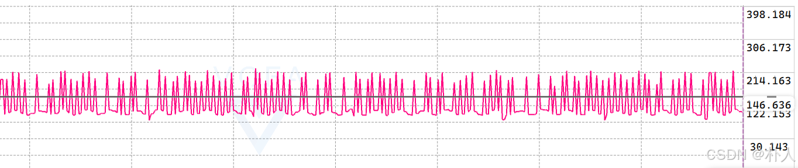
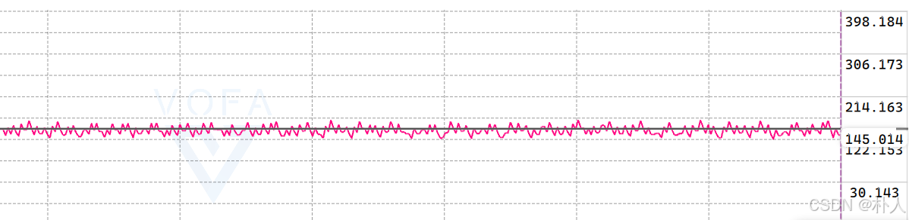
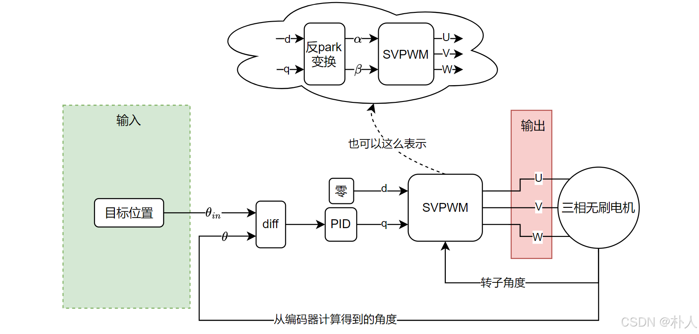
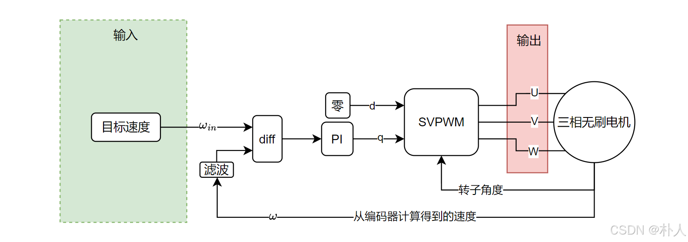
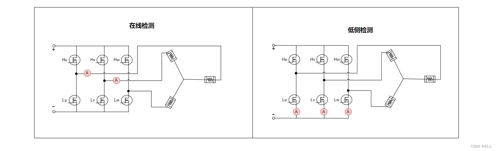
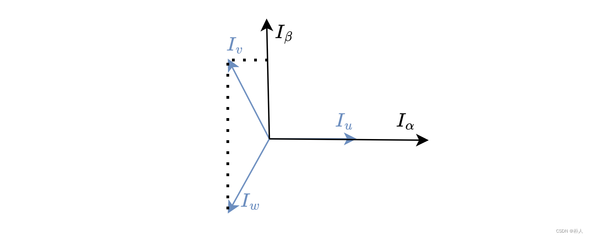
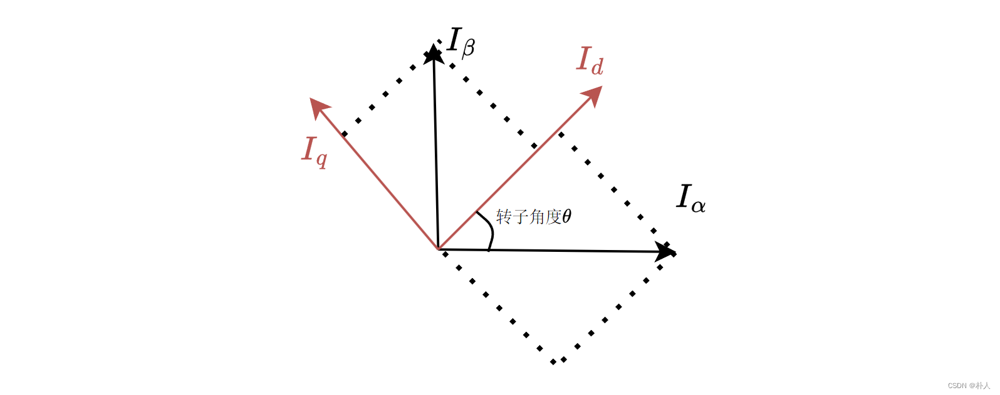
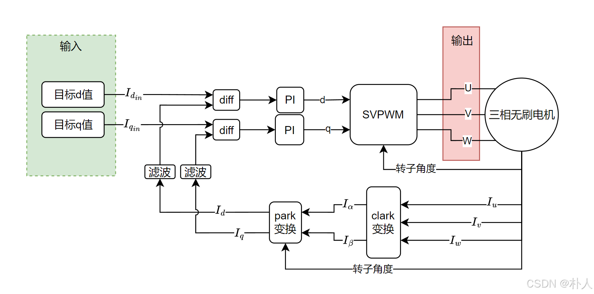
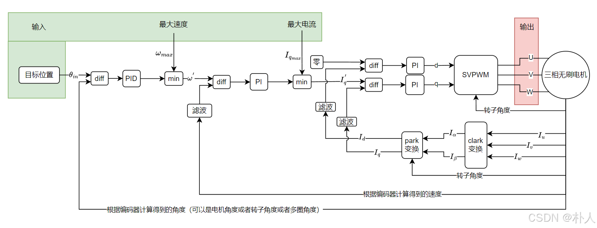

# 37 【从零开始实现stm32无刷电机FOC】【理论】【3/7 位置、速度、电流控制】

> 朴人 已于 2025-06-22 11:43:18 修改 阅读量7.6k 收藏 85 点赞数 48
> 文章链接：https://blog.csdn.net/qq570437459/article/details/138872078

**目录**

[TOC]

[上一节](https://blog.csdn.net/qq570437459/article/details/138871835) ，通过对SVPWM的推导，我们获得了控制电机转子任意受力的能力。本节，我们选用上节得到的转子dq轴解耦的SVPWM形式，对转子受力进行合理控制，实现FOC电机控制的最终目标：位置、速度、电流控制。

## PID控制

看到本节的人，大概率是了解PID（Proportional比例，Integral积分，Derivative微分）控制的，也是本人能力所限，在此不进行完整讲解，也不涉及高级控制方法。
不管是电机的位置还是速度还是电流，都可以视为被控参数。
从直观想法上，当一个被控参数实时值小于目标值时，需要施加外力使被控参数提高。如果施加的外力过大，被控参数会被超调，导致被控参数在目标值附近的振荡幅度越来大；如果施加的外力过小，参数到达目标值的速度又太慢。因此需要得到一个合适的外力，使得被控参数既不会振荡越来越剧烈，调节速度也不会太慢。从这个直观的控制想法就是PID中的P。单纯使用P控制时，设置外力大小=被控参数与目标值的差距*P系数，所谓差距越大施加的外力越大，是很直观的。如果P系数设置的比较小，虽然被控参数不会一直振荡了，可以慢慢稳定到目标值了，但是调节速度太慢了，此时可以加入PID的D控制，使得原先振荡的被控参数快速收缩到目标值。
再从直观想法上去思考D控制，纯P控制下被控参数靠近以及掠过目标值时，一个与速度反方向的纠偏力有助于被控参数在目标值附近产生制动，让被控参数更快地收缩到目标值。这个与速度反方向的纠偏力就是D控制。加入D控制后，控制外力大小=被控参数与目标值的差距*P系数+被控参数速度*D系数。当纯D控制时，由于初始状态下被控参数的速度为0 ，被控参数不会得到外力，由此也可以看出，P控制是提供外力的，D控制是约束外力的。如果D系数选择过大，则轻微的速度就能够引起巨大的外力；如果D系数选择过小，则不足以约束P控制生产的外力，被控参数稳定就慢。
还是从直观想法上去思考I控制，当被控参数存在负载时，单纯的P控制提供的外力可能不足以支撑这个负载，因此可以加上这样一个机制，把被控参数与目标值差距随着时间累计起来，这样就能得到存在负载时被控参数到达目标值所需的动力了。这个机制就是I控制。加入I控制后，控制外力大小=被控参数与目标值的差距*P系数+被控参数速度*D系数+被控参数与目标值差距随时间累计*I系数。
在控制电机时，没有特殊情况下，由于d轴对电机旋转不生成贡献，pid控制可以只控制q轴的力，d轴可以进行控制也可以直接设置输出为0。

## 滤波

在速度控制和电流控制时，受限于采样精度和频率等，速度和电流是不稳定的且变化比较快，例如下图是电机速度的直接计算值，存在很多锯齿，在真实值附近波动，如果直接使用这样的值，会导致PID输出波动较大，
 

下图为经过滤波后，比较接近真实值： 

滤波方法有很多种，比如低通滤波、卡尔曼滤波，本质就是在夹杂了噪音的数据中估计出一个接近真实的值。由于滤波是一个非常大的课题，原理不在本节进行说明，可直接查看后续实践部分的代码，只是在此提醒，输入PID控制器前，需要进行滤波计算。

## 单独位置控制

位置指的是角度，要注意，有两种物理角度，一个是电机角度，一个是转子角度，两者是不一样的。电机编码器是安装在转子外壳上的，因此编码器获得的是转子外壳的角度，而转子位于内部，由于转子外壳和转子是互相固定的，两种角度有一个固定偏移，安装的时候编码器零度不可能正好对着转子永磁体。编码器角度由编码器提供，转子角度也就能知道了。在后续实践部分会说明怎么获得这个固定偏移，在本节只需完成理论计算部分。合成的磁矢量是作用于转子永磁体的，因此理论计算是在转子角度基础上计算的。
 

有两种方法可以实现转子的位置控制：

**pid法：** 
直观的思想就是用转子q轴不停地左右拉扯转子，转子一旦偏离目标位置了，就在q轴施加一个反向的力拉扯一下，偏离越大，拉扯力越大，让转子回到目标位置。
优点：q轴能够提供较大的力，位置控制比较迅速有力。
缺点：由于q轴与转子永磁体磁矢量相差90度，因此需要知道转子实时位置（角度）。
由于在有编码器的情况下，转子实时位置很容易获得，因此大部分情况下使用pid控制位置。
 

单独位置的FOC控制框图如下图。图中的意思是输入一个目标位置，与编码器计算得到的角度进行差值计算，然后输入pid控制器，只控制转子q轴强度，d轴强度直接设置为0，最后将dq轴强度（0~1之间）输入到前文推导得到的SVPWM函数中，输出得到uvw桥臂的pwm占空比。这里要注意的是输入的目标位置 $\theta_{in}$ 可以是转子角度或者编码器角度或者多圈角度，只要与反馈的 $\theta$ 保持同一种角度即可。
 

**d轴强拖：** 
核心思想是人为控制线圈生成一个目标线圈磁矢量，永磁铁的d轴会被吸引到目标位置。注意该方法是吸引d轴到目标位置。
优点：由于生成的就是目标位置，因此无需知道转子角度，转子自然会被吸引过去。
缺点：切向分力小，轻微切向外力就能让转子明显脱离位置。
 

## 单独速度控制

速度控制使用d轴拖动的方法就不合适了，因为d轴拖动就是为了不使用编码器，没了编码器数据就很难计算速度了。速度控制可以使用pid控制方法，但是由于电机旋转过程中速度值变化比较不稳定，而D控制是与被控参数的变化程度成正比，所以一般只使用PI控制。
速度的计算方式非常简单，就是 $\frac{当前角度-上次记录的角度}{\Delta{t}}
$ 。
将目标速度与实时速度的差值输入到PI控制中就能实现速度控制。
单独速度的FOC控制框图如下图。
 

## 单独电流控制

电机的电流代表了力矩大小。转子的受力在dq轴解耦后，可以发现只有q轴才对电机旋转生成贡献，只有q轴才产生力矩，因此只需要控制q轴电流即可控制电机力矩。如果对d轴电流也进行控制可以提升电机电流利用率，降低发热，提升电机最高力矩输出。
 

**获得电机电流：** 
转子dq轴是一个抽象出来的概念，是为了方便解耦转子受力的，无法直接检测dq轴电流，能够直接检测的电流是电机相线电路上的电流，dq轴电流可以根据相线电流计算得到。
相线电流的检测有很多种，最常见的两种方式是：1.电流检测放置在上下桥臂功率管之间，称为在线检测。2.电流检测放置在下桥臂与GND之间，称为低端检测。
 

由于一个节点 `流出电流+流入电流=0` ，因此三个相线只需要两个电流检测单元即可。但是低侧检测最好使用三个电流检测单元，因为当某个桥臂的pwm占空比为1或者接近1时，该下桥臂将没有电流经过或者电流不稳定，三个相线就只剩下一个电流检测能够正常采集电流，有三个电流检测单元后，可以三个都读取电流，根据占空比情况选择其中两个电流值，另一个通过电流总和为0进行计算。两个电流检测单元的低侧检测也可以通过限制pwm占空比最高为90%的方法，使得下桥臂在每个pwm周期内，保证留出一定的导通时间。在线检测则没有该困扰，因为不管下桥臂是否处于关闭状态，相线始终有电流经过。由于在线检测位置的电压比较大，因此在线检测的电流检测单元需要能够承受较大电压，价格比较高。

获得三个相线电流后，接下来想办法转换为dq轴电流。可以将相线电流投影到dq轴上，这样就能直接得到dq轴电流了，不过目前主流做法是先将三相电流投影到 $\alpha$ 轴和 $\beta$ 轴（这步称为clark变换），再将 $\alpha$ 轴和 $\beta$ 轴电流投影到dq轴（这步称为park变换），因为在更高级的无位置传感器FOC中会用到 $\alpha$ 轴和 $\beta$ 轴电流。

**clark变换：** 
将三相电流 $I_u,I_v,I_w$ 投影到 $I_\alpha,I_\beta$ 上，从下图的几何关系可以看出，投影表达式为：

$$
\begin{cases} I_\alpha=I_u-I_v*\cos{60\degree}-I_w*\cos{60\degree} \\ I_\beta=I_v*\cos{30\degree}-I_w*\cos{30\degree} \end{cases}
$$

 

**park变换：** 
将 $I_\alpha,I_\beta$ 轴投影到dq轴（实际上就是乘以一个旋转矩阵），从下图的几何关系可以看出，投影表达式为：

$$
\begin{cases} I_d=I_\alpha*\cos{\theta}+I_\beta*\sin{\theta} \\ I_q=-I_\alpha*\sin{\theta}+I_\beta*\cos{\theta} \end{cases}
$$

 

单独电流的FOC控制图如下图，由于电流变化比较不稳定，所以与被控参数变化速度有关的D控制在这里通常不使用，只使用PI控制。
 

## 位置-速度-电流串级控制

如果有这样一个需求：控制位置时，规定电机归位过程中的最大速度以及最大电流；或者控制速度时，规定电机到达目标速度过程中的最大电流，那么就需要使用到位置-速度-电流串级控制。这里的串级控制并不是控制电机达到某一个电流值或者速度值，而是要求电机在控制过程中能够达到的最大电流值或者最大速度值，因为无法做到电机保持在一个位置的时候，依然有速度或者有电流。
串级控制的意思就是当前控制环的输入为上一个控制环的输出，以串级位置控制为例，控制框图为：
 

---

理论部分目前到此结束，我们得到了SVPWM的计算方法以及位置、速度、电流的控制流程，可以进行FOC代码编写了，但是实践的时候会遇到种种问题，比如相线的顺序、pwm占空比怎么落实、电流采样时刻、外设的配置等，接下来的实践部分使用超常见的单片机性价比之王：smt32f103c8t6以及stm32cube工具，不使用电机库，从零开始实现完整的FOC控制。