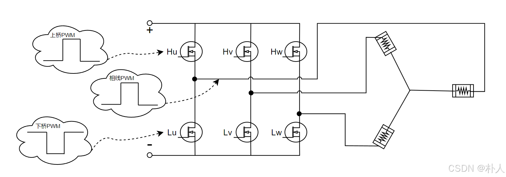
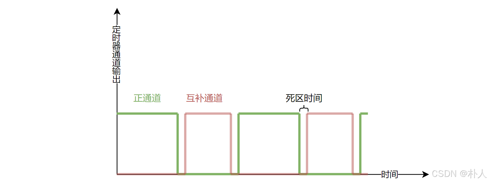
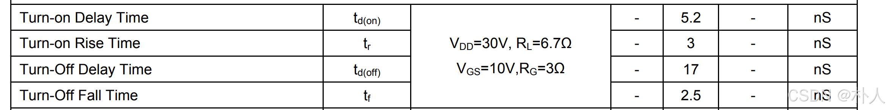
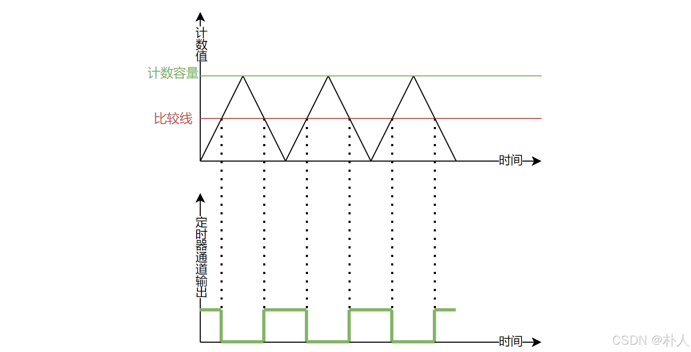
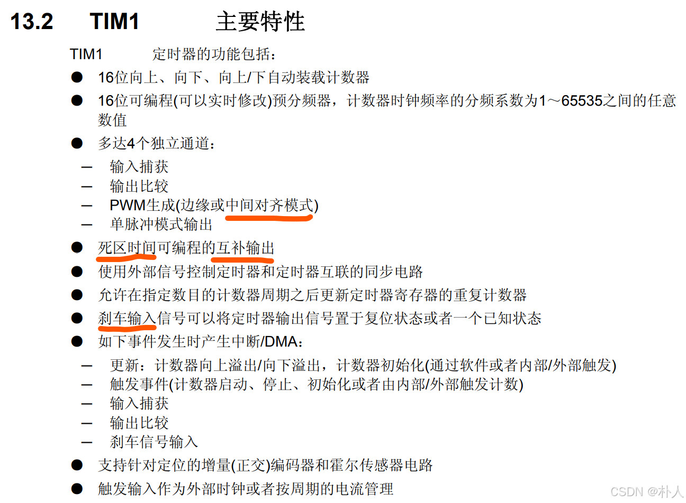
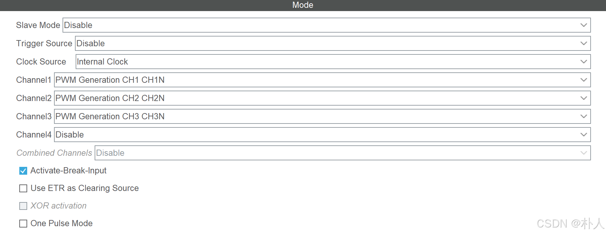
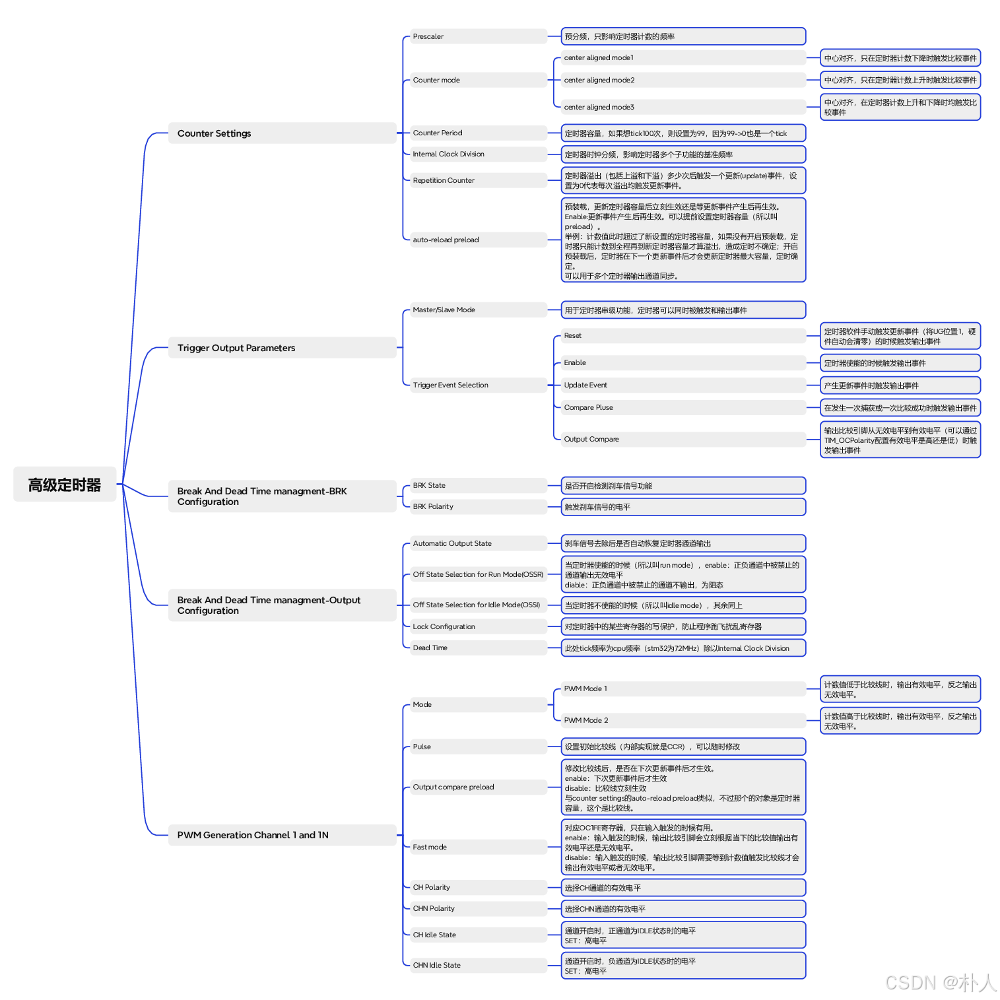
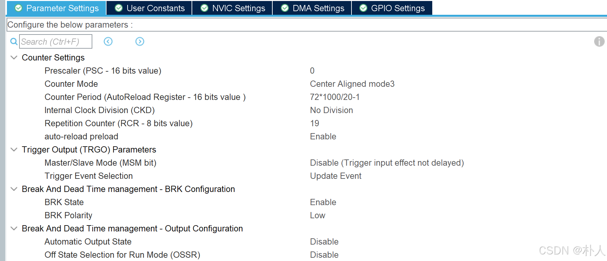
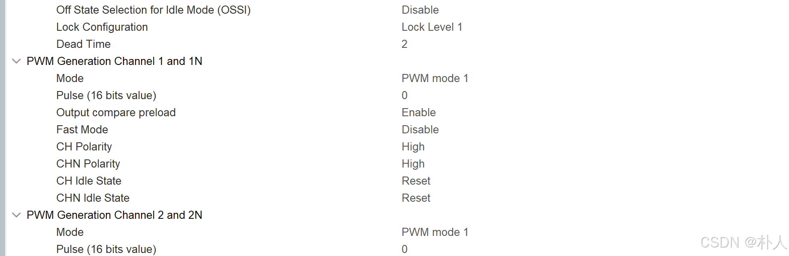
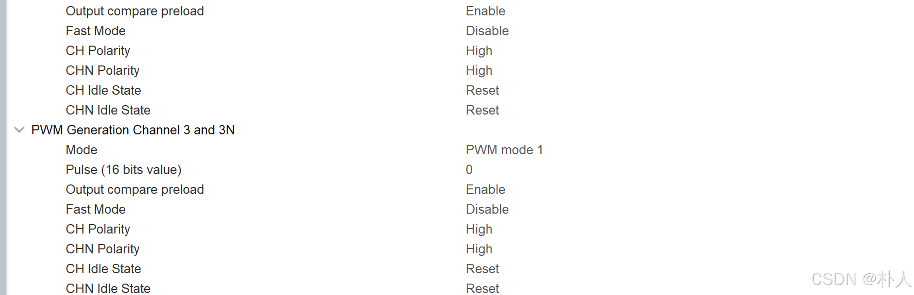

# 38 【从零开始实现stm32无刷电机FOC】【实践】【4/7 stm32高级定时器】

> 朴人 已于 2024-10-19 18:16:31 修改 阅读量8.2k 收藏 92 点赞数 35
> 文章链接：https://blog.csdn.net/qq570437459/article/details/140227714


-  [点击查看本文开源的完整FOC工程https://gitee.com/best_pureer/stm32_foc](https://gitee.com/best_pureer/stm32_foc) 

-  [配套硬件：点此前往查看](https://item.taobao.com/item.htm?id=839302894720) 

在完成理论方面的准备后，是可以进行写代码实现了，但是stm32单片机提供了不少可以用于电机控制的硬件外设，充分利用这些硬件资源，可以减少代码量以及提高运行性能。
本文使用的stm32型号为喜闻乐见的stm32f103c8t6，这个芯片的最小系统板价格低、使用量很高，适合学习无刷电机FOC使用。本文使用最流行的stm32cube+hal库配置硬件资源。
用于FOC的硬件外设最重要的两个是：1.高级定时器。2.adc外设的高级用法。本节介绍stm32高级定时器的用法。如果需要实现电机力矩控制，那么需要使用到adc外设。
查看电机控制电路原理图，可以看到6个输入口控制了6个功率管（半桥*3）的开关，继而控制电机相线。从前文理论部分可知，FOC最终控制的是半桥的相线PWM占空比，对应上下桥PWM示意图如下：
 

从上图看到，半桥的上功率管和下功率管不能同时导通，否则功率管会由于短路流经大量电流被烧毁（电机绕组有电阻在，不算短路），因此上下两个的功率管的PWM要求互补导通。由于功率管不是理想器件，导通和关断不是瞬间完成的，有上升和跌落的时间，因此在互补状态下还要提供一个死区时间防止开关过程中的上下同时导通。
互补PWM以及死区时间的示意图如下，
 

下图是MOS管NCE6005AS的开关时间，从图中看出，死区时间应该至少设置为17+2.5=19.5ns。
 

stm32的高级定时器在硬件层面提供了生成互补pwm输出功能以及死区功能。下图是定时器配置为上下计数模式的pwm产生示意图，定时器当前计数值与设定的比较线（值）的比较关系控制定时器通道的输出。示意图中虽然计数值低于比较线时输出高电平，但是是否低于比较线才输出以及输出高电平还是低电平都是可以配置的。
 

将上下功率管的控制引脚分别接到单片机pwm输出通道的正通道以及互补通道，即可实现自动互补pwm输出以及自动插入死区时间。注意，有些功率管驱动器（半桥驱动器，比如ir2104）自带上下桥互补输出以及自带死区插入，这样只需pwm正通道即可控制上下桥功率管，也不必开启单片机的死区功能了。
stm32的高级定时器硬件还提供了刹车功能，意思是当某个引脚被配置为刹车引脚后，输入有效信号时会终止pwm输出。这个刹车信号的来源需要自己定义，比如有些功率管集成芯片就提供了发生异常时输出电平信号的能力，也可以通过比较电路将电机总电流超过阈值后产生一个电平信号。
下图标注的为本节要使用到的配置的和电机控制相关的定时器功能。还有几个功能也与电机控制相关，但是不在本节介绍：图中重复计数器功能与adc有关，下节再进行介绍；图中的增量（正交）编码器功能与abz编码器信号有关，暂不介绍。
 

为了尽量完整地展示TIM1的用法，接下来的stm32cube配置开启了pwm互补输出功能，仅供学习参考，请自行根据电路实际情况删减配置。本文实际电路选用自带互补和死区的半桥驱动器，开启的配置项更少，可前往本文开头提到的git仓库查看配置项。
首先配置TIM1的模式，设置时钟源为内部时钟，设置通道为互补通道，设置刹车引脚：
 

接下来配置TIM1的参数，下图是stm32cube中关于高级定时器TIM1的参数选项解释：



根据选项说明，主要配置项为：

- 为了减少谐波，配置定时器计数模式为中心对齐模式，这样pwm波的有效输出在周期内都是对称的。

- 设置定时器计数容量为72*1000/20，也就是设置pwm频率为20KHz。

- 设置了重复计数器以及输出事件来源，这个是下节adc采样用的，这里先不介绍。

- 设置刹车引脚的电平以及死区时间。当配置项中的死区时间参数小于128时，实际产生的死区时间等于定时器计n个数的时间；当这个参数大于等于128时，实际产生的死区时间与定时器计n个数的时间有倍数关系。上下功率管实际所需死区时间很短，通常小于128个定时器计数时间，所以这里不用关心倍数关系。

- 设置互补pwm输出的极性CH Polarity和CHN Polarity，这指的是使功率管导通的控制引脚极性，比如上下桥都是nmos，那么都设置为High高电平。

- 设置pwm模式为mode1，当定时器计数值小于比较线时，输出有效电平。配置为mode1时，比较线和占空比能够直观匹配上，比如代码设置比较线为20%的计数容量，那么占空比就为20%。
   

   

   

从stm32cube生成代码后，在main函数的while(1)之前调用

```c
HAL_TIM_PWM_Start(&htim1, TIM_CHANNEL_1);
HAL_TIM_PWM_Start(&htim1, TIM_CHANNEL_2);
HAL_TIM_PWM_Start(&htim1, TIM_CHANNEL_3);
```

即可开启pwm输出。由于在定时器配置时设置初始比较值为0，因此此时各个通道的输出占空比为0，即没有输出。
通过调用

```c
__HAL_TIM_SET_COMPARE(&htim1, TIM_CHANNEL_1, 0.3*72*1000/20);
```

就可以设置pwm比较值，从而设置pwm的占空比，上面这个语句设置了pwm的占空比为30%。

---

本节对stm32高级定时器中可用于FOC控制的配置项进行了介绍，并尽量开启了TIM1的完整功能，请根据自己的电路环境以及配置项说明图进行配置项的删减，比如是否开启互补和死区功能、是否开启刹车功能、死区时间的修改等等。在本文完整的FOC工程中，由于本文的电路环境使用了自带互补和死区的半桥驱动器，没有开启互补、死区和刹车功能。
[点击查看本文开源的完整FOC工程](https://gitee.com/best_pureer/stm32_foc) 