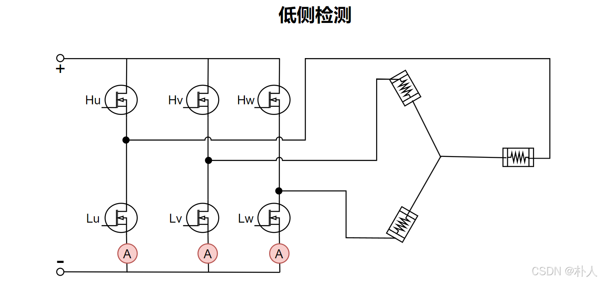
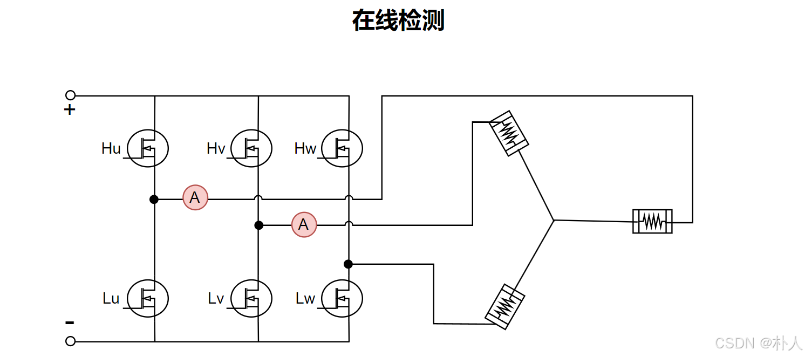
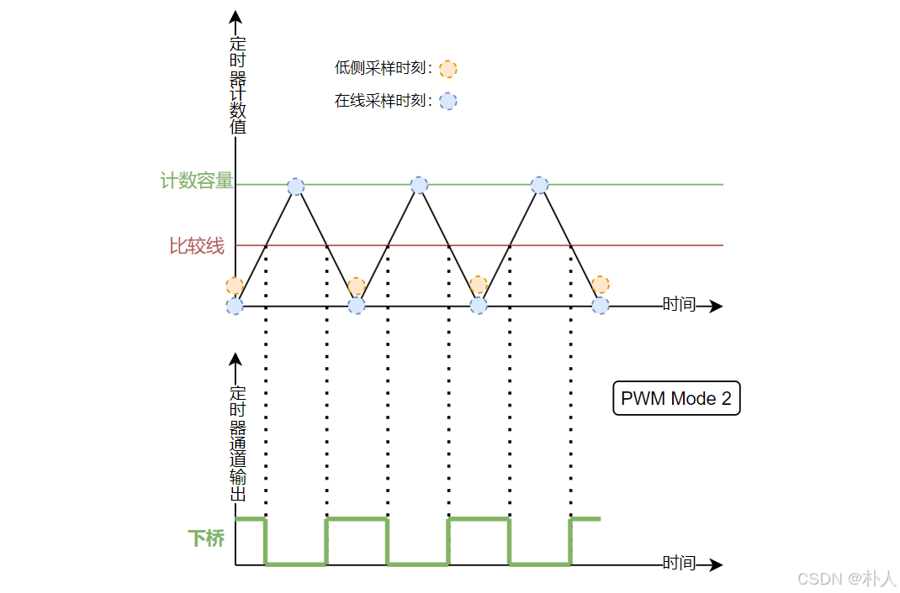
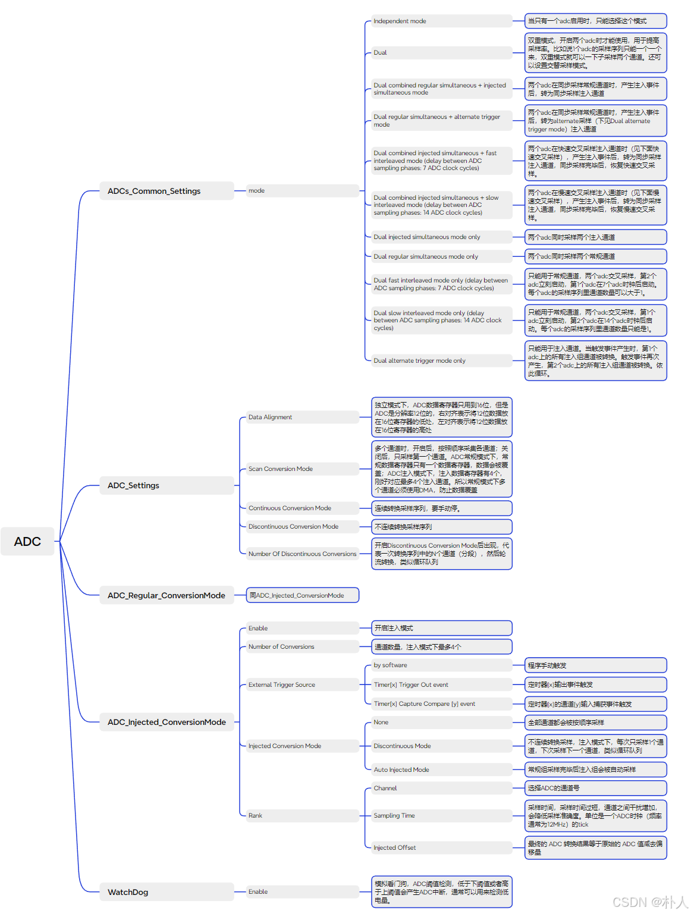
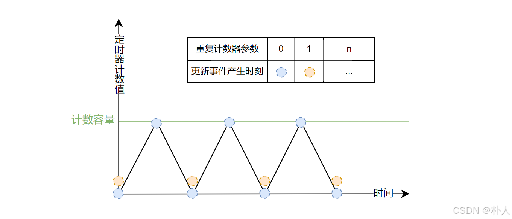
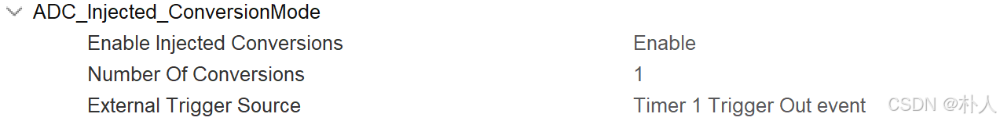
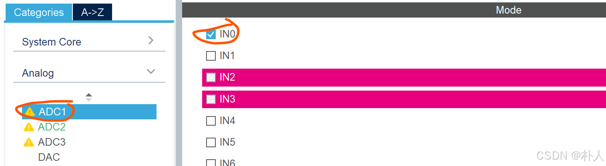
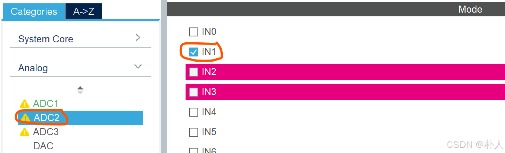
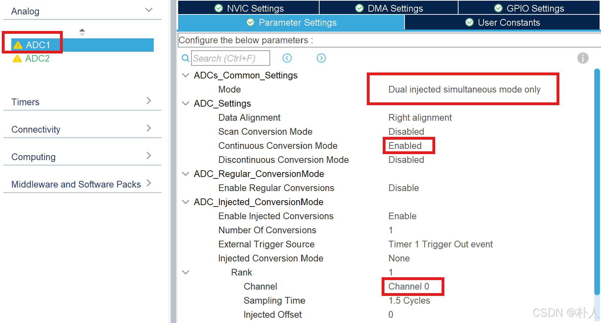
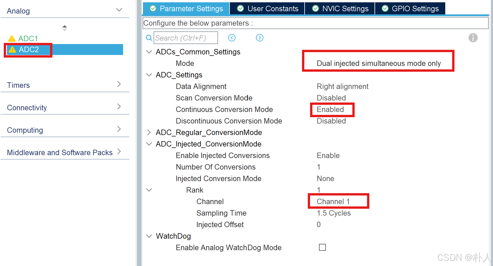

# 39 【从零开始实现stm32无刷电机FOC】【实践】【5/7 stm32 adc外设的高级用法】

> 朴人 已于 2025-03-30 13:05:02 修改 阅读量5.6k 收藏 88 点赞数 47
> 文章链接：https://blog.csdn.net/qq570437459/article/details/140229184

**目录**

[TOC]

-  [点击查看本文开源的完整FOC工程https://gitee.com/best_pureer/stm32_foc](https://gitee.com/best_pureer/stm32_foc) 

-  [配套硬件：点此前往查看](https://item.taobao.com/item.htm?id=839302894720) 

本节介绍的adc外设高级用法用于电机电流控制。
从前面几节可知，电机力矩来自于转子的q轴受磁力，而磁场强度与电流成正比，也就是说电机力矩与q轴电流成正相关，控制了q轴电流就是控制了电机力矩。从前文电流控制内容可知，q轴电流从三个相线电流计算得到，三个相线电流通过电流采样单元连接到stm32的adc接口得到。这里要注意，本文全文没有提到过dq轴电压或相线的电压，因为相线电阻会随着温度而改变，而电流才是决定磁场强度。

## 采样时刻

从电机控制电路来看，相线的电流采样并不是随时都适合采的。
首先看采样单元位于下桥的电路（低侧采样），当下桥关闭时，流经低侧电流采样单元的电流为0，而电机绕组是一个电感，其电流不能突变，电机相线实际是有电流存在的，因此低侧采样只能在下桥打开或者上桥关闭（互补PWM）的状态下进行，但是不要在功率管刚打开或者关闭的时刻采样，因为开关动作时电流存在波动。
回顾 [前文](https://blog.csdn.net/qq570437459/article/details/138871835) 推导SVPWM内容，我们使用的是七段式SVPWM，在一个PWM周期内加入了000零矢量以及111零矢量，因此不管功率管是低电平导通还是高电平导通，在一个PWM周期内总是都存在3个下桥功率管全导通的时段，只要在该时段中间进行采样即可。由于下桥长时间关闭时，低侧采样点完全没有电流流过，因此需要限制一下上桥最高占空比为90%，这样下桥至少留出10%的时间给电流采样。
 

再看采样单元位于相线的电路（在线采样），不管上下功率管是否关闭，由于采样单元位于相线，相线电感电流不能突变，因此始终有电流流过，照理说可以随时采样，但是功率管在刚打开或者关闭的时候（此时定时器计数位于比较线）电流会有波动，所以最好在定时器计数上下溢出时即pwm三角波极值点的时候采样，此时电流比较稳定。
 

总结上面分析的采样时刻示意图如下图，图中配置的PWM模式为Mode2（如果要想实现低侧采样，本文例程中心对齐模式为3的前提下，PWM模式为Mode1是不行的），可以查看 [上一节](https://blog.csdn.net/qq570437459/article/details/140227714) 关于高级定时器配置项的注释。
 

电机电流的采样时刻非常重要，但是如果不了解adc外设的高级用法，你虽然知道在应该哪个时刻采样电流，就会绕一个非常大的弯子去实现在特定时刻采样（比如煞费苦心地配置定时器中断或者精心设计一个延时从而尽可能在特定时刻进行采样，等等）。
在介绍采样方式前，先放出stm32cube中的adc配置项的解释，见下图：
 

## 触发采样

adc可以被定时器输出事件从硬件层面上触发采样，这样就可以自动在某些时刻进行采样了。这里要使用上节未进行介绍的高级定时器的重复计数器（Repetition Counter）以及输出事件（Trigger Event Selection）。adc外部触发源可以设置为定时器的输出事件，定时器每产生一个输出事件都会触发一次adc采样。定时器输出事件来源之一是定时器更新事件，定时器计数上下溢出可以产生定时器更新事件，重复计数器控制了定时器上下溢出多少次才产生一次定时器更新事件。中心对齐模式3的前提下，更新事件示意图如下：
 

对于在线采样，由于所有极值点都可以进行采样，因此重复计数器参数不管设置为多少都可以，只是影响到采样频率。
对于低侧采样，中心对齐模式、pwm模式、重复计数器的配置项需要精心设计，才能在下桥打开时间中间点被触发采样。中心对齐模式1、2、3会影响上下溢出时是否产生更新事件。pwm模式1或者模式2会影响采样时刻下桥的有效状态，举个例子，pwm模式2时，当定时器计数小于比较线时，下桥的pwm通道输出有效电平。在本文例程中心对齐模式3前提下，只有模式2才能实现低侧采样。
在stm32cube中，定时器触发adc采样功能需要设置高级定时器的配置项为：
 

 

adc通道分为两种，常规通道和注入通道，注入通道就是在常规通道采样时可以插队，注入通道采样完毕后，常规通道继续其未完成的采样。在stm32中，只有注入通道才能被高级定时器TIM1的输出事件触发，因此需要配置注入通道而不是常规通道：
 

## 同步采样

stm32的adc有多个通道对应多个IO口，有两种方式可以采集adc多个通道，分别是采样序列和同步采样。
**采样序列：** 
多个adc通道可以配置到采样序列中，当adc被定时器触发采样时，采样序列中的多个通道会按照序列顺序自动依次采样，整个序列采样完成后产生一个采样完成中断。但是这个采样方式的多个通道不是同时进行的，有先后顺序的，在采集电机电流时，总是希望几个相线电流能够同时被采样到，因此同步采样更加好。有些stm32的adc只有一个，只能采用采样序列方式。
**同步采样：** 
同步采样需要多个adc，配置为主adc和从adc。当主adc被定时器触发采样时，从adc也会同时进行采样，全部adc采样完成后产生一个采样完成中断。在stm32f1中，最多可以配置双adc同步模式；在stm32f4中，可以配置三adc同步模式。
以电机电流在线采样双采样单元为例，在stm32cube中，首先打开adc1的通道0和adc2的通道1，对应电路上的两个采样单元：
 

 

配置adc1为双同步注入模式，此时adc1即为主adc：
 

配置adc2：
 

stm32cube生成代码后，在main函数的while(1)前调用

```c
HAL_ADCEx_Calibration_Start(&hadc1);
HAL_ADCEx_Calibration_Start(&hadc2);
HAL_ADCEx_InjectedStart_IT(&hadc1);
HAL_ADCEx_InjectedStart(&hadc2);
```

开启双adc同步采样，配合定时器触发采样，就可以在硬件层面上实现特定时刻自动双adc同步采样。

---

至此，实现FOC的最重要的两个外设（定时器和adc）已经介绍完毕，你可以根据自己的电路环境，以及本文提供的stm32cube定时器和adc外设配置说明图，对配置项删减，尝试实现FOC控制。
你也可以等等再写代码，先了解一下接下来要介绍的cmsis-dsp库，因为反park变换、park变换、clark变换、pid控制器等等常用的功能，在cmsis-dsp库中都有。
[点击查看本文开源的完整FOC工程](https://gitee.com/best_pureer/stm32_foc) 