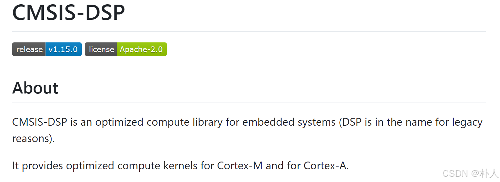
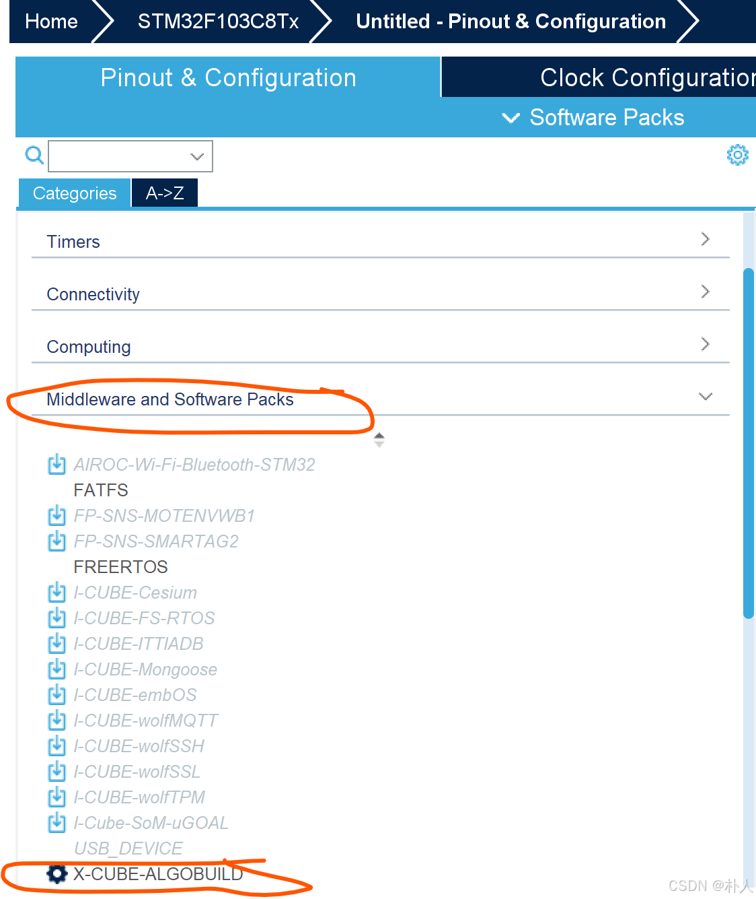
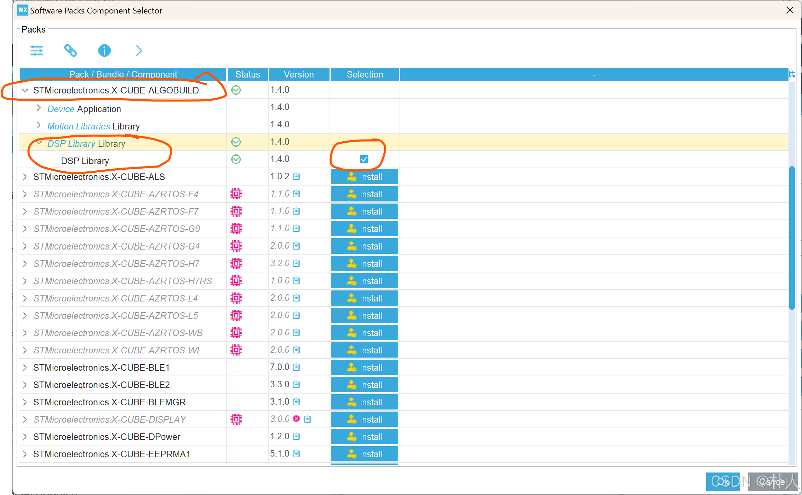
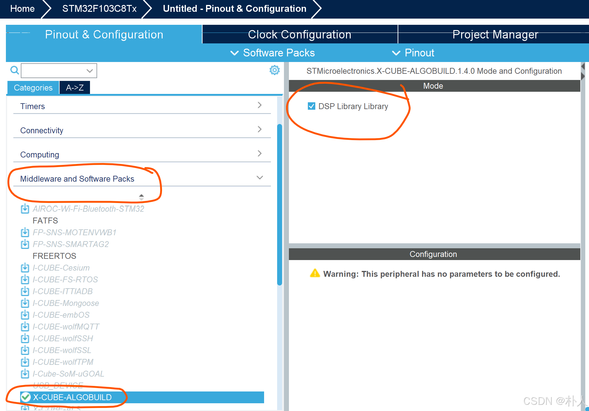

# 40 【从零开始实现stm32无刷电机FOC】【实践】【6/7 CMSIS-DSP】

> 朴人 已于 2025-02-17 13:42:21 修改 阅读量4.9k 收藏 57 点赞数 23
> 文章链接：https://blog.csdn.net/qq570437459/article/details/140478449

**目录**

[TOC]


[点击查看本文开源的完整FOC工程https://gitee.com/best_pureer/stm32_foc](https://gitee.com/best_pureer/stm32_foc) 
CMSIS-DSP库是ARM开源的、对ARM处理器优化的数学库，本文使用了其提供的三角函数、反park变换函数、park变换函数、clarke变换函数、PID控制器。
CMSIS-DSP原始代码仓库是 [https://github.com/ARM-software/CMSIS-DSP](https://github.com/ARM-software/CMSIS-DSP) ，官方对其的介绍是一个针对Cortex-M和Cortex-A内核优化的嵌入式系统计算库，此处的DSP不是指的硬件，而是数字处理的意思。
 

## 导入CMSIS-DSP库

本文使用stm32cube编译好的CMSIS-DSP二进制文件，首先在Middleware and Software Packs中选择X-CUBE-ALGOBUILD： 

选择安装DSP Library，并且勾选Selection，下图为已经安装好的状态：
 

勾选DSP Library Library：
 

到此，工程代码里就能够使用CMSIS-DSP库了，只需在要使用DSP库的C源文件加上

```c
#include "arm_math.h"
```

## 使用CMSIS-DSP

**三角函数：** 
单独计算sin和cos三角函数，输入弧度rad：

```c
  float32_t arm_sin_f32(float32_t x);
  float32_t arm_cos_f32(float32_t x);
```

单个函数完成计算sin和cos三角函数，输入角度deg：

```c
  /**
   * @brief  Floating-point sin_cos function.
   * @param[in]  theta   input value in degrees
   * @param[out] pSinVal  points to the processed sine output.
   * @param[out] pCosVal  points to the processed cos output.
   */
  void arm_sin_cos_f32(
        float32_t theta,
        float32_t * pSinVal,
        float32_t * pCosVal);
```

**clarke变换：** 

```c
  /**
   *
   * @brief  Floating-point Clarke transform
   * @param[in]  Ia       input three-phase coordinate <code>a</code>
   * @param[in]  Ib       input three-phase coordinate <code>b</code>
   * @param[out] pIalpha  points to output two-phase orthogonal vector axis alpha
   * @param[out] pIbeta   points to output two-phase orthogonal vector axis beta
   * @return        none
   */
  __STATIC_FORCEINLINE void arm_clarke_f32(
  float32_t Ia,
  float32_t Ib,
  float32_t * pIalpha,
  float32_t * pIbeta)
```

clarke变换是将三个相线电流投影到 $\alpha$ 和 $\beta$ 轴，由于三个相线电流相加等于0，因此只需要输入两个相线电流 `Ia` 和 `Ib` 到clarke变换函数中，输出到 `pIalpha` 和 `pIbeta` 。

**park变换：** 

```c
  /**
   * @brief Floating-point Park transform
   * @param[in]  Ialpha  input two-phase vector coordinate alpha
   * @param[in]  Ibeta   input two-phase vector coordinate beta
   * @param[out] pId     points to output   rotor reference frame d
   * @param[out] pIq     points to output   rotor reference frame q
   * @param[in]  sinVal  sine value of rotation angle theta
   * @param[in]  cosVal  cosine value of rotation angle theta
   * @return     none
   *
   * The function implements the forward Park transform.
   *
   */
  __STATIC_FORCEINLINE void arm_park_f32(
  float32_t Ialpha,
  float32_t Ibeta,
  float32_t * pId,
  float32_t * pIq,
  float32_t sinVal,
  float32_t cosVal)
```

park变换是将 $\alpha$ 和 $\beta$ 轴投影到dq轴，此处的 `sinVal` 和 `cosVal` 为转子角度的sin和cos值。

**反park变换：** 

```c
   /**
   * @brief  Floating-point Inverse Park transform
   * @param[in]  Id       input coordinate of rotor reference frame d
   * @param[in]  Iq       input coordinate of rotor reference frame q
   * @param[out] pIalpha  points to output two-phase orthogonal vector axis alpha
   * @param[out] pIbeta   points to output two-phase orthogonal vector axis beta
   * @param[in]  sinVal   sine value of rotation angle theta
   * @param[in]  cosVal   cosine value of rotation angle theta
   * @return     none
   */
  __STATIC_FORCEINLINE void arm_inv_park_f32(
  float32_t Id,
  float32_t Iq,
  float32_t * pIalpha,
  float32_t * pIbeta,
  float32_t sinVal,
  float32_t cosVal)
```

反park变换是将dq轴投影到 $\alpha$ 和 $\beta$ 轴，此处的 `sinVal` 和 `cosVal` 为转子角度的sin和cos值。

**PID控制器：** 
CMSIS-DSP库中的PID控制器是增量式PID计算累加到上一次的PID总输出。
位置式PID就是直观地分别将P、I、D控制器的各自输出加起来：

$$
u(t) = K_p e(t) + K_i \sum_{i=0}^{t} (e(i)*\Delta T) + K_d \frac{[e(t) - e(t-1)]} {\Delta T}

$$

为了方便计算，这里将 $\Delta T$ 当作为1，在 $K_i$ 和 $K_d$ 系数上缩放回去就好了。
增量式PID理念是将PID的输出是上次PID输出的基础上加上之前两次的累计误差：

$$
u(t) =u(t-1) +\Delta u(t)
$$

$$
\Delta u(t) = K_p e(t) + K_i \sum_{i=0}^{t} e(i) + K_d [e(t) - e(t-1)]\\ -(K_p e(t-1) + K_i \sum_{i=0}^{t-1} e(i) + K_d [e(t-1) - e(t-2)])\\ = K_p [e(t) - e(t-1)] + K_i e(t) + K_d [e(t) - 2e(t-1) + e(t-2)]\\ = A_0⋅e[t]+A_1⋅e[t−1]+A_2⋅e[t−2]\\ 其中 \begin{cases} A_0=K_p+K_i+K_d\\ A_1=-K_p-2K_d\\ A_2=K_d \end{cases}
$$

$A_0，A_1，A_2，本次误差e[t]，上次误差e[t-1]，上上次误差e[t-2]，上一次的PID输出u(t-1)$ 均为已知数，增量式PID的输出 $u(t)$ 也就能够计算出来了。
从增量式PID公式 $\Delta u(t) = K_p [e(t) - e(t-1)] + K_i e(t) + K_d [e(t) - 2e(t-1) + e(t-2)]$ 可以看出，当被控参数突然受到大的扰动时，不像位置式PID的P项 $K_p*e(t)$ 会产生一个大的输出，增量式PID的 $K_p [e(t) - e(t-1)]$ 输出是不大的，因此增量式PID对被控参数变化的输出比较平滑，不会突变，当然响应没有位置式PID快。
在代码上，首先需要创建一个PID控制器：

```c
arm_pid_instance_f32 pid_position;
```

然后设置PID控制器的PID参数：

```c
pid_position.Kp = 1.2;
pid_position.Ki = 0.01;
pid_position.Kd = 2.1;
```

然后调用函数初始化PID控制器：

```c
/**
 * @brief  Initialization function for the floating-point PID Control.
 * @param[in,out] *S points to an instance of the PID structure.
 * @param[in]     resetStateFlag  flag to reset the state. 0 = no change in state & 1 = reset the state.
 * @return none.
 * \par Description:
 * \par
 * The <code>resetStateFlag</code> specifies whether to set state to zero or not. \n
 * The function computes the structure fields: <code>A0</code>, <code>A1</code> <code>A2</code>
 * using the proportional gain( \c Kp), integral gain( \c Ki) and derivative gain( \c Kd)
 * also sets the state variables to all zeros.
 */

void arm_pid_init_f32(
  arm_pid_instance_f32 * S,
  int32_t resetStateFlag)
```

其中参数 `resetStateFlag` 为0时，会清空PID控制器内部保存的增量式数据： $e[n],e[n-1],e[n-2]$ 。
一般初始化的用法是：

```c
arm_pid_init_f32(&pid_position, false);
```

此时就能够调用函数计算PID输出值了：

```c
  /**
   * @brief         Process function for the floating-point PID Control.
   * @param[in,out] S   is an instance of the floating-point PID Control structure
   * @param[in]     in  input sample to process
   * @return        processed output sample.
   */
  __STATIC_FORCEINLINE float32_t arm_pid_f32(
  arm_pid_instance_f32 * S,
  float32_t in)
```

其中参数 `S` 是PID控制器，参数 `in` 是被控参数的差值，返回PID控制器的输出值。

---

至此，所有准备工作就绪，我们了解了理论推导、FOC特定外设的配置和数学库的使用，接下来进入到从零开始实现stm32无刷电机FOC的完整工程讲解。
[点击查看本文开源的完整FOC工程https://gitee.com/best_pureer/stm32_foc](https://gitee.com/best_pureer/stm32_foc) 