# 41 【从零开始实现stm32无刷电机FOC】【实践】【7.1/7 硬件设计】

> 朴人 已于 2025-06-08 23:27:36 修改 阅读量7.8k 收藏 89 点赞数 46
> 文章链接：https://blog.csdn.net/qq570437459/article/details/142188225

**目录**

[TOC]

-  [点击查看本文开源的完整FOC工程https://gitee.com/best_pureer/stm32_foc](https://gitee.com/best_pureer/stm32_foc) 

-  [配套硬件：点此前往查看](https://item.taobao.com/item.htm?id=839302894720) 

为了承载和验证本文的FOC代码工程，本节设计了一个简易的三相无刷电机 [硬件套件](https://www.goofish.com/item?id=839277963299) ，主控采用非常常用的stm32f103c8t6单片机，电机编码器采用MT6701，电机采用22xx系列云台电机，驱动电路采用集成驱动芯片MS8313/DRV8313，电流传感器采用INA199A1在线采样。
该 [硬件套件](https://www.goofish.com/item?id=839277963299) 使用无工具快拆装设计，到手即可直接快速手拧安装拆卸。
接下来对各个模块进行设计讲解：

## stm32电路

stm32f103c8t6可以说是学习stm32中最热门和常见的一颗芯片，网络上的配套资料非常丰富，某宝上的成品最小系统板的价格也非常便宜（当你不确定是电路问题还是代码问题时，可以快速地低成本地使用最小系统板进行验证），本文使用其作为主控芯片。
如果你自行进行芯片选型时，注意不要选择同样热门的stm32f103c6t6，实测Flash容量不足以运行本文的FOC代码。

-  **晶振电路** 
  该电路是单片机运行的必要条件：
   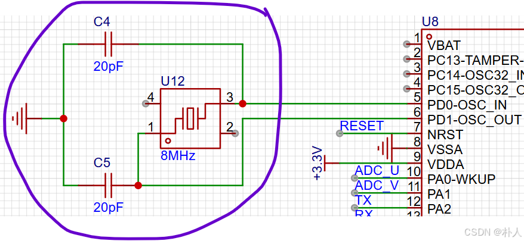

-  **boot选择电路** 
  该电路非必须，但是最好保留，以防万一程序里将烧录引脚当成普通IO口进行了控制，导致无法通过J-Link、DAPLink等进行烧录，而只能使用ISP烧录。stm32的boot0和boot1引脚输入可以控制程序启动方式，对应关系如下：

| boot0电平 | boot1电平 | 启动方式 |
|:---:|:---:|:---:|
| 0 | 任意 | 正常启动，即在主flash启动 |
| 1 | 0 | 芯片出厂时自带一个bootloader用于串口烧录程序，启动该bootloader程序，即ISP烧录 |
| 1 | 1 | 在ram启动 |

一般不使用在ram启动，因此从上表来看，只需要将boot1直接接地，控制boot0位的输入电平，即可使用ISP烧录。
 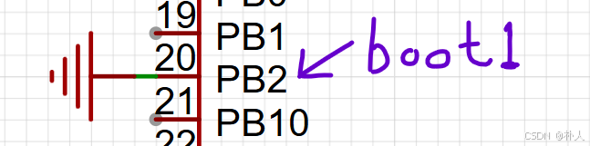

将boot0下拉处理，实现默认输入为0，默认正常启动：
 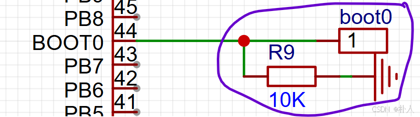

-  **SWD调试信号** 
  单片机烧录调试可选择SWD接口或JTAG接口，JTAG除了电源线需要接入JTCK引脚、JTDI引脚、JTDO引脚、JTMS引脚，而SWD除了电源线只需要接入SWCLK引脚和SWDIO引脚，常用的J-Link、DAPLink等调试器都支持SWD接口。本文使用SWD接口并且使用超低成本的开源调试器DAPLink。该调试电路直接引出即可：
   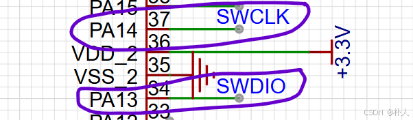

-  **复位电路** 
   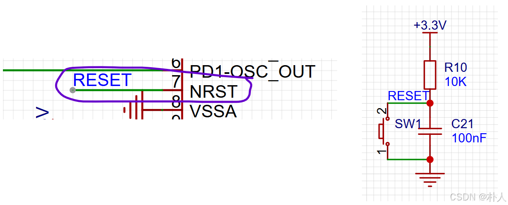

-  **LED电路** 
  放置一个IO控制的LED灯，方便程序里某些情况下用作指示灯。
   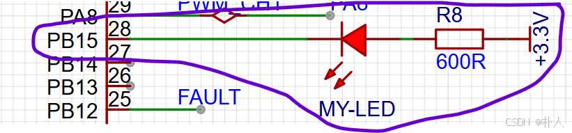

-  **PWM输出信号** 
  用于输出FOC产生的PWM信号到电机驱动桥，直接引出即可。本文的硬件套件电路板将该三个信号引出方便接示波器，同时这里的PA9和PA10也是ISP烧录的引脚。
   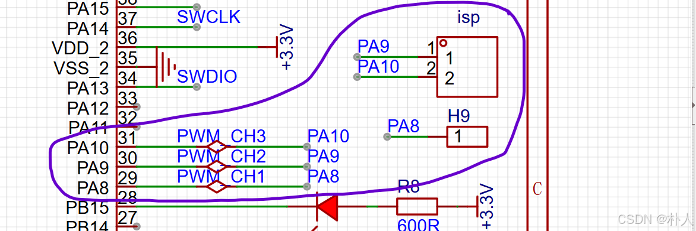

  接入PWM的刹车引脚：
   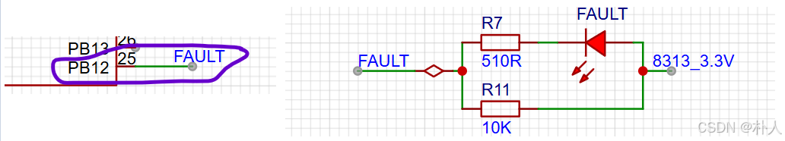

-  **SPI信号** 
  用于读取MT6701磁编码器，直接连线即可。
   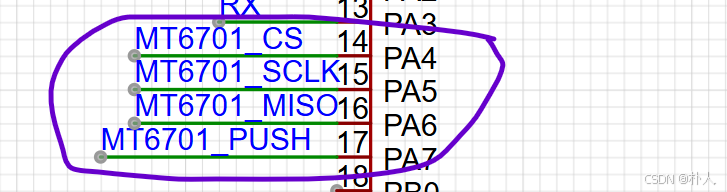

-  **调试串口信号** 
  一个串口用于调试，直接引出即可。
   

-  **ADC信号** 
  用于电流采样信号采集，直接连线即可，注意ADC外设的通道是对应固定引脚的，不能随便接。
   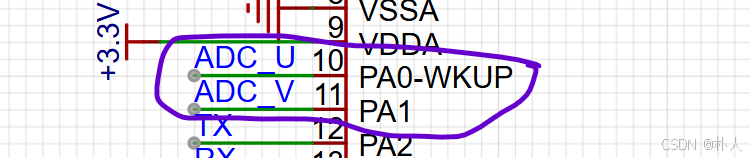

## 磁编码器电路

本文使用MT6701磁编码器，该编码器价格比常用的AS5600稍贵，但是支持SPI角度读取。
经过我实测，stm32f1系列的I2C外设确实存在硬件bug，使用硬件I2C读取AS5600时，经常会陷入busy状态，因此本文使用支持SPI读取的MT6701。
MT6701供电电压可以是3.3V或者5V，这里使用了5V进行供电，因为MT6701数据手册中有写：要操作内部EEPROM时，供电电压在4.5V到5V之间。不过一般也不操作内部EEPROM，操作内部EEPROM需要使用I2C方式，由于这里使用了SPI接口，万一要操作时请使用软件I2C。
 

 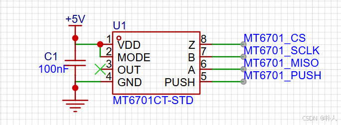

## 电机驱动电路

为了方便学习验证FOC算法，本文选择集成驱动芯片MS8313/DRV8313，该芯片内部有3个半桥驱动以及保护电路，可以减少对驱动设计的要求以及防止损坏器件。
该芯片自带的过流保护和相线短路保护非常有用，如果使用MOS管搭建的驱动桥进行驱动，在刚开始学习验证FOC算法的时候，比较容易烧毁MOS管，我就烧毁过MOS管好几次。
但是该芯片驱动电流不是很高，每个电机相线最高峰值输出2.5A电流，对于学习验证阶段足够了。
 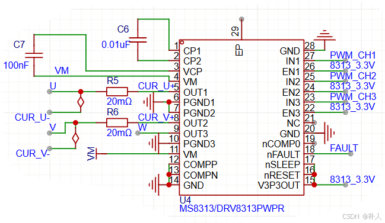

## 电流采样电路

为了方便在定时器任意溢出时刻采样，将电流采集位置设计在电机相线上，采样时刻请查看 [前文（adc外设的高级用法）](https://blog.csdn.net/qq570437459/article/details/140229184) 。
电流采样是放大采样电阻两端电压后输入单片机ADC引脚，再根据欧姆定律反算得到的。例如假设：

- 运算放大器放大倍数是50倍，输出大于1.65V代表正向电流，小于1.65V代表负向电流。

- 采样电阻是0.02Ω。

- 单片机ADC读到的电压是0.65V。
  那么流经该相线的电流为(1.65-0.65)/50/0.02=1A。

本文电流传感器选择INA199系列，该电流传感器相对于更常用INA240系列的价格低很多，INA240大约是10+元一片，INA199具有26V的共模电压，采集相线上的采样电阻两端电压没有问题，就是参考电压需要输入1.65V会麻烦一点。
这里选择INA199A1，放大倍数是50倍。
 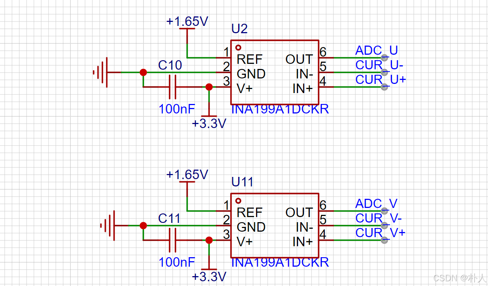

 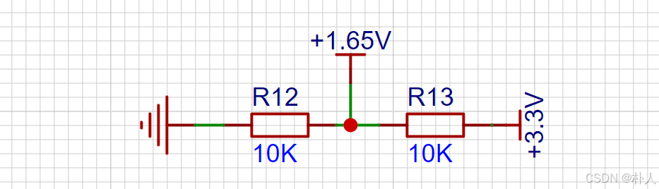

## 电机选择

由于MS8313/DRV8313驱动电流有限，因此最好选择绕组电阻高一点（线电阻10Ω以上）的电机，不要使用航模电机，这里使用2208云台电机。云台电机与航模电机主要的区别就是绕组铜线匝数不一样，云台电机匝数多、绕组电阻大、磁感应强度大、扭矩大，大概小于200KV的航模电机也就能称为云台电机了。
经过我的测试，使用1000KV的2208航模电机在MS8313/DRV8313驱动下，位置环的力矩比较微弱，速度环勉强能运行，总之不适合MS8313/DRV8313驱动，当然由于MS8313/DRV8313自带过流保护，因此使用很低绕组电阻的航模电机也不会烧毁驱动。
下图左边是2208云台电机，右边是2208航模电机：

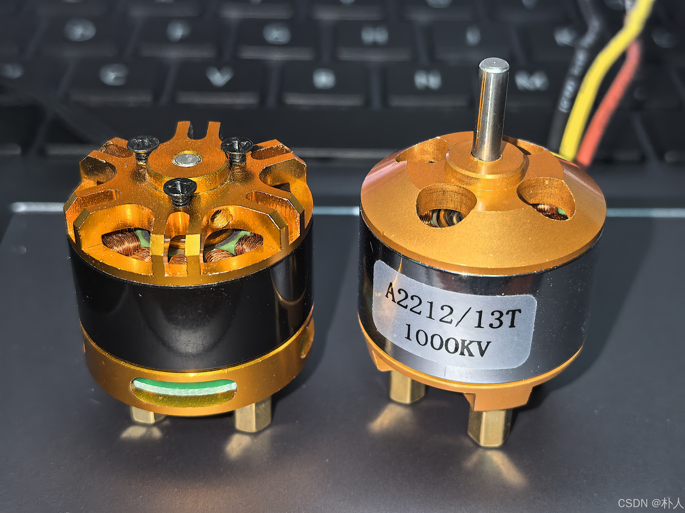

## 本文示例硬件说明

为了学习验证本文的FOC算法，我按照上述电路设计了一个简单的集成了磁编码器、电机驱动、单片机的 [ALL-IN-ONE验证板](https://www.goofish.com/item?id=839277963299) 。 [点此链接前往查看。](https://item.taobao.com/item.htm?id=839302894720) 

- 支持位置环、速度环、电流环（力矩环）。

- 无需接线，无需找对应引脚，安装好电机后，只需外接一根电源线和一根Type-C线（使用适配DAPLink），盲插即可工作。

- 使用全手拧设计，全程无需螺丝刀等工具，到手即可快速手拧安装和拆卸。

- 引出多个接口：磁编码器的SPI接口、三相PWM信号线、多个低压电源口，方便抓取波形等操作。

- 可适配实验用平台底座，电机调试过程中底座稳定不摇晃。

- 自带电机电源开关，一键关闭电机电源，及时制止失控。
   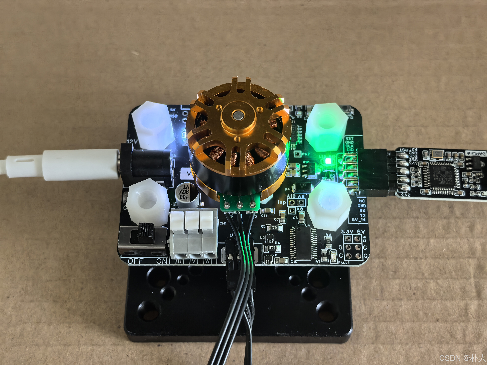

