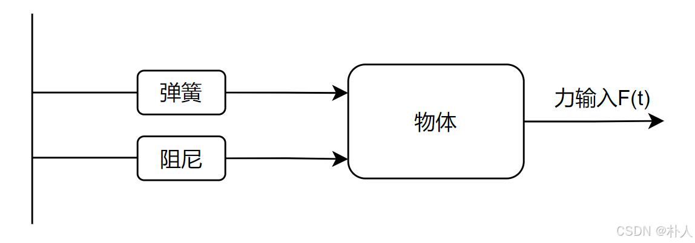

# 43 【卡尔曼滤波理论推导与实践】【理论】【2/5 状态空间方程】

> 朴人 已于 2025-05-20 18:34:24 修改 阅读量1.1k 收藏 12 点赞数 25
> 文章链接：https://blog.csdn.net/qq570437459/article/details/144578615

**目录**

[TOC]

将卡尔曼滤波核心思想钉在开头：

> 用测量值修正系统模型值，得到当前轮次的最优估计值。再将该最优估计值当作下一轮的系统模型输入，继续进行下一轮的最优估计，如此迭代进行。

测量值是我们测量得到的，这个是已知的。系统模型现在还没有建模，本节建立系统模型，系统模型值就是系统模型计算得到的值。为了避免迷失在公式推导的海洋中，请【牢记】本节的目标：搞明白系统模型。

---

### 系统模型描述了什么？

描述了上一轮次的状态与本轮次状态的转换关系。比如说我们关注一个在旋转过程中的电机角度和速度这两个量，每轮次的角度 $\theta$ 和速度 $\omega$ 打包看作一个【状态】。在没有外力的情况下，【 $\theta_k=\theta_{k-1}+\Delta{t}*\omega_{k-1}$ 】【 $\omega_k=\omega_{k-1}】$ ，这就是系统模型所谓的【描述了上一轮次的状态与本轮次状态的转换关系】。当然这个转换关系通常会写成矩阵形式，叫做状态转移方程。这个就是简单的系统模型。

### 弹簧阻尼质量块模型

在有外力情况下，系统模型怎么样的呢？大部分情况下，会使用弹簧阻尼质量块这个模型进行分析，大部分物理现象被抽象概括成这个模型，当然不一定准确，但是具有一定的普适性。
 

该模型描述有一个物体，连接着弹簧，受阻尼影响，受到一个外力。只建模到二阶量，即物体的位移、速度、加速度，分别是位移对时间的零阶、一阶、二阶导数： $x^{(0)},x^{(1)},x^{(2)}$ 。由于只描述到二阶量，因此也叫做二阶系统。
记系统中物体质量为 $M$ ，阻尼系数为 $D$ ，弹簧系数为 $K$ ，这些是人为给定的常数。阻尼力的公式为 $F=-D*x^{(1)}$ ，弹簧力的公式为 $F=-K*x^{(0)}$ 。

目标是求出这个模型的状态转移方程。

##### 状态转移方程

从受力分析 $F_总=ma$ 可以得到他们之间的关系：

$$
F(t)-D*x^{(1)}-K*x^{(0)}=M*x^{(2)}
$$

这是一个二阶微分方程。
由于一阶微分表述的是当前量与当前量的导数的关系，离散后具有有迭代的性质，符合状态转移理念，因此我们要想办法将上面这个二阶微分方程转换为一阶微分方程，当然二阶量就无法作为状态的一员了。
$令z_1=x^{(0)},z_2=x^{(1)}$ ，这样即可转换为一阶微分方程：

$$
F(t)-D*z_2-K*z_1=M*z_2^{(1)}
$$

经过转换后， $z_1,z_2$ 就是系统的状态了。为了书写简洁，将这两个z写成向量形式：

$$
\vec{z}=\left[\begin{matrix}z_1\\z_2\end{matrix}\right]

$$

有了一阶微分方程后，就可以进行离散化得到状态转移方程。接下来想办法创造出前后状态之间的迭代的形态。
先整理成表达式左边是 $⃗\vec{z}$ 的一阶量，右边是 $⃗\vec{z}$ ，方便后续离散化。

$$
\begin{cases}z_1^{(1)}=z_2\\z_2^{(1)}=\frac{F(t)-D*z_2-K*z_1}{M}=-\frac{K}{M}*z_1-\frac{D}{M}*z_2+\frac{F(t)}{M}\end{cases}

$$

再写成矩阵形式：

$$
\left[\begin{matrix}z_1^{(1)}\\z_2^{(1)}\end{matrix}\right]=\left[\begin{matrix}0&1\\-\frac{K}{M}&-\frac{D}{M}\end{matrix}\right]\left[\begin{matrix}z_1\\z_2\end{matrix}\right]+\left[\begin{matrix}0\\\frac{1}{M}\end{matrix}\right]*F(t)

$$

现在可以进行离散化了，写成离散形式， $\Delta{t}$ 是常数，来自于程序员自己设定的定时器：

$$
\frac{\vec{z_{k}}-\vec{z_{k-1}}}{\Delta{t}}=\left[\begin{matrix}0&1\\-\frac{K}{M}&-\frac{D}{M}\end{matrix}\right]\vec{z_{k-1}}+\left[\begin{matrix}0\\\frac{1}{M}\end{matrix}\right]*F_{k-1}

$$

$⃗\vec{z_{k-1}}$ 通通挪到右边去，左边只剩 $⃗\vec{z_k}$ ，状态转移方程这不就出来了：

$$
\vec{z_{k+1}}=(\left[\begin{matrix}0&1\\-\frac{K}{M}&-\frac{D}{M}\end{matrix}\right]+\mathrm{I})*\Delta{t}*\vec{z_k}+\left[\begin{matrix}0\\\frac{1}{M}\end{matrix}\right]*\Delta{t}*F_k

$$

将上式的常数包装成矩阵，使公式更加简洁：

$$
\vec{z_k}=\mathrm{A}*\vec{z_{k-1}}+\mathrm{B}*F_{k-1}

$$

至此，弹簧阻尼质量块模型的状态转移方程推导完毕。 $⃗\vec{z_0}$ 可以人为给定。

##### 测量方程

测量也是有方程的，测量方程比较简单，如下所示。这里的 $H_?$ 就类似于电流互感器倍数的角色，很多时候就是1； $y_?$ 就是直接测到的值。

$$
\begin{cases}y_1=H_1*z_1\\y_2=H_2*z_2\end{cases}
$$

写成矩阵形式：

$$
\vec{y_k}=\mathrm{H}*\vec{z_k}

$$

##### 状态空间方程

【状态转移方程】和【测量方程】组合起来就叫做【状态空间方程】，描述了整个数学模型：

$$
\begin{cases}\vec{z_k}=\mathrm{A}*\vec{z_{k-1}}+\mathrm{B}*F_{k-1}\\\vec{y_k}=\mathrm{H}*\vec{z_k}\end{cases}

$$

其中 $\mathrm{A}$ 称为状态转移矩阵或状态矩阵， $\mathrm{B}$ 称为控制矩阵， $\mathrm{H}$ 称为观测矩阵。
结合到卡尔曼滤波理念----将上轮估计值作为本轮的系统模型输入，记系统模型输出为 $⃗\vec{z_{k模}}$ （也叫做 **先验** 值），上轮估计值为 $⃗\vec{z_{k-1估}}$ （也叫做 **后验** 值），直接测量值 $⃗\vec{y_{k测}}$ ，状态测量值 $⃗\vec{z_{k测}}$ ，写成表达式：

$$
\begin{cases}\vec{z_{k模}}=\mathrm{A}*\vec{z_{k-1估}}+\mathrm{B}*F_{k-1}\\\vec{y_{k测}}=\mathrm{H}*\vec{z_{k测}}\end{cases}

$$

### 真实世界模型

显然，状态空间方程是理想化的数学建模，真实世界是存在噪声的。系统模型本身建模不一定贴切，存在噪声；测量过程也存在噪声。
我们简单地将噪声建模为正态分布。记每轮次系统模型噪声值为 $⃗\vec{w_k}$ ，每轮次测量噪声值为 $⃗\vec{v_k}$ ，真实状态值为 $⃗\vec{z_{k真}}$ ，真实测量值为 $⃗\vec{y_{k真}}$ 。由于直接测量出来的就是真实测量值，因此 $\vec{y_{k真}}=\vec{y_{k测}}
$ 。加入噪声后的状态空间方程为：

$$
\begin{cases}\vec{z_{k真}}=\mathrm{A}*\vec{z_{k-1真}}+\mathrm{B}*F_{k-1}+\vec{w_{k-1}}\\\vec{y_{k测}}=\mathrm{H}*\vec{z_{k真}}+\vec{v_k}\end{cases}

$$

这里出现了多处数学模型上的不准确，分别是：将系统模型笼统地建模为弹簧阻尼质量块系统，这是不准确的；很多场景测量模型不是线性倍数关系，在那些场景下是不准确的；将噪声模型笼统地建模为正态分布，这是不准确的。这几处不准确不在标准卡尔曼滤波考虑范围内，这也是为什么会出现很多改进的滤波方法。

---

至此，系统模型已经搞定了，我们可以计算得到每轮次的系统模型值。卡尔曼滤波核心思想中还剩下【修正】这个概念没有推导出来，下节进行推导，这也是卡尔曼滤波最精髓的一部分。