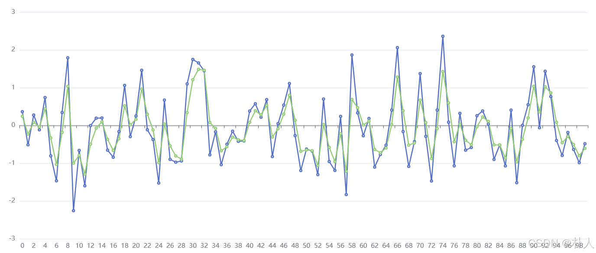
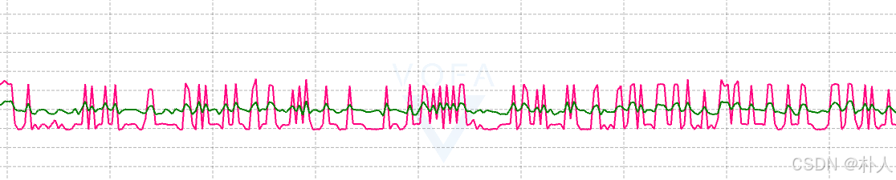

# 47 【卡尔曼滤波理论推导与实践】【理论】【5/5 实践】

> 朴人 已于 2024-12-22 15:21:55 修改 阅读量955 收藏 20 点赞数 26
> 文章链接：https://blog.csdn.net/qq570437459/article/details/144580928

**目录**

[TOC]


#### 纯数据测试

以下是一组用于测试卡尔曼滤波效果的随机数，数据符合正态分布：

```c
float data[100] = {
    0.363862, -0.513862, 0.274995, -0.116705, 0.737538, -0.805855, -1.466861, 0.341686, 1.790097, -2.256973, -0.660804, -1.599156, -0.005046, 0.192808, 0.197730, -0.655214, -0.843492, -0.164128, 1.059953, -0.297467, 0.250578, 1.461144, -0.116109, -0.372906, -1.525109, 0.671173, -0.898717, -0.974049, -0.941133, 1.099297, 1.747304, 1.654461, 1.447078, -0.779911, -0.169738, -1.040344, -0.497227, -0.153408, -0.421740, -0.411828, 0.380917, 0.573127, 0.218011, 0.684942, -0.825562, 0.046687, 0.538140, 1.110051, -0.270661, -1.193754, -0.625245, -0.680311, -1.302749, 0.698607, -0.956332, -1.191621, 0.239516, -1.829948, 1.865713, 0.333165, -0.274085, 0.184411, -1.103641, -0.770997, -0.522408, 0.405664, 2.060596, -0.162643, -1.085030, -0.428954, 1.372273, -0.288994, -1.471486, 0.407071, 2.360732, 0.085634, -1.071266, 0.320299, -0.654719, -0.584019, 0.257440, 0.382700, 0.036487, -0.900200, -0.517771, -1.073011, 0.406082, -1.517588, 0.001986, 0.548289, 1.553179, -0.061153, 1.434410, 0.764319, -0.398311, -0.795418, -0.186323, -0.636652, -0.986078, -0.484984
};
```

对于一维数据来说， $\mathrm{A},\mathrm{H},\mathrm{Q},\mathrm{R},\mathrm{G}$ 这些矩阵都只有一维，退化成一个数了，协方差矩阵退化成方差了。
只关注了一个处于稳定态的数据，系统模型中状态都没变化，状态转移矩阵 $\mathrm{A}$ 就是1， $\mathrm{B}$ 就是0。
测量矩阵 $\mathrm{H}$ 是1。
系统模型噪声协方差矩阵 $\mathrm{Q}$ 和测量噪声协方差矩阵 $\mathrm{R}$ 是人为设定的，就和pid一样是需要人工调节的参数，如果设定的好，那么就符合现实世界的噪声模型，滤波效果自然就好。待会直接都设置为1看一下滤波效果。
既然很多都是1，写成C语言就是下面这个代码了：

```c
//input:测量值
//r:模型噪声的方差
//q:测量噪声的方差
float kalman_filter_std(float input, float r, float q)
{
    static float z;
    static float p = 1;
    float g = 0;
    //p=A*p*trans(A); //因为A是1,所以省略
    p = p + q;
    g = p / (p + r);
    z = z + g * (input - z);
    p = (1 - g) * p;
    return z;
}
```

进行卡尔曼滤波实验测试

```clike
int main(int argc, char **argv) {
    for (int i = 0; i < sizeof(data)/sizeof(data[0]); i++) 
	    printf("%f,",kalman_filter_std(data[i],1,1));
}
```

得到如下结果，图中蓝色数据为原始数据，绿色数据为滤波后的数据，可以看到绿色数据波动更小。
 

#### 电机速度数据测试

对 [【从零开始实现stm32无刷电机FOC系列】](https://blog.csdn.net/qq570437459/article/details/142188261) 文章中的电机进行电机速度数据滤波测试，设置为纯电流控制模式，对速度进行卡尔曼滤波，设置了 `r=1,q=0.15` ，结果如下图，红色数据为测量出来的电机速度，绿色数据为卡尔曼滤波之后的速度。
 

---

至此卡尔曼滤波的推导和简单实践已经结束。卡尔曼滤波要人工调节的参数包括初值、Q、R，就和调PID参数一样，要调出一个好的参数还是不容易的，调参属于另一门学问了，受限于我能力不够，请自行在网络上搜索。