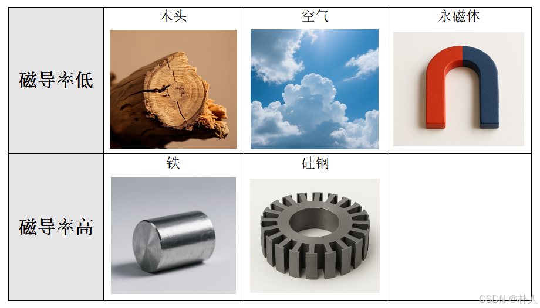
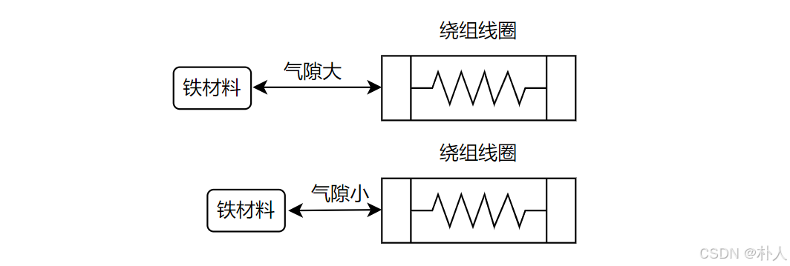
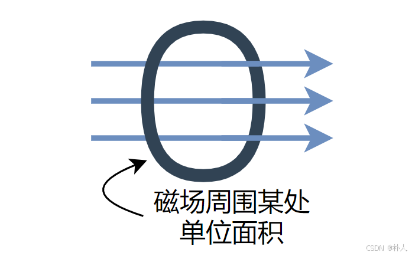
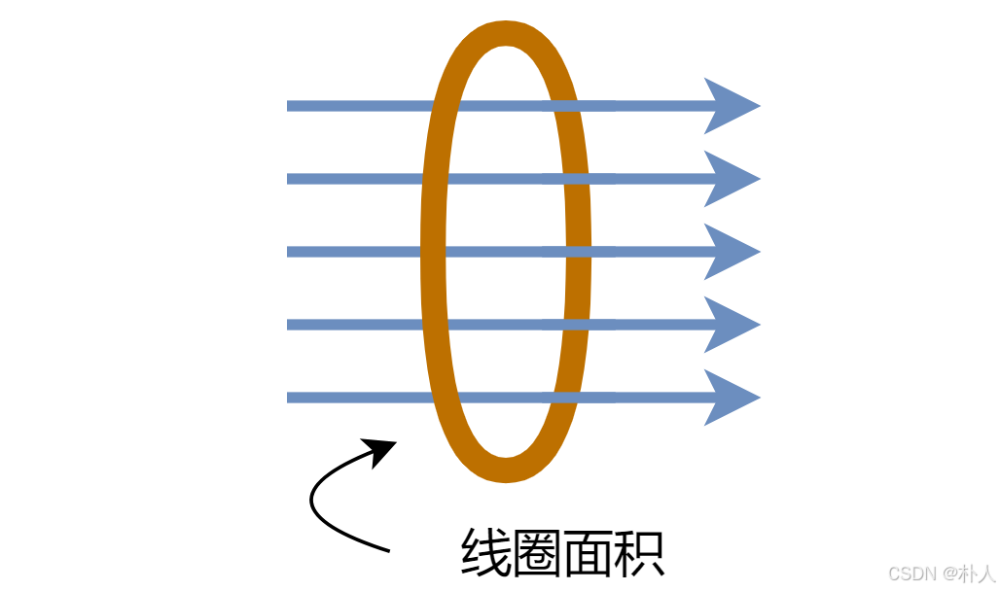
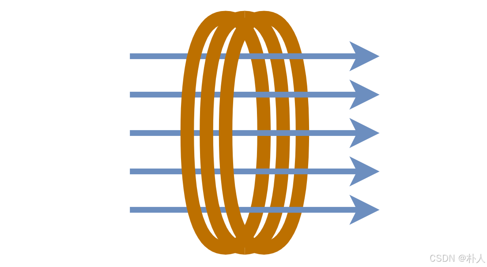
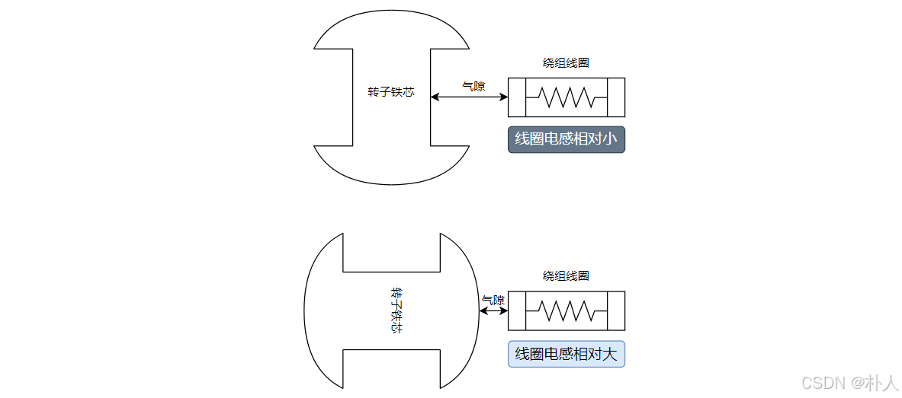
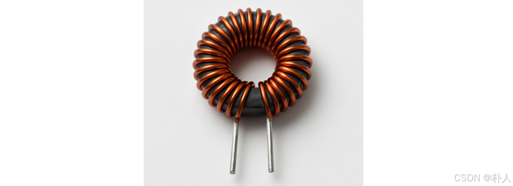

# 51 【无刷电机FOC进阶基础准备】【02 常用电磁名词】

> 朴人 已于 2025-06-03 10:28:57 修改 阅读量832 收藏 16 点赞数 15
> 文章链接：https://blog.csdn.net/qq570437459/article/details/147951079

**目录**

[TOC]

本节介绍一些高频的电磁名词，大部分在高中阶段出现过，这部分内容不会很严谨，只介绍一些实用的概念。

##### 磁导率

描述一个材料自身的磁性受外部磁场影响的能力，比如磁导率低的材料有：木头、空气，磁导率高的材料有：铁。 **注意注意注意** ：永磁体是一个磁导率和空气差不多低的材料，因为永磁体自身的磁性不容易受到外部磁场影响而改变。
 

##### 气隙

线圈与材料之间的空气距离，因为空气磁导率比较低，所以导磁材料与线圈之间的空隙越小越好。
 

##### 磁感应强度

从【强度】这个词可以看出，这是一个单位量。指线圈附近的介质材料感应出的磁力线密度，所谓密度就是 **单位面积内** 的磁力线数量。【磁力线】这个东西是虚拟的等效量，真实世界中没有一根一根的线。
 

简单来说磁感应强度与介质有关，比如线圈中放置木头、空气等磁导率低的材料比放置铁材料产生的磁感应强度更低；放置一大块铁比一小块铁的磁感应强度更低；铁材料靠近线圈比远离线圈的磁感应强度更低。

##### 磁通量

因为磁感应强度是单位面积内的磁力线数量，所以非单位面积内的磁力线数量用名词【磁通量】表示。磁通量=磁感应强度*面积。单扎线圈的磁通量，就用磁感应强度*线圈直径面积表示。
 

##### 磁链

因为磁通量是对于单圈导线来说的，而线圈通常由多圈导线组成，所以用名词【磁链】来表示多圈线圈的叠加磁通量。磁链=磁通量*线圈圈数，通常用符号 $\psi$ 表示。非常非常笼统地讲，你可以认为磁链就是总磁通量。
 

##### 电感值

电感值表述了一个线圈通入电流后产生磁链大小的能力，即磁链 $\psi=L*i$ ，对于电机绕组来说，我们可以不用去数线圈圈数，而是可以通过电表直接测量绕组的电感值，这样就能直接得到磁链。就算通入电流是常量，一个线圈的电感也不一定是常量，因为磁链本质是磁感应强度的叠加，而磁感应强度是受到介质影响的，比如电机旋转过程中，线圈周围的介质发生变化（比如电机旋转过程中线圈轴线方向的转子铁材料的增加或减少，或者说气隙变化），则磁感应强度也会变化，从而引起磁链变化和电感值变化。所以电机绕组电感值不一定是一个常量。
 

通常买元器件电感，都是按照固定的值买的，这是因为元器件有封装，内部有固定的介质，而且元器件一般焊接在pcb板子上，周围没有铁材料，电感值相对比较固定。
 

##### 感应电动势

一个线圈的磁链产生变化会产生感应电动势，这就是磁生电的过程。根据楞次定律，感应电动势的方向总是阻碍磁通的变化。写成数学式为：

$$
E=-\frac{d\psi}{dt}

$$

三种方式能引起线圈磁链变化，这三种方式都是独立互不影响的：

- 线圈通入电流变化

- 线圈周围介质变化（比如转子旋转导致气隙变化）

- 外部磁场对线圈磁链的影响（比如转子上永磁体旋转对绕组线圈的影响）

因此感应电动势有感生电动势和动生电动势，本质都是磁链发生了变化。特别地，在电机中，转子永磁体造成的磁链变化产生的感应电动势称为 **反电动势** 。