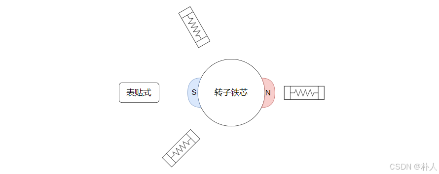
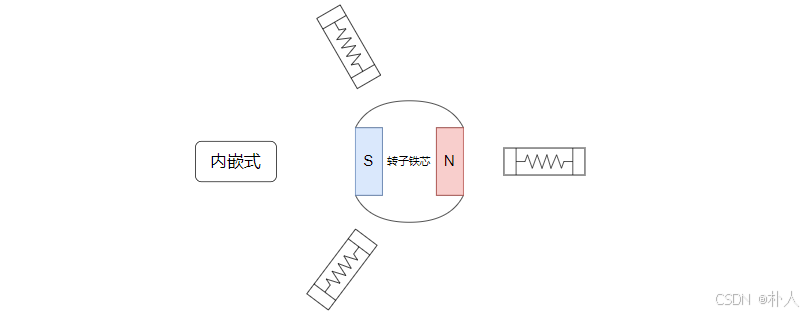

# 52 【无刷电机FOC进阶基础准备】【03 电机凸极性】

> 朴人 已于 2025-06-30 22:09:49 修改 阅读量702 收藏 26 点赞数 23
> 文章链接：https://blog.csdn.net/qq570437459/article/details/148074385

**目录**

[TOC]

#### 转子物理结构

如果让你制造一个电机，你会怎么将永磁体固定在转子上呢？
第一种电机，将永磁体贴在转子铁芯表面，这种方法形象地称为表贴式：
 

第二种电机，转子铁芯开个槽，永磁体嵌在槽里，这种方法形象地称为内嵌式：
 

市面上这两种电机都有，两者的转子对线圈的电磁性能是有差异的。

#### 磁链差异

上节介绍过，

> 永磁体是一个磁导率和空气差不多 **低** 的材料

> 三种独立的方式能引起线圈磁链变化：
> 
> 

- 线圈通入电流变化

- 线圈周围介质变化（比如转子旋转导致气隙变化）

- 外部磁场对线圈磁链的影响（比如转子上永磁体旋转对绕组线圈的影响）

分析一下不同永磁体安装方式对磁链变化的影响：

- 电流影响是一致的

- 永磁体磁导率等同于空气，分析周围介质的时候将永磁体看成空气、看成气隙，可以看到表贴式的转子是均匀的圆形，而内嵌式的转子是有凹坑或者说有凸出的不均匀形状。
  表贴式电机的线圈周围介质没有变化，磁链可以表示为：

  $$
  表贴式：\psi=\psi_s
  $$

  内嵌式电机的线圈周围介质不断在变化，而且是转一圈有两个周期变化，磁链可以表示为：

  $$
  内嵌式：\psi=\psi_s+\psi_2
  $$

   $\psi_s$ 用于表示电机旋转起来后磁链平均值，内嵌式电机的就是在 $\psi_s$ 基础上在加上变动项，而且一圈有2次周期变化，所以用尾缀2表示。因为转子在旋转，所以 $\psi_2$ 是三角函数，不同绕组初始相位角度不同，以a相为例，转子0度的时候，气隙最大、磁链最小， $\psi_{a2}=-\Psi_2cos2\theta$ ，其中 $\Psi_2$ 是幅值， $\theta$ 是转子角度。

- 外部磁场来自永磁体，旋转起来后，表贴式的转子和内嵌式的转子对线圈磁链的影响方式是相同的，都会引起磁链变化。

#### dq电感差异

表贴式转子是均匀的，因此dq电感相等。
内嵌式转子的永磁体位于d轴，而永磁体磁导率等于空气，因此d轴电感小于q轴电感。

---

由于内嵌式电机的转子在电磁性能表达上有凸出的铁芯结构，所以也被形象地称为 `凸极电机` ；表贴式电机的转子在电磁性能表达上是一个均匀的圆形贴心，所以也被形象地称为 `隐极电机` 。