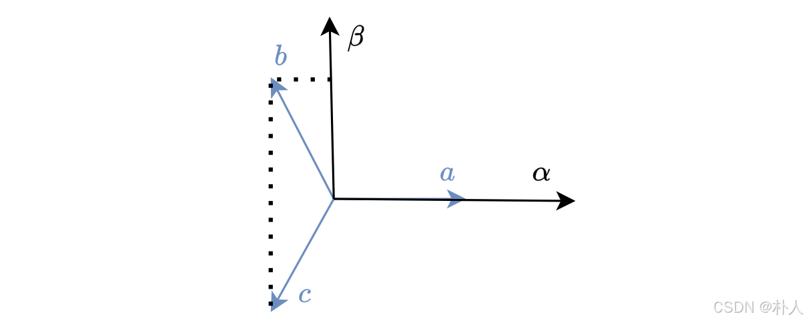
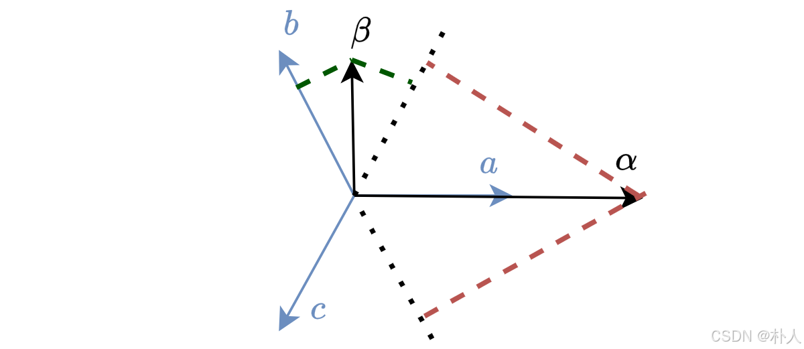
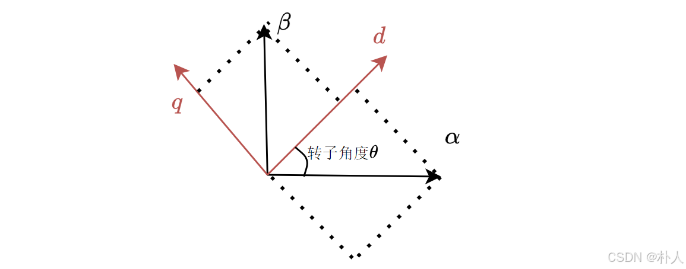

# 53 【无刷电机FOC进阶基础准备】【04 clark变换、park变换、等幅值变换】

> 朴人 已于 2025-07-07 09:58:24 修改 阅读量1.3k 收藏 22 点赞数 16
> 文章链接：https://blog.csdn.net/qq570437459/article/details/148813608

**目录**

[TOC]

其实我不太记得住什么是clark变换、park变换，我每次要用到这个名词的时候都会上网查一下，因为这就是两个名词而已，但是我能记住的是他们背后的含义。
经过 [【从零开始实现stm32无刷电机FOC】](https://blog.csdn.net/qq570437459/article/details/138800656) 系列后应该对clark变换、park变换有了解了，本节对他们再介绍一遍，本节的重点是等幅值变换。

#### clark变换

本质是将abc相的数据投影到αβ轴上，如下图所示，αβ轴是静止的相互垂直的坐标轴。
 

$$
\begin{cases} \alpha=a-b*\cos{60\degree}-c*\cos{60\degree} \\ \beta=b*\cos{30\degree}-c*\cos{30\degree} \end{cases}
$$

写成矩阵形式就是：

$$
\begin{bmatrix} \alpha \\ \beta \end{bmatrix}=\begin{bmatrix} 1 & -\frac{1}{2} & -\frac{1}{2} \\ 0 & \frac{\sqrt{3}}{2} & -\frac{\sqrt{3}}{2} \end{bmatrix}\begin{bmatrix} a \\ b \\ c \end{bmatrix}
$$

其中的矩阵就是clark变换矩阵：

$$
\mathrm{M}_{clark}= \begin{bmatrix} 1 & -\frac{1}{2} & -\frac{1}{2} \\ 0 & \frac{\sqrt{3}}{2} & -\frac{\sqrt{3}}{2} \end{bmatrix}
$$

clark逆变换就是将αβ轴的数据投影到abc相，如下图所示。
 

$$
\mathrm{M}_{inclark}= \begin{bmatrix} 1 & 0 \\ -\frac{1}{2} & \frac{\sqrt{3}}{2} \\ -\frac{1}{2} & -\frac{\sqrt{3}}{2} \end{bmatrix}
$$

#### park变换

本质是将αβ轴的数据投影到dq轴上，也可以看作αβ轴旋转到dq轴，如下图所示，dq轴是旋转的相互垂直的坐标系。
 

$$
\begin{cases} d=\alpha*\cos{\theta}+\beta*\sin{\theta} \\ q=-\alpha*\sin{\theta}+\beta*\cos{\theta} \end{cases}
$$

写成矩阵形式就是：

$$
\begin{bmatrix} d \\ q \end{bmatrix}=\begin{bmatrix} \cos\theta & \sin\theta \\ -\sin\theta & \cos\theta \end{bmatrix}\begin{bmatrix} \alpha \\ \beta \end{bmatrix}
$$

其中的矩阵就是park变换矩阵，这个矩阵就是一个旋转矩阵，而且是一个顺时针旋转矩阵（从坐标系角度看是逆时针旋转）：

$$
\mathrm{M}_{park}=\begin{bmatrix} \cos\theta & \sin\theta \\ -\sin\theta & \cos\theta \end{bmatrix}
$$

park逆变换就是dq轴转到αβ轴，就是反向旋转，反向旋转矩阵直接求逆矩阵就可以了：

$$
\mathrm{M}_{inpark}=\begin{bmatrix} \cos\theta & -\sin\theta \\ \sin\theta & \cos\theta \end{bmatrix}
$$

$$
\begin{bmatrix} \alpha \\ \beta \end{bmatrix}=\mathrm{M}_{inpark}\begin{bmatrix} d \\ q \end{bmatrix}
$$

#### 等幅值变换

在数学推导以及代码实现上，我们希望abc相坐标系、αβ轴、dq轴的最大坐标轴长度统一，各种数值能够缩放到单位量，如果最大电流是1A，最大电压是1V，这样能够方便推导和代码实现，等幅值变换就是为了这个效果。
park变换是旋转矩阵，旋转不会改变坐标轴长度，因此park变换不需要再加等幅值变换，或者说它天然就是等幅值变换。
分析一下clark变换对坐标轴长度的影响，假设abc相的mos管桥臂分别处于[1,0,0]开关状态，那么abc相电流分别为[1,- $\frac{1}{2}
$ ,- $\frac{1}{2}
$ ]，用clark变换进行计算一下：

$$
\begin{bmatrix} 1 & -\frac{1}{2} & -\frac{1}{2} \\ 0 & \frac{\sqrt{3}}{2} & -\frac{\sqrt{3}}{2} \end{bmatrix}\begin{bmatrix} 1 \\ -\frac{1}{2} \\ -\frac{1}{2} \end{bmatrix}=\begin{bmatrix} \frac{3}{2}\\ 0 \end{bmatrix}
$$

可以看到α轴的长度为 $\frac{3}{2}
$ ，这意味着幅值为1的abc相坐标轴经过clark变换后得到的αβ轴幅值为 $\frac{3}{2}
$ 。而我们想要变换后的幅值与abc相相同，因此如果在clark变换矩阵前人为乘一个 $\frac{2}{3}
$ 系数，αβ轴就在单位长度范围内了，如下所示，a相和α轴都为1：

$$
\frac{2}{3}\begin{bmatrix} 1 & -\frac{1}{2} & -\frac{1}{2} \\ 0 & \frac{\sqrt{3}}{2} & -\frac{\sqrt{3}}{2} \end{bmatrix}\begin{bmatrix} 1 \\ -\frac{1}{2} \\ -\frac{1}{2} \end{bmatrix}=\begin{bmatrix} 1\\ 0 \end{bmatrix}
$$

**这个乘 $\frac{2}{3}
$ 就是clark变换的等幅值变换，是指将abc相的幅值和αβ轴的幅值统一大小，方便推导和写代码。** 
这时候会有疑问，难道可以随便乘 $\frac{2}{3}
$ 吗？是的，可以随便乘，如果你不嫌麻烦，你乘1万也行，因为最终用到的是αβ轴两者的比例关系，αβ轴的长度同时放大和缩小又有什么关系呢，最终体现在SVPWM内两个基础矢量的比例关系。

再来分析下clark逆变换，假设αβ轴长度分别是1,0，那么abc相的长度经过clark逆变换后会变成多少呢：

$$
\begin{bmatrix} 1 & 0 \\ -\frac{1}{2} & \frac{\sqrt{3}}{2} \\ -\frac{1}{2} & -\frac{\sqrt{3}}{2} \end{bmatrix}\begin{bmatrix} 1\\ 0 \end{bmatrix}=\begin{bmatrix} 1 \\ -\frac{1}{2} \\ -\frac{1}{2} \end{bmatrix}
$$

竟然直接变成了等幅值的abc相，这意味着clark逆变换不需要额外加等幅值系数，它天生就是等幅值变换的。这是为什么呢？我们可以将clark变换和clark逆变换直接乘一下：

$$
\begin{bmatrix} 1 & -\frac{1}{2} & -\frac{1}{2} \\ 0 & \frac{\sqrt{3}}{2} & -\frac{\sqrt{3}}{2} \end{bmatrix}\begin{bmatrix} 1 & 0 \\ -\frac{1}{2} & \frac{\sqrt{3}}{2} \\ -\frac{1}{2} & -\frac{\sqrt{3}}{2} \end{bmatrix}=\begin{bmatrix} \frac{3}{2} &0 \\ 0 &\frac{3}{2} \end{bmatrix}
$$

我们直观地想， **任何一个变换乘以其逆变换，结果当然要等于没变换** ，而经历一次clark正逆变换后，得到的长度是原先的 $\frac{3}{2}
$ 倍，正好可以对应clark变换带来的 $\frac{3}{2}
$ 倍以及clark逆变换带来的1倍。
只要保证 **任何一个变换乘以其逆变换，结果当然要等于没变换** ，矩阵前面的变换系数可以随便放置，比如等幅值变换全部放在clark变换前面，等功率变换分别放在clark变换和clark逆变换前面：

$$
等幅值变换：\frac{2}{3}\begin{bmatrix} 1 & -\frac{1}{2} & -\frac{1}{2} \\ 0 & \frac{\sqrt{3}}{2} & -\frac{\sqrt{3}}{2} \end{bmatrix}\begin{bmatrix} 1 & 0 \\ -\frac{1}{2} & \frac{\sqrt{3}}{2} \\ -\frac{1}{2} & -\frac{\sqrt{3}}{2} \end{bmatrix}=\begin{bmatrix} 1 &0 \\ 0 &1 \end{bmatrix}
$$

$$
等功率变换：\sqrt\frac{2}{3}\begin{bmatrix} 1 & -\frac{1}{2} & -\frac{1}{2} \\ 0 & \frac{\sqrt{3}}{2} & -\frac{\sqrt{3}}{2} \end{bmatrix}*\sqrt\frac{2}{3}\begin{bmatrix} 1 & 0 \\ -\frac{1}{2} & \frac{\sqrt{3}}{2} \\ -\frac{1}{2} & -\frac{\sqrt{3}}{2} \end{bmatrix}=\begin{bmatrix} 1 &0 \\ 0 &1 \end{bmatrix}
$$

