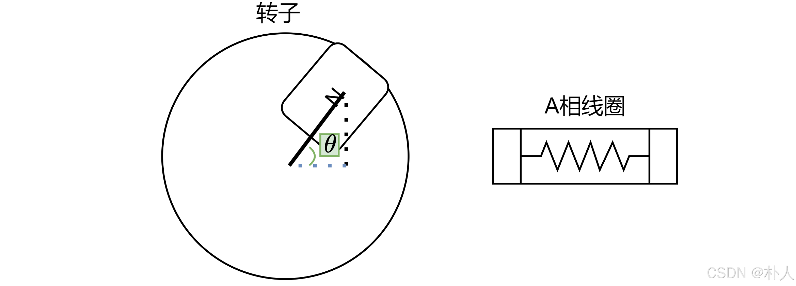
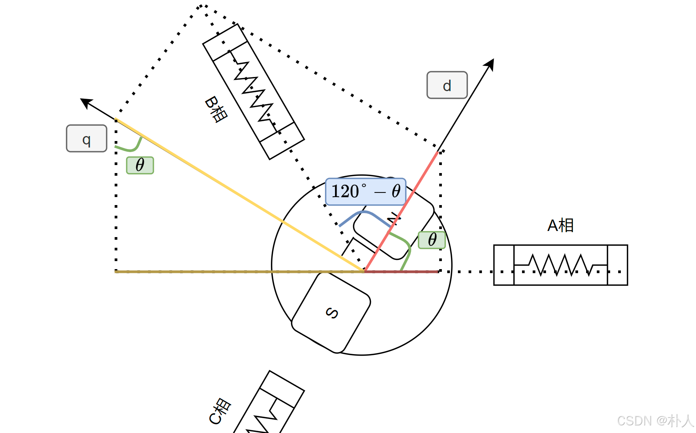
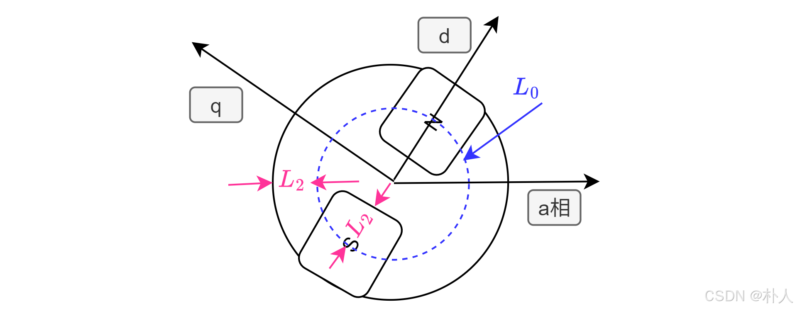
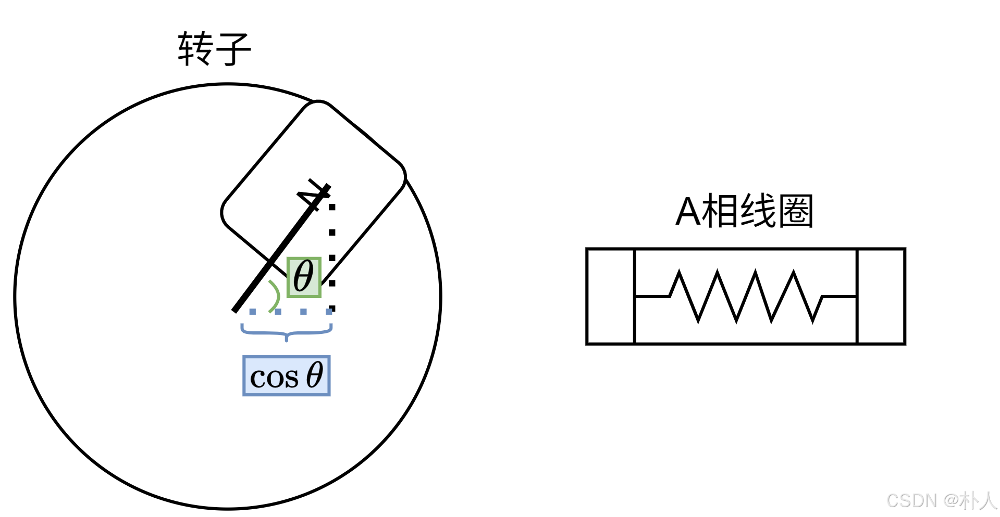

# 55 【永磁同步电机数学模型全程推导】【2 abc相磁链、电压方程】

> 朴人 于 2025-07-14 11:35:39 发布 阅读量1k 收藏 15 点赞数 18
> 文章链接：https://blog.csdn.net/qq570437459/article/details/147742270

**目录**

[TOC]

abc相是对称的，以a相电压方程为例进行推导。
绕组线圈就是一个电阻+电感，因此绕组输入电压被这两部分分走。电阻分到的电压为 $R_ai_a$ 。电感部分的电压体现在感应电动势上，磁通量变化产生感应电动势，因此电感分到的电压为 $\frac{d \psi_a}{dt}
$ ，磁链 $\psi$ 的概念 [前文](https://blog.csdn.net/qq570437459/article/details/147951079) 有介绍。于是a相电压方程为：

$$
u_a=R_ai_a+\frac{d \psi_a}{dt}

$$

其中 $u_a$ 是已知的输入，来自于PWM占空比； $R_a$ 是相电阻，是可以测出来的常数； $i_a$ 是相电压，通过电流采样得到； $t$ 来自单片机定时器，已知； $\psi_a$ 的具体内容还不知道，接下来进行推导。

来分析一下a相线圈总磁链 $\psi_a$ 由哪些磁链组成：

- 自感磁链，记作 $\psi_{aa}$ ，受到相电感和凸极电感影响

- 来自b、c相与a相的互感磁链，记作 $\psi_{ba}$ 和 $\psi_{ca}$ 

- 转子永磁体产生的磁链，记作 $\psi_{fa}$ ，f全称flux或field。

对这些磁链进行逐个分析，为了普适性，按照凸极电机进行分析，隐极电机就是凸极电感为0的特殊情况。

##### 自感磁链

受到自身相电感和凸极电感影响。将相电感记作符号 $L_0$ 。凸极电感随着转子角度周期变化，从下图可以看出， $\theta$ 为0°或者180°时，a相正对铁芯缺口，气隙较大，凸极电感最小； $\theta$ 为90°或者270°时，a相正对铁芯突出，气隙较小，凸极电感最大。将凸极电感幅值记作 $L_2$ ，这里的2表示转子转一圈，凸极电感变化两个周期，因此凸极电感表达式为 $-L_2cos2\theta$ 。
 

因此自感电感表达式为：

$$
L_{aa}=L_0-L_2\cos2\theta
$$

按照相同的推导方式可以得到bc相自感电感，这里不再进行推导，直接给出结果：

$$
L_{bb}=L_0 - L_2 \cos2(\theta - 120\degree)\\ L_{cc}=L_0 - L_2 \cos2(\theta +120\degree)
$$

$L_0$ 和 $L_2$ 可以通过外接电表测量得到，测量方法本节先不讲。
对应的自感磁链就是电感乘电流：

$$
\psi_{aa}=L_{aa}*i_a
$$

##### 互感磁链

分析b相与a相之间的互感磁链 $\psi_{ba}$ （= $\psi_{ab}$ ），因为凸极电机的转子不均匀，不能直接将磁链从b相投影到a相，可以先将b相电流投影到dq轴方向得到dq方向的磁链，再将dq方向的磁链投影到a相，参考下图进行投影：
 

记dq轴方向的示意电感为 $L_{dd},L_{qq}$ ，如下图所示：
 

从图可知， $L_{dd},L_{qq}$ 就是 $L_{aa}$ 的最小值和最大值：

$$
L_{dd}=L_0-L_2\\ L_{qq}=L_0+L_2
$$

或者表示为：

$$
\frac{L_{dd}+L_{qq}}{2}=L_0\\\frac{L_{dd}-L_{qq}}{2}=-L_2
$$

注意这里的 $L_{dd},L_{qq}$ 和dq轴电感 $L_d,L_q$ 不一样， $L_d,L_q$ 是abc相经过clark变换和park变换得到的，而 $L_{dd},L_{qq}$ 只是便于推导的临时中转数据。
开始从b相投影到dq轴方向：

$$
\psi_{bd}=L_{dd}i_b\cos(120\degree-\theta)，\psi_{bq}=L_{qq}i_b\sin(120\degree-\theta)
$$

再将磁链从dq轴投影到a相：

$$
\begin{aligned}\psi_{ba}&=\psi_{bd}\cos\theta+\psi_{bq}\sin\theta\\&=L_{dd}i_b\cos(120\degree-\theta)\cos\theta-L_{qq}i_b\sin(120\degree-\theta)\sin\theta\end{aligned}
$$

上式的 $i_b$ 可以提取出来，于是 $\psi_{ba}=L_{ba}*i_b$ ， $L_{ba}$ 就是b相与a相之间的互感，很多文章也会用符号 $M_{ba}$ 表示。 $L_{ba}$ 还能继续化简。
这里利用一个三角函数化简公式（ `积化和差` 公式）：

$$
X\cos A\cos B+Y\sin A\sin B=\frac{X+Y}{2}\cos(A-B)+\frac{X-Y}{2}\cos(A+B)

$$

于是 $L_{ba}$ 就化简为：

$$
L_{ba}=-\frac{1}{4}(L_{dd}+L_{qq})+\frac{1}{2}(L_{dd}-L_{qq})\cos(2\theta-120\degree)

$$

我们已经知道了 $L_0=\frac{L_{dd}+L_{qq}}{2}
$ ， $-L_2=\frac{L_{dd}-L_{qq}}{2}
$ ，因此 $L_{ba}$ 可以化简为：

$$
L_{ba}=-\frac{1}{2}L_0-L_2\cos(2\theta-120\degree)

$$

你可以自行模仿上述过程推导 $L_{ca}$ ，这里直接给出结果

$$
L_{ca}=-\frac{1}{2}L_0-L_2\cos(2\theta+120\degree)

$$

电感乘电流即得到互感磁链：

$$
\psi_{ba}=L_{ba}*i_b\\ \psi_{ca}=L_{ca}*i_c
$$

##### 永磁体磁链

永磁体磁链和转子均不均匀无关，可以直接投影到绕组上，随转子角度 $\theta$ 变化而变化，a相为例投影如图所示：
 

从几何看到投影关系非常简单，写成表达式：

$$
\psi_{fa}=\psi_f\cos{\theta}
$$

其中 $\psi_f$ 是永磁体磁链系数，通俗地讲就是表示永磁体的磁力强不强，因为只和永磁体本身有关，所以在一个电机中是常数，每个电机都有差别，是永磁同步电机非常重要的参数，电机厂商会提供，也可以自行测量，测量方法先不讲。
bc相的永磁体磁链可以同理推导，这里不再进行推导。

##### 磁链方程

至此a相磁链各部分都推导完毕，将其组合起来：

$$
\psi_a=\psi_{aa}+\psi_{ab}+\psi_{ac}+\psi_{af}
$$

$$
\begin{aligned}\psi_a&=\psi_{aa}+\psi_{ab}+\psi_{ac}+\psi_{af}\\&=L_{aa}*i_a+L_{ba}*i_b+L_{ca}*i_c+\psi_f\cos{\theta}\end{aligned}
$$

其中 $L_{aa}、L_{ba}、L_{ca}$ 在本节都有推导结果，并且可得到具体数值。 $i_a、i_b、i_c$ 通过电流采样获得。 $\psi_f$ 是电机固定参数，电机厂商提供或者可测量。 $\theta$ 是转子角度，通过编码器获得。

b相、c相磁链你可以按照上述推导过程进行一遍，这里就不再推导一遍了。

abc相磁链的推导结果是：

$$
\begin{aligned}\psi_a&=L_{aa}*i_a+L_{ba}*i_b+L_{ca}*i_c+\psi_f\cos{\theta}\\\psi_b&=L_{ab}*i_a+L_{bb}*i_b+L_{cb}*i_c+\psi_f\cos(\theta-120\degree)\\\psi_c&=L_{ac}*i_a+L_{bc}*i_b+L_{cc}*i_c+\psi_f\cos(\theta+120\degree)\end{aligned}

$$

可以写成矩阵形式，更加简洁：

$$
\begin{bmatrix} \psi_a \\ \psi_b \\ \psi_c \end{bmatrix}= \begin{bmatrix} L_{aa} & L_{ba} & L_{ca} \\ L_{ab} & L_{bb} & L_{cb} \\ L_{ac} & L_{bc} & L_{cc} \end{bmatrix} \begin{bmatrix} i_a \\ i_b \\ i_c \end{bmatrix} + \psi_f \begin{bmatrix} \cos\theta \\ \cos(\theta -120\degree) \\ \cos(\theta + 120\degree) \end{bmatrix}
$$

其中 $L_{xx}$ 都是推导了的，分别是：

$$
\begin{aligned} L_{aa}&=L_0-L_2 \cos2\theta\\ L_{bb}&=L_0 - L_2 \cos2(\theta - 120\degree)=L_0 - L_2 \cos(2\theta + 120\degree)\\ L_{cc}&=L_0 - L_2 \cos2(\theta +120\degree)=L_0 - L_2 \cos(2\theta - 120\degree)\\ L_{ab}&=L_{ba} = -\frac{1}{2}L_0 - L_2 \cos(2\theta -120\degree)\\ L_{bc}&=L_{cb} = -\frac{1}{2}L_0 - L_2 \cos2\theta\\ L_{ca}&=L_{ac} = -\frac{1}{2}L_0 - L_2 \cos(2\theta +120\degree) \end{aligned}
$$

发现一部分可以进行化简：

$$
\begin{bmatrix} L_{aa} & L_{ba} & L_{ca} \\ L_{ab} & L_{bb} & L_{cb} \\ L_{ac} & L_{bc} & L_{cc} \end{bmatrix}\begin{bmatrix} i_a \\ i_b\\ i_c \end{bmatrix}=L_0\textcolor{008000}{\begin{bmatrix} 1 & -\frac{1}{2}& -\frac{1}{2} \\ -\frac{1}{2} & 1 & -\frac{1}{2}\\ -\frac{1}{2}\ & -\frac{1}{2} & 1 \end{bmatrix}\begin{bmatrix} i_a \\ i_b\\ i_c \end{bmatrix}}-L_2\begin{bmatrix} \cos2\theta & \cos(2\theta -120\degree) & \cos(2\theta +120\degree) \\ \cos(2\theta -120\degree) & \cos(2\theta + 120\degree) & \cos2\theta \\ \cos(2\theta +120\degree) & \cos2\theta & \cos(2\theta - 120\degree) \end{bmatrix}\begin{bmatrix} i_a \\ i_b\\ i_c \end{bmatrix}
$$

可以利用 $i_b+i_c=-i_a$ 对绿色部分进行化简：

$$
\begin{bmatrix} 1 & -\frac{1}{2}& -\frac{1}{2} \\ -\frac{1}{2} & 1 & -\frac{1}{2}\\ -\frac{1}{2}\ & -\frac{1}{2} & 1 \end{bmatrix}\begin{bmatrix} i_a \\ i_b\\ i_c \end{bmatrix}=\begin{bmatrix} i_a-\frac{1}{2}(i_b+i_c) \\ i_b-\frac{1}{2}(i_a+i_c)\\ i_c-\frac{1}{2}(i_b+i_a) \end{bmatrix}=\begin{bmatrix} i_a+\frac{1}{2}i_a \\ i_b+\frac{1}{2}i_b\\ i_c+\frac{1}{2}i_c \end{bmatrix}=\frac{3}{2}\begin{bmatrix} i_a \\ i_b\\ i_c \end{bmatrix}
$$

于是磁链方程可以化简成：

$$
\begin{bmatrix} \psi_a \\ \psi_b \\ \psi_c \end{bmatrix}=(\frac{3}{2}\mathrm{L_0}-L_2\begin{bmatrix} \cos2\theta & \cos(2\theta -120\degree) & \cos(2\theta +120\degree) \\ \cos(2\theta -120\degree) & \cos(2\theta + 120\degree) & \cos2\theta \\ \cos(2\theta +120\degree) & \cos2\theta & \cos(2\theta - 120\degree) \end{bmatrix})\begin{bmatrix} i_a \\ i_b\\ i_c \end{bmatrix}+\psi_f \begin{bmatrix} \cos\theta \\ \cos(\theta -120\degree) \\ \cos(\theta + 120\degree) \end{bmatrix}
$$

其实从上式就可以初步预见到，经过等幅值变换后， $L_d,L_q$ 或者 $L_\alpha,L_\beta$ 的 $L_0$ 部分必定是 $\frac{3}{2}L_0
$ ，或者说隐极电机的 $L_d,L_q$ 或者 $L_\alpha,L_\beta$ 就等于 $\frac{3}{2}L_0
$ 。

##### 电压方程

回看本节开头，绕组电压被电阻和感应电动势分走，即：

$$
u=Ri+\frac{d \psi}{dt}

$$

磁链 $\psi$ 的表达式已经推导得到了，那么最终的abc相电压方程就是：

$$
\begin{bmatrix} u_a \\ u_b \\ u_c \end{bmatrix}= \begin{bmatrix} R_ai_a \\ R_bi_b \\ R_ci_c \end{bmatrix}+ d\begin{bmatrix} \psi_a \\ \psi_b \\ \psi_c \end{bmatrix}/dt
$$

因为 $R_a=R_b=R_c$ ，本文统一用 $R_s$ (s是stator：定子)表示，可以写成：

$$
\begin{bmatrix} u_a \\ u_b \\ u_c \end{bmatrix}= R_s \begin{bmatrix} i_a \\ i_b \\ i_c \end{bmatrix}+ d\begin{bmatrix} \psi_a \\ \psi_b \\ \psi_c \end{bmatrix}/dt
$$

这里的磁链求导展开后比较复杂，不用展开计算，后续可以转到αβ轴、dq轴计算。