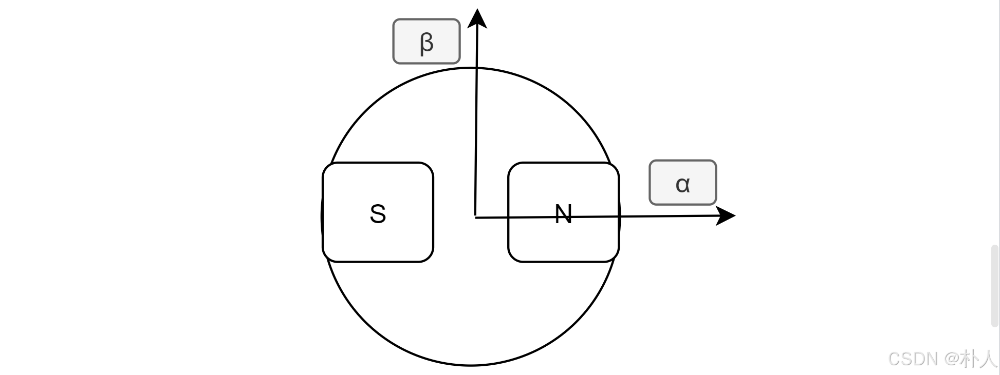

# 56 【永磁同步电机数学模型全程推导】【3 αβ轴磁链、电压方程】

> 朴人 于 2025-07-15 14:15:36 发布 阅读量198 收藏 5 点赞数 3
> 文章链接：https://blog.csdn.net/qq570437459/article/details/148459908

**目录**

[TOC]

本节推导αβ轴的磁链、电压方程。

### clark变换

αβ轴由abc相经过等幅值clark变换（clark变换就是投影）得到，等幅值clark变换矩阵用 $\mathrm{M}_{clark}$ 表示。因为αβ轴是虚拟的轴，和abc轴不是同一个坐标系没有互感不存在物理上的牵扯，不需要考虑转子凸极不均匀情况，可以直接进行clark变换投影。

$$
\begin{aligned} \begin{bmatrix} (\psi|i|u)_{\alpha} \\ (\psi|i|u)_{\beta} \end{bmatrix}&= \mathrm{M}_{clark}* \begin{bmatrix} (\psi|i|u)_a \\ (\psi|i|u)_b \\ (\psi|i|u)_c \end{bmatrix} \\ \end{aligned}
$$

其中 $\mathrm{M}_{clark}$ 为， $\frac{2}{3}
$ 是为了等幅值变换：

$$
\mathrm{M}_{clark}= \frac{2}{3}*\begin{bmatrix} 1 & -\frac{1}{2} & -\frac{1}{2} \\ 0 & \frac{\sqrt{3}}{2} & -\frac{\sqrt{3}}{2} \end{bmatrix}
$$

clark逆变换用 $\mathrm{M}_{inclark}$ 表示，注意逆变换没有 $\frac{2}{3}
$ 系数：

$$
\mathrm{M}_{inclark}= \begin{bmatrix} 1 & 0 \\ -\frac{1}{2} & \frac{\sqrt{3}}{2} \\ -\frac{1}{2} & -\frac{\sqrt{3}}{2} \end{bmatrix}
$$

如果你对上述clark正逆变换和等幅值变换有疑问，可以尝试前往 [【无刷电机FOC进阶基础准备】【04 clark变换、park变换、等幅值变换】](https://blog.csdn.net/qq570437459/article/details/148813608) 了解。

### 磁链方程

#### 按部就班推导法

对abc相磁链进行clark变换即可得到αβ轴磁链方程：

$$
\begin{aligned} \begin{bmatrix} \psi_{\alpha} \\ \psi_{\beta} \end{bmatrix}&= \mathrm{M}_{clark}* \begin{bmatrix} \psi_a \\ \psi_b \\ \psi_c \end{bmatrix} \end{aligned}
$$

将上节推导得到的abc相磁链方程摘抄过来并代入，这里我代入的是上节未进一步化简的磁链方程，你也可以选择代入进一步化简的磁链方程，我也计算过一遍，最终的计算结果是一样的。代入：

$$
\begin{bmatrix} \psi_{\alpha} \\ \psi_{\beta} \end{bmatrix}= \mathrm{M}_{clark}*(\begin{bmatrix} L_{aa} & L_{ba} & L_{ca} \\ L_{ab} & L_{bb} & L_{cb} \\ L_{ac} & L_{bc} & L_{cc} \end{bmatrix} \begin{bmatrix} i_a \\ i_b \\ i_c \end{bmatrix} + \psi_f \begin{bmatrix} \cos\theta \\ \cos\left(\theta -120\degree\right) \\ \cos\left(\theta + 120\degree\right) \end{bmatrix})
$$

发现可以利用clark逆变换，将上式的 $\begin{bmatrix} i_a \\ i_b \\ i_c \end{bmatrix}
$ 变换到 $\begin{bmatrix} i_\alpha \\ i_\beta \end{bmatrix}$ ：

$$
\begin{bmatrix} i_a \\ i_b \\ i_c \end{bmatrix}=\mathrm{M}_{inclark}*\begin{bmatrix} i_\alpha \\ i_\beta \end{bmatrix}

$$

再执行clark变换：

$$
\begin{bmatrix} \psi_{\alpha} \\ \psi_{\beta} \end{bmatrix}=\textcolor{FF0000}{ \mathrm{M}_{clark} \begin{bmatrix} L_{aa} & L_{ba} & L_{ca} \\ L_{ab} & L_{bb} & L_{cb} \\ L_{ac} & L_{bc} & L_{cc} \end{bmatrix}\mathrm{M}_{inclark}}*\begin{bmatrix} i_\alpha \\ i_\beta \end{bmatrix}+\textcolor{0000FF}{\mathrm{M}_{clark}*\psi_f \begin{bmatrix} \cos\theta \\ \cos\left(\theta -120\degree\right) \\ \cos\left(\theta + 120\degree\right) \end{bmatrix}}
$$

可以看到主要由红、蓝两部分组成，其中蓝色计算量小，红色计算量大。

先计算蓝色部分：

$$
\begin{aligned} \psi_f*\mathrm{M}_{clark} \begin{bmatrix} \cos\theta \\ \cos\left(\theta -120\degree\right) \\ \cos\left(\theta + 120\degree\right) \end{bmatrix}&=\psi_f*\frac{2}{3}\begin{bmatrix} 1 & -\frac{1}{2} & -\frac{1}{2} \\ 0 & \frac{\sqrt{3}}{2} & -\frac{\sqrt{3}}{2} \end{bmatrix}\begin{bmatrix} \cos\theta \\ \cos\left(\theta -120\degree\right) \\ \cos\left(\theta + 120\degree\right) \end{bmatrix}\\ &=\psi_f*\frac{2}{3}\begin{bmatrix} \cos\theta-\frac{1}{2}\cos(\theta-120\degree)-\frac{1}{2}\cos(\theta+120\degree) \\ \frac{\sqrt{3}}{2}\cos(\theta-120\degree)-\frac{\sqrt{3}}{2}\cos(\theta+120\degree) \end{bmatrix} \end{aligned}
$$

先别往下硬算，利用一下三角函数这两个公式：

$$
\cos(a-b)+\cos(a+b)=2\cos{a}\cos{b}\\ \cos(a-b)-\cos(a+b)=2\sin{a}\cos{b}
$$

再继续算：

$$
=\psi_f*\frac{2}{3}\begin{bmatrix} \cos\theta-\frac{1}{2}(2\cos\theta\cos120\degree) \\ \frac{\sqrt{3}}{2}2\sin\theta\sin120\degree \end{bmatrix}
$$

蓝色部分的结果就出来了：

$$
\textcolor{0000FF}{ \psi_f\begin{bmatrix} \cos\theta \\ \sin\theta \end{bmatrix} }
$$

再来计算一下红色部分，电感矩阵的元素在上节推导过了。红色部分计算非常多，硬着头皮算一下（或者让matlab算），你完全可以跳过下面的计算过程直接看结果，因为这个计算过程又恶心又无脑：

先展开：

$$
\begin{aligned} \mathrm{M}_{clark} \begin{bmatrix} L_{aa} & L_{ba} & L_{ca} \\ L_{ab} & L_{bb} & L_{cb} \\ L_{ac} & L_{bc} & L_{cc} \end{bmatrix}\mathrm{M}_{inclark}&=\frac{2}{3} \begin{bmatrix} L_{aa}-\frac{1}{2}L_{ba}-\frac{1}{2}L_{ca} & L_{ba}-\frac{1}{2}L_{bb}-\frac{1}{2}L_{bc} & L_{ca}-\frac{1}{2}L_{cb}-\frac{1}{2}L_{cc} \\ \frac{\sqrt{3}}{2}L_{ab}-\frac{\sqrt{3}}{2}L_{ac} & \frac{\sqrt{3}}{2}L_{bb}-\frac{\sqrt{3}}{2}L_{bc} & \frac{\sqrt{3}}{2}L_{cb}-\frac{\sqrt{3}}{2}L_{cc} \end{bmatrix}\mathrm{M}_{inclark}\\&=\frac{2}{3}\begin{bmatrix} L_{aa}-\frac{1}{2}L_{ba}-\frac{1}{2}L_{ca}-\frac{1}{2}(L_{ba}-\frac{1}{2}L_{bb}-\frac{1}{2}L_{bc})-\frac{1}{2}(L_{ca}-\frac{1}{2}L_{cb}-\frac{1}{2}L_{cc}) & \frac{\sqrt{3}}{2}(L_{ba}-\frac{1}{2}L_{bb}-\frac{1}{2}L_{bc})-\frac{\sqrt{3}}{2}(L_{ca}-\frac{1}{2}L_{cb}-\frac{1}{2}L_{cc}) \\ \frac{\sqrt{3}}{2}L_{ab}-\frac{\sqrt{3}}{2}L_{ac}-\frac{1}{2}(\frac{\sqrt{3}}{2}L_{bb}-\frac{\sqrt{3}}{2}L_{bc})-\frac{1}{2}(\frac{\sqrt{3}}{2}L_{cb}-\frac{\sqrt{3}}{2}L_{cc}) & \frac{\sqrt{3}}{2}(\frac{\sqrt{3}}{2}L_{bb}-\frac{\sqrt{3}}{2}L_{bc})- \frac{\sqrt{3}}{2}(\frac{\sqrt{3}}{2}L_{cb}-\frac{\sqrt{3}}{2}L_{cc}) \end{bmatrix} \end{aligned}
$$

再把上节推导得到的 $L_{xx}$ 代入进来，代入后可以利用三角函数的两个公式便于化简

$$
\begin{aligned} \cos(2\theta-120\degree)+\cos(2\theta+120\degree)&=-\cos2\theta\\ \cos(2\theta-120\degree)-\cos(2\theta+120\degree)&=\sqrt{3}\sin2\theta \end{aligned}

$$

计算一下矩阵左上角元素：

$$
\begin{aligned}L_{aa}+\frac{1}{4}L_{bb}+\frac{1}{4}L_{cc}-L_{ba}-L_{ca}+\frac{1}{2}L_{bc}&=L_0-L_2 \cos2\theta+\frac{1}{4}(L_0 - L_2 \cos\left(2\theta + 120\degree\right))+\frac{1}{4}(L_0 - L_2 \cos\left(2\theta - 120\degree\right))-(-\frac{1}{2}L_0 - L_2 \cos\left(2\theta -120\degree\right))-(-\frac{1}{2}L_0 - L_2 \cos\left(2\theta +120\degree\right))+\frac{1}{2}(-\frac{1}{2}L_0 - L_2 \cos(2\theta))\\&=\frac{9}{4}L_0-\frac{3}{2}L_2\cos2\theta+\frac{3}{4}L_2\cos(2\theta+120\degree)+\frac{3}{4}L_2\cos(2\theta-120\degree)\\&=\frac{9}{4}L_0-\frac{3}{2}L_2\cos2\theta-\frac{3}{4}L_2\cos2\theta\\&=\frac{9}{4}L_0-\frac{9}{4}L_2\cos2\theta\end{aligned}
$$

计算一下矩阵左下角元素：

$$
\begin{aligned}-\frac{\sqrt{3}}{4}L_{bb}+\frac{\sqrt{3}}{4}L_{cc}+\frac{\sqrt{3}}{2}L_{ab}-\frac{\sqrt{3}}{2}L_{ac}&=\frac{\sqrt{3}}{4}(-(L_0 - L_2 \cos\left(2\theta + 120\degree\right))+L_0 - L_2 \cos\left(2\theta -120\degree\right)+2(-\frac{1}{2}L_0 - L_2 \cos\left(2\theta -120\degree\right))-2(-\frac{1}{2}L_0 - L_2 \cos\left(2\theta +120\degree\right)))\\&=\frac{\sqrt{3}}{4}(3L_2\cos(2\theta+120\degree)-3L_2\cos(2\theta-120\degree)))\\&=-\frac{3\sqrt{3}}{4}\sqrt{3}L_2\sin2\theta\\&=-\frac{9}{4}L_2\sin2\theta\end{aligned}
$$

计算一下矩阵右上角元素， $L_{xx}$ 代入后发现和左下角元素一样，那这步就不用计算了。
计算一下矩阵右下角元素，

$$
\begin{aligned}\frac{3}{4}L_{bb}+\frac{3}{4}L_{cc}-\frac{3}{2}L_{bc}&=\frac{3}{4}(L_0 - L_2 \cos\left(2\theta + 120\degree\right)+L_0 - L_2 \cos\left(2\theta -120\degree\right)-2(-\frac{1}{2}L_0 - L_2 \cos(2\theta)))\\&=\frac{3}{4}(3L_0+3L_2\cos2\theta)\\&=\frac{9}{4}L_0+\frac{9}{4}L_2\cos2\theta \end{aligned}
$$

于是红色部分等于：

$$
\textcolor{FF0000}{\frac{3}{2}\begin{bmatrix} L_0-L_2\cos2\theta & -L_2\sin2\theta \\ -L_2\sin2\theta & L_0+L_2\cos2\theta \end{bmatrix}}
$$

这个就是αβ轴的电感矩阵。
此时，有人可能会产生困惑，不是经过等幅值clark变换过来的吗，为什么还会有 $\frac{3}{2}
$ 系数？其实这个 $\frac{3}{2}
$ 和幅值变换无关，是abc相之间的互感引入的。从上节进一步化简的abc相磁链方程就可以初见端倪，abc相磁链方程本身就存在 $\frac{3}{2}
$ 系数。
至此红、蓝两部分都得到了计算结果，我们得到了αβ轴磁链方程：

$$
\begin{bmatrix} \psi_{\alpha} \\ \psi_{\beta} \end{bmatrix}=\frac{3}{2}\begin{bmatrix} L_0-L_2\cos2\theta & -L_2\sin2\theta \\ -L_2\sin2\theta & L_0+L_2\cos2\theta \end{bmatrix}\begin{bmatrix} i_{\alpha} \\ i_{\beta} \end{bmatrix}+\psi_f\begin{bmatrix} \cos\theta \\ \sin\theta \end{bmatrix}
$$

注意，有些文章的 $L_2$ 是负数，有些文章的 $L_2$ 是正数，本系列文章从一开始就按照 $L_2$ 是正数进行推导，所以有可能和部分文章符号不同，这是正常现象。

#### 直接推导法

先推导α轴磁链方程，和上节abc相的推导一个套路。这部分的推导一定要能自己进行abc相的推导再看，一模一样的套路，所以会省略一些步骤。

##### 自感

回看一下上节化简后的abc相磁链方程，由于等幅值变换，αβ轴电感的相电感 $L_0$ 部分直接等于abc相的相电感幅值 $\frac{3}{2}L_0
$ 。
关于凸极电感 $L_2$ 部分，我们可以假设 $i_a$ 处于最大幅值为1，则 $i_b,i_c$ 为 $-\frac{1}{2},-\frac{1}{2}
$ ，然后用上节化简后的abc相磁链方程进行计算，看下经过互感叠加后a相凸极电感 $L_2$ 部分会等于多少：

$$
-L_2\begin{bmatrix} \cos2\theta & \cos(2\theta -120\degree) & \cos(2\theta +120\degree) \\ \cos(2\theta -120\degree) & \cos(2\theta + 120\degree) & \cos2\theta \\ \cos(2\theta +120\degree) & \cos2\theta & \cos(2\theta - 120\degree) \end{bmatrix}\begin{bmatrix} 1 \\ -\frac{1}{2}\\ -\frac{1}{2} \end{bmatrix}=-L_2\begin{bmatrix} \frac{3}{2}\cos2\theta \\ 只关注a相\\ 只关注a相 \end{bmatrix}
$$

得到经过互感叠加后的a相凸极电感 $L_2$ 表达式为 $-\frac{3}{2}L_2\cos2\theta
$ ，幅值为 $-\frac{3}{2}L_2
$ ，得到a相 $L_2$ 的幅值之后，就可以利用等幅值变换性质， $\alpha$ 轴的 $L_2$ 部分的幅值也等于 $-\frac{3}{2}L_2
$ 。
因为转子角度 $\theta$ 等于0时，α轴正对凸极转子的缺口，β轴正对凸极转子的凸出：
 

所以α轴的 $L_2$ 部分的表达式是 $-\frac{3}{2}L_2\cos2\theta
$ ，β轴的 $L_2$ 部分的表达式是 $+\frac{3}{2}L_2\cos2\theta
$ 。
$L_0$ 部分和 $L_2$ 部分都得到了，自感等于 $L_0$ 部分加 $L_2$ 部分：

$$
L_{\alpha\alpha}=\frac{3}{2}(L_0-L_2\cos2\theta)\\ L_{\beta\beta}=\frac{3}{2}(L_0+L_2\cos2\theta)

$$

##### 互感

与上节abc相的推导类似，先将β轴电流投影到dq轴方向，得到dq方向的磁链后，再投影到α轴。因为αβ轴和dq轴只差一个旋转矩阵（park变换），所以此处的 $L_{dd},L_{qq}$ 就等于最终的 $L_{d},L_{q}$ 。
先投影到dq轴方向：

$$
\psi_{\beta d}=L_{dd}i_b\cos(90\degree-\theta)=L_{dd}i_\beta\sin\theta，\psi_{\beta q}=L_{qq}i_\beta\sin(90\degree-\theta)=L_{qq}i_\beta\cos\theta
$$

再投影到α轴：

$$
\begin{aligned}L_{\beta\alpha}=L_{\alpha\beta}&=L_{dd}\sin\theta\cos\theta-L_{qq}\cos\theta\sin\theta\\&=(L_{dd}-L_{qq})\sin\theta\cos\theta\\&=\frac{L_{dd}-L_{qq}}{2}\sin2\theta\end{aligned}

$$

注意，这个坐标系下的 $L_{dd},L_{qq}$ 是 $L_{\alpha\alpha}$ 的最小值和最大值：

$$
L_{dd}=\frac{3}{2}(L_0-L_2)\\ L_{qq}=\frac{3}{2}(L_0+L_2)
$$

可见αβ轴坐标系下 $\frac{L_{dd}-L_{qq}}{2}=-\frac{3}{2}L_2
$ ，和abc相坐标系下 $\frac{L_{dd}-L_{qq}}{2}=-L_2
$ 不同。
于是互感磁链就等于：

$$
L_{\beta\alpha}=L_{\alpha\beta}=-\frac{3}{2}L_2\sin2\theta
$$

##### 磁链方程

αβ轴坐标系下的永磁体磁链经过abc相等幅值变换后还是等于 $\psi_f$ ，投影到αβ轴分别为 $\psi_f\cos{\theta},\psi_f\sin{\theta}$ 。
α轴磁链等于自感磁链+互感磁链+永磁体磁链：

$$
\psi_\alpha=L_{\alpha\alpha}*i_\alpha+L_{\beta\alpha}*i_\beta+\psi_f\cos{\theta}
$$

同样的 $\psi_\beta$ ：

$$
\psi_\beta=L_{\alpha\beta}*i_\alpha+L_{\beta\beta}*i_\beta+\psi_f\sin{\theta}
$$

写成矩阵形式：

$$
\begin{bmatrix} \psi_\alpha \\ \psi_\beta \end{bmatrix}= \begin{bmatrix} L_{\alpha\alpha} & L_{\beta\alpha} \\ L_{\alpha\beta} & L_{\beta\beta} \end{bmatrix} \begin{bmatrix} i_\alpha \\ i_\beta \end{bmatrix} + \psi_f \begin{bmatrix} \cos\theta \\ \sin\theta \end{bmatrix}
$$

其中自感 $L_{\alpha\alpha},L_{\beta\beta}$ 和互感 $L_{\alpha\beta}=L_{\beta\alpha}$ 在上面推导了，现在代入进来：

$$
\begin{bmatrix} \psi_\alpha \\ \psi_\beta \end{bmatrix}= \frac{3}{2}\begin{bmatrix} L_0-L_2\cos2\theta & -L_2\sin2\theta \\ -L_2\sin2\theta & L_0+L_2\cos2\theta \end{bmatrix} \begin{bmatrix} i_\alpha \\ i_\beta \end{bmatrix} + \psi_f \begin{bmatrix} \cos\theta \\ \sin\theta \end{bmatrix}
$$

可以看到，和按部就班法的结果一样，但是没有复杂的计算。

### 电压方程

αβ轴的电压分别被电阻和感应电动势分走。对磁链方程进行时间求导就可得到感应电动势，不过我目前不打算介绍凸极情况下的 $\psi_\alpha,\psi_\beta$ 求导，因为最好了解无感反电动势观测器之后，再来求导凸极情况下的αβ轴磁链方程，才会明白求导结果为什么要处理成特定的形式，该形式称为【扩展反电动势】，你可以自行找资料了解。
目前我们不考虑凸极情况，即 $L_2$ 等于0，那么αβ轴磁链方程为：

$$
\begin{bmatrix} \psi_\alpha \\ \psi_\beta \end{bmatrix}= \frac{3}{2}L_0 \begin{bmatrix} i_\alpha \\ i_\beta \end{bmatrix} + \psi_f \begin{bmatrix} \cos\theta \\ \sin\theta \end{bmatrix}
$$

隐极情况下 $L_d=L_q$ ，而 $L_2$ 又等于0，所以 $\frac{3}{2}L_0=L_d=L_q
$ ，可以将 $\frac{3}{2}L_0
$ 记作符号 $L_s$ (Sync同步电感)。
感应电动势就是进行对时间求导：

$$
d\begin{bmatrix} \psi_\alpha \\ \psi_\beta \end{bmatrix}/dt= L_s d\begin{bmatrix} i_\alpha \\ i_\beta \end{bmatrix}/dt + \omega\psi_f \begin{bmatrix} -\sin\theta \\ \cos\theta \end{bmatrix}
$$

于是电压方程为：

$$
\begin{aligned} \begin{bmatrix} u_\alpha \\ u_\beta \end{bmatrix}&= R_s\begin{bmatrix} i_\alpha \\ i_\beta \end{bmatrix}+d\begin{bmatrix} \psi_\alpha \\ \psi_\beta \end{bmatrix}/dt\\&=R_s\begin{bmatrix} i_\alpha \\ i_\beta \end{bmatrix}+ L_s d\begin{bmatrix} i_\alpha \\ i_\beta \end{bmatrix}/dt + \omega\psi_f \begin{bmatrix} -\sin\theta \\ \cos\theta \end{bmatrix}\end{aligned}
$$

其中 $\omega$ 是转子速度，是转子角度 $\theta$ 对时间的求导。
至此，隐极电机的αβ轴电压方程已经推导，凸极情况暂不进行推导，最好等以后了解了无感反电动势观测器再进行推导，否则不好理解为什么要那样推导，也可以自行了解一下【扩展反电动势】。