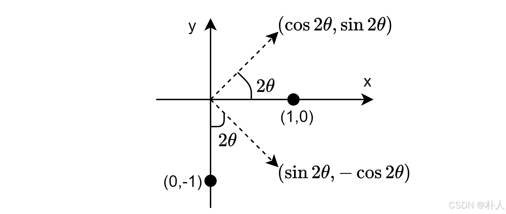
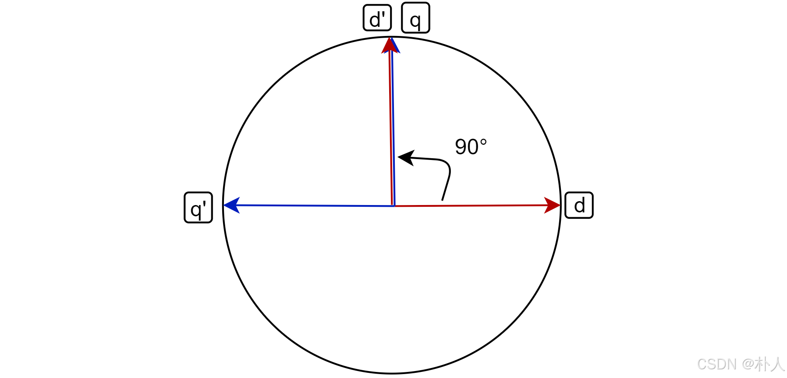

# 57 【永磁同步电机数学模型全程推导】【4 dq轴磁链、电压方程】

> 朴人 于 2025-07-15 14:16:23 发布 阅读量700 收藏 6 点赞数 20
> 文章链接：https://blog.csdn.net/qq570437459/article/details/148540217

**目录**

[TOC]

### park变换

dq轴由αβ轴经过park变换得到，park变换矩阵用 $\mathrm{M}_{park}$ 表示，park逆变换矩阵用 $\mathrm{M}_{inpark}$ 表示：

$$
\begin{aligned} \begin{bmatrix} (\psi|i|u)_{d} \\ (\psi|i|u)_{q} \end{bmatrix}&=\mathrm{M}_{park} \begin{bmatrix} (\psi|i|u)_{\alpha} \\ (\psi|i|u)_{\beta} \end{bmatrix}\\ \begin{bmatrix} (\psi|i|u)_{\alpha} \\ (\psi|i|u)_{\beta} \end{bmatrix}&=\mathrm{M}_{inpark} \begin{bmatrix} (\psi|i|u)_{d} \\ (\psi|i|u)_{q} \end{bmatrix} \end{aligned}
$$

park变换天生就是等幅值变换。park变换矩阵是一个顺时针旋转矩阵，park逆变换矩阵是一个逆时针旋转矩阵：

$$
\mathrm{M}_{park}=\begin{bmatrix} \cos\theta & \sin\theta \\ -\sin\theta & \cos\theta \end{bmatrix}\\ \mathrm{M}_{inpark}=\begin{bmatrix} \cos\theta & -\sin\theta \\ \sin\theta & \cos\theta \end{bmatrix}
$$

如果你对上述park正逆变换有疑问，可以尝试前往 [【无刷电机FOC进阶基础准备】【04 clark变换、park变换、等幅值变换】](https://blog.csdn.net/qq570437459/article/details/148813608) 了解。

### 磁链方程

#### 按部就班推导法

对αβ轴磁链进行park变换即可得到dq轴磁链方程。先把上节推导得到的αβ轴磁链方程摘抄过来：

$$
\begin{bmatrix} \psi_\alpha \\ \psi_\beta \end{bmatrix}= \frac{3}{2}\begin{bmatrix} L_0-L_2\cos2\theta & -L_2\sin2\theta \\ -L_2\sin2\theta & L_0+L_2\cos2\theta \end{bmatrix} \begin{bmatrix} i_\alpha \\ i_\beta \end{bmatrix} + \psi_f \begin{bmatrix} \cos\theta \\ \sin\theta \end{bmatrix}
$$

对其进行park变换：

$$
\mathrm{M}_{park}\begin{bmatrix} \psi_\alpha \\ \psi_\beta \end{bmatrix}= \mathrm{M}_{park}*\frac{3}{2}\begin{bmatrix} L_0-L_2\cos2\theta & -L_2\sin2\theta \\ -L_2\sin2\theta & L_0+L_2\cos2\theta \end{bmatrix} \begin{bmatrix} i_\alpha \\ i_\beta \end{bmatrix} + \mathrm{M}_{park}*\psi_f \begin{bmatrix} \cos\theta \\ \sin\theta \end{bmatrix}
$$

发现可以利用park逆变换，将上式的 $\begin{bmatrix} i_\alpha \\ i_\beta \end{bmatrix}$ 变换到 $\begin{bmatrix} i_d \\ i_q \end{bmatrix}$ ：

$$
\begin{bmatrix} i_d \\ i_q \end{bmatrix}=\mathrm{M}_{inpark}*\begin{bmatrix} i_\alpha \\ i_\beta \end{bmatrix}
$$

再继续park变换：

$$
\begin{bmatrix} \psi_d \\ \psi_q \end{bmatrix}= \textcolor{FF0000}{\mathrm{M}_{park}*\frac{3}{2}\begin{bmatrix} L_0-L_2\cos2\theta & -L_2\sin2\theta \\ -L_2\sin2\theta & L_0+L_2\cos2\theta \end{bmatrix}\mathrm{M}_{inpark}} \begin{bmatrix} i_d \\ i_q \end{bmatrix} + \textcolor{0000FF}{\mathrm{M}_{park}*\psi_f \begin{bmatrix} \cos\theta \\ \sin\theta \end{bmatrix}}
$$

可以看到主要由红、蓝两部分组成，其中蓝色计算量小，红色计算量大。 ~~（怎么感觉和上节差不多套路）~~ 
先计算蓝色部分。说是计算，实则可以秒杀，park变换是一个顺时针旋转矩阵，而 $\begin{bmatrix}\cos\theta \\ \sin\theta\end{bmatrix}$ 是一个与坐标轴夹角θ的单位矢量，将这个矢量顺时针旋转θ角后直接就位于x轴，所以结果直接等于 $\begin{bmatrix}1 \\ 0\end{bmatrix}$ 。于是蓝色部分结果就是：

$$
\textcolor{0000FF}{ \begin{bmatrix} \psi_f \\ 0 \end{bmatrix}}
$$

再来计算一下红色部分。可以看到左右都有park变换，这种情况下可以提取一个公因数从而利用等幅值变换，这里先提取一个 $L_0$ ，提取后结果为：

$$
\textcolor{FF0000}{\frac{3}{2}\mathrm{M}_{park}\begin{bmatrix} L_0& 0 \\ 0 & L_0 \end{bmatrix}\mathrm{M}_{park}+\frac{3}{2}\mathrm{M}_{park}\begin{bmatrix} -L_2\cos2\theta & -L_2\sin2\theta \\ -L_2\sin2\theta & L_2\cos2\theta \end{bmatrix}\mathrm{M}_{inpark}}
$$

加号左边由于等幅值变换，不用算，直接等于：

$$
\frac{3}{2}\begin{bmatrix} L_0 & 0 \\ 0 & L_0 \end{bmatrix}
$$

加号右边发现可以提取 $-L_2$ ：

$$
-\frac{3}{2}L_2\mathrm{M}_{park}\begin{bmatrix} \cos2\theta & \sin2\theta \\ \sin2\theta & -\cos2\theta \end{bmatrix}\mathrm{M}_{inpark}
$$

上式看似需要计算，实测可以再次秒杀。将中间的矩阵看成两个向量：

$$
\vec{v_1}=\begin{bmatrix} \cos2\theta\\ \sin2\theta \end{bmatrix},\vec{v_2}=\begin{bmatrix} \sin2\theta\\ -\cos2\theta \end{bmatrix}

$$

$⃗\vec{v_1}$ 可以看作 $\begin{bmatrix} 1\\ 0 \end{bmatrix}$ 逆时针旋转 $2\theta$ 角得到， $⃗\vec{v_2}$ 可以看作 $\begin{bmatrix} 0\\ -1 \end{bmatrix}$ 逆时针旋转 $2\theta$ 角得到，如下图所示：
 

根据 $\mathrm{A}*\mathrm{B}=(\mathrm{B}^T*\mathrm{A}^T)^T$ ，加号右边可以表示为：

$$
-\frac{3}{2}L_2\mathrm{M}_{park}(\mathrm{M}_{inpark}^T\begin{bmatrix} \cos2\theta & \sin2\theta \\ \sin2\theta & -\cos2\theta \end{bmatrix}^T)^T=-\frac{3}{2}L_2\mathrm{M}_{park}(\mathrm{M}_{park}\begin{bmatrix} \cos2\theta & \sin2\theta \\ \sin2\theta & -\cos2\theta \end{bmatrix})^T
$$

从上式可以得到， $⃗\vec{v_1}$ 经过一次顺时针旋转 $\theta$ 角后变成 $\begin{bmatrix} \cos\theta\\ \sin\theta \end{bmatrix}$ ， $⃗\vec{v_2}$ 经过一次顺时针旋转 $\theta$ 角后变成 $\begin{bmatrix} \sin\theta\\ -\cos\theta \end{bmatrix}$ ，而旋转后的 $[\vec{v_1},\vec{v_2}]
$ 矩阵依然是斜角对称的，意味着转置等于本身，两个向量再经历了一次顺时针 $\theta$ 角旋转后，最终回到了坐标轴位置 $\begin{bmatrix} 1\\ 0 \end{bmatrix}$ 和 $\begin{bmatrix} 0\\ -1 \end{bmatrix}$ ，结果就是：

$$
-\frac{3}{2}L_2\begin{bmatrix} 1 & 0 \\ 0 & -1 \end{bmatrix}

$$

将红色部分加号左边和右边得到的结果合并到一起：

$$
\frac{3}{2}\begin{bmatrix} L_0 & 0 \\ 0 & L_0 \end{bmatrix}-\frac{3}{2}L_2\begin{bmatrix} 1 & 0 \\ 0 & -1 \end{bmatrix}=\begin{bmatrix} \frac{3}{2}(L_0-L_2) & 0 \\ 0 & \frac{3}{2}(L_0+L_2) \end{bmatrix}
$$

上节推导αβ轴自感时得到了 $L_d=\frac{3}{2}(L_0-L_2),L_q=\frac{3}{2}(L_0+L_2)
$ ，所以红色部分最终化简的结果为：

$$
\textcolor{FF0000}{\begin{bmatrix} L_d& 0 \\ 0 & L_q \end{bmatrix}}
$$

红蓝部分都计算完毕了，磁链方程就为：

$$
\begin{aligned} \begin{bmatrix} \psi_d \\ \psi_q \end{bmatrix}&=\begin{bmatrix} L_d& 0 \\ 0 & L_q \end{bmatrix}\begin{bmatrix} i_d \\ i_q \end{bmatrix}+\begin{bmatrix} \psi_f \\ 0 \end{bmatrix}\\&=\begin{bmatrix} L_di_d \\ L_qi_q \end{bmatrix}+\begin{bmatrix} \psi_f \\ 0 \end{bmatrix}\end{aligned}
$$

#### 直接推导法

由于d轴一直指向转子铁芯缺口方向，q轴一直指向转子铁芯凸出方向，两者之间没有互感，因此电感只由自感组成：

$$
\begin{bmatrix} L_d& 0 \\ 0 & L_q \end{bmatrix}
$$

d轴和永磁体同一个方向，q轴方向没有永磁体，所以永磁体磁链全部位于d轴，直接等于：

$$
\begin{bmatrix} \psi_f \\ 0 \end{bmatrix}
$$

于是可以直接推导出dq轴磁链为：

$$
\begin{aligned} \begin{bmatrix} \psi_d \\ \psi_q \end{bmatrix}&=\begin{bmatrix} L_d& 0 \\ 0 & L_q \end{bmatrix}\begin{bmatrix} i_d \\ i_q \end{bmatrix}+\begin{bmatrix} \psi_f \\ 0 \end{bmatrix}\\&=\begin{bmatrix} L_di_d \\ L_qi_q \end{bmatrix}+\begin{bmatrix} \psi_f \\ 0 \end{bmatrix}\end{aligned}
$$

可以看到，和按部就班法的结果一样，但是没有复杂的计算。

### 电压方程

dq轴与abc相和αβ轴是静态坐标系不同，dq轴是动态坐标系，自身跟着转子旋转。对于静止坐标系来说，电压被电阻和自身磁链变化产生的感应电动势分走，而动态坐标系下的电压还会受到旋转产生的感应电动势影响。比如说转子经过单位时间后旋转了90°，d轴旋转到了原先q轴的位置，原先q轴处磁链的消失会对旋转过来的d轴产生影响。（很不严谨地想象类比一下，q轴旋转的拖影会对d轴造成影响）
 

由于dq轴还存在旋转产生的感应电动势，若和αβ轴一样的套路只将dq轴磁链对时间进行求导将缺少旋转感应电动势，因此可以对αβ轴电压方程进行park变换，这样就能从整体角度得到dq轴电压方程，这里先把αβ轴电压方程写一下：

$$
\begin{bmatrix} u_\alpha \\ u_\beta \end{bmatrix}= R_s\begin{bmatrix} i_\alpha \\ i_\beta \end{bmatrix}+d\begin{bmatrix} \psi_\alpha \\ \psi_\beta \end{bmatrix}/dt
$$

先利用一下park逆变换，将所有αβ轴相关的转到dq轴：

$$
R_s\mathrm{M}_{inpark}\begin{bmatrix} i_d \\ i_q \end{bmatrix}+d(\mathrm{M}_{inpark}\begin{bmatrix} \psi_d \\ \psi_q \end{bmatrix})/dt
$$

开始正式执行park变换，这里 $R_s$ 直接等幅值变换不需要计算了：

$$
\begin{bmatrix} u_d \\ u_q \end{bmatrix}=R_s\begin{bmatrix} i_d \\ i_q \end{bmatrix}+\mathrm{M}_{park}d(\mathrm{M}_{inpark}\begin{bmatrix} \psi_d \\ \psi_q \end{bmatrix})/dt
$$

从公式看，只要处理好加号右边的部分，dq轴电压方程就出来了。
开始计算，把加号右边乘积求导展开（ $\frac{d(AB)}{dt}=\frac{dA}{dt}*B+A*\frac{dB}{dt}
$ ）：

$$
\mathrm{M}_{park}d(\mathrm{M}_{inpark}\begin{bmatrix} \psi_d \\ \psi_q \end{bmatrix})/dt=\mathrm{M}_{park}\frac{d\mathrm{M}_{inpark}}{dt}*\begin{bmatrix} \psi_d \\ \psi_q \end{bmatrix}+\bcancel{\mathrm{M}_{park}\mathrm{M}_{inpark}}*d\begin{bmatrix} \psi_d \\ \psi_q \end{bmatrix}/dt

$$

上式中park逆变换矩阵的求导结果计算一下：

$$
\frac{d\mathrm{M}_{inpark}}{dt}=\omega\begin{bmatrix} -\sin\theta & -\cos\theta \\ \cos\theta & -\sin\theta \end{bmatrix}

$$

这里同样可以将这个矩阵看成两个单位向量分别从 $\begin{bmatrix}0\\1\end{bmatrix}$ 和 $\begin{bmatrix}-1\\0\end{bmatrix}$ 逆时针旋转 $\theta$ 角而来，左乘park变换矩阵即顺时针旋转矩阵后，又回到了坐标轴上，即：

$$
\mathrm{M}_{park}\frac{d\mathrm{M}_{inpark}}{dt}=\omega\begin{bmatrix} 0 & -1 \\ 1 & 0 \end{bmatrix}

$$

至此dq轴电压方程就可以表示为：

$$
\begin{bmatrix} u_d \\ u_q \end{bmatrix}=R_s\begin{bmatrix} i_d \\ i_q \end{bmatrix}+\begin{bmatrix} 0 & -\omega \\ \omega & 0 \end{bmatrix}\begin{bmatrix} \psi_d \\ \psi_q \end{bmatrix}+d\begin{bmatrix} \psi_d \\ \psi_q \end{bmatrix}/dt

$$

将dq轴磁链方程代入，得到最终的dq轴电压方程：

$$
\begin{bmatrix} u_d \\ u_q \end{bmatrix}=R_s\begin{bmatrix} i_d \\ i_q \end{bmatrix}+\begin{bmatrix} L_ddi_d/dt \\ L_qdi_q/dt \end{bmatrix}+\omega\begin{bmatrix} -L_qi_q \\ L_di_d+\psi_f \end{bmatrix}
$$

写成非矩阵形式就是：

$$
\begin{aligned} u_d&=R_si_d+L_d\frac{di_d}{dt}-\omega L_qi_q\\ u_q&=R_si_q+L_q\frac{di_q}{dt}+\omega L_di_d+\omega\psi_f\end{aligned}

$$

从最终的推导结果也可以看出，如果存在旋转速度 $\omega$ ，那么dq轴之间的电压确实存在耦合，耦合项为： $-\omega L_qi_q,+\omega L_di_d+\omega\psi_f$ ，这就是旋转产生的感应电动势。