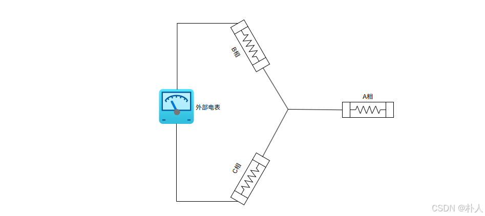
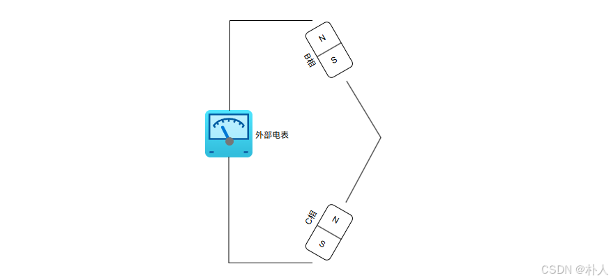
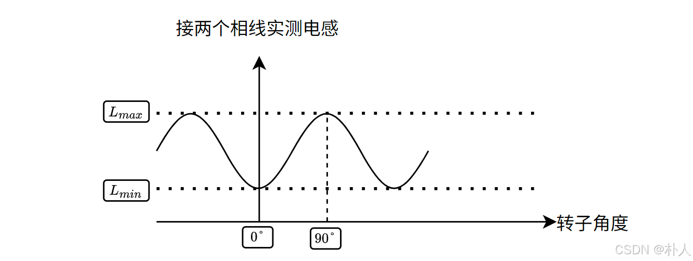

# 59 【永磁同步电机数学模型全程推导】【6 电表测量方法】

> 朴人 于 2025-07-16 09:24:34 发布 阅读量731 收藏 16 点赞数 12
> 文章链接：https://blog.csdn.net/qq570437459/article/details/149235339

**目录**

[TOC]

### 测量电阻 $R_s$ 

用电阻表测量任意两端相线，测得结果是线电阻，除以2就是相电阻 $R_s$ 。

### 测量电感 $L_0,L_2,L_d,L_q$ 

$L_0,L_2$ 可以通过测量计算得到，一般测量方式是：用手缓慢转动电机，用电感表测量电机任意两个相线之间的电感，接线如下图所示：
 

由于只接到电机的两相，另一相不会有电流流过，因此另一相相当于不存在。示意如图：
 

从示意图可以看出，bc相流过的电流大小相等，方向相反（磁极分别N朝外和N朝内）。为了方便计算，将电流大小看作单位值 $i=1A$ ， $i_b=1A，i_c=-1A$ 。总磁链等于b相磁链（ $\psi_b$ ）+c相磁链（- $\psi_c$ ），因为是缓慢转动电机后每次都停下来进行测量，转子速度为0，电感表本质是测量电压，所以 $\psi_f$ 项对时间求导后被省略了。电表测得电感等于总磁链除以电流：

$$
L=\frac{\psi_b-\psi_c}{i}

$$

将之前推导的abc相磁链摘抄进来，注意 $i_a$ 是0，此处省略a相：

$$
\begin{aligned}\frac{\psi_b-\psi_c}{i}&=\frac{L_{bb}*i_b+L_{cb}*i_c-L_{bc}*i_b-L_{cc}*i_c}{i}\\&=L_{bb}-L_{cb}-L_{bc}+L_{cc}\\&=(L_0 - L_2 \cos(2\theta + 120\degree))-(-\frac{1}{2}L_0 - L_2 \cos2\theta)-(-\frac{1}{2}L_0 - L_2 \cos2\theta)+(L_0 - L_2 \cos(2\theta - 120\degree))\\&=3L_0-L_2(2\cos2\theta-\cos(2\theta-120\degree)+\cos(2\theta+120\degree))\end{aligned}

$$

利用一下三角公式：

$$
\cos(2\theta-120\degree)+\cos(2\theta+120\degree)=-\cos2\theta
$$

于是可以化简成：

$$
L=\frac{\psi_b-\psi_c}{i}=3L_0-3L_2\cos2\theta

$$

缓慢转动电机时测得电感数值会变化，记录一下电感表测得的最小值 $L_{min}$ 和最大值 $L_{max}$ ，如下图所示：
 

从推导得到的公式也可以看出， $L_{min}=3L_0-3L_2$ ， $L_{max}=3L_0+3L_2$ 
根据之前推导过的 $L_d,L_q$ 和 $L_0,L_2$ 的关系：

$$
L_d=\frac{3}{2}(L_0-L_2)\\L_q=\frac{3}{2}(L_0+L_2)

$$

可知 $L_d=\frac{L_{min}}{2}
$ ， $L_q=\frac{L_{max}}{2}
$ ， $L_0=\frac{L_d+L_q}{3}
$ ， $L_2=-\frac{L_d-L_q}{3}
$ 

### 测量磁链常数 $\psi_f$ 

将电机断电，用外力较快速地匀速转动电机，用示波器测量任意两相之间的电压，即测量反电动势。
由于电机断电，电压完全由反电动势组成，输入产生的电流全部为0，因此相电压如下：

$$
u_b=R_si_b+\frac{d\psi_b}{dt}=\bcancel{R_si_b}+\frac{\bcancel{L_{ab}*i_a+L_{bb}*i_b+L_{cb}*i_c}+\psi_f\cos(\theta-120\degree)}{dt}\\u_c=R_si_c+\frac{d\psi_c}{dt}=\bcancel{R_si_c}+\frac{\bcancel{L_{ac}*i_a+L_{bc}*i_b+L_{cc}*i_c}+\psi_f\cos(\theta+120\degree)}{dt}

$$

任意两相之间的电压是线电压，线电压等于 $u_b-u_c$ ，于是线电压的表达式为：

$$
\begin{aligned}u_b-u_c&=\frac{d\psi_f(\cos(\theta-120\degree)-\cos(\theta+120\degree))}{dt}\\&=\frac{d\sqrt{3}\psi_f\sin\theta}{dt}\\&=\sqrt{3}\omega\psi_f\cos\theta\end{aligned}

$$

为了测量方便，通常记录示波器上的线电压峰峰值 $u_{peak\_peak}(u_{pp})$ ，即最大值减最小值：

$$
u_{pp}=(u_b-u_c)_{max}-(u_b-u_c)_{min}=2\sqrt{3}\omega\psi_f
$$

于是磁链常数：

$$
\psi_f=\frac{u_{pp}}{2\sqrt{3}\omega}

$$

##### 反电动势常数 $K_e$ 

你可能经常看到永磁同步电机上有标注反电动势常数 $K_e$ (e代表反电动势)，单位是 `V/kRPM` ，意思是每分钟1000转产生的反电动势大小是 $K_e$ 伏。有了反电动势常数可以转换为磁链常数 $\psi_f$ 。
电机厂商是如何测量反电动势常数的呢？将电机断电，外部拖动电机到稳定的转速（比如每分钟1000转），将万用表切到交流电压有效值档，测量任意两相之间的电压。可以看到，从电机厂商角度，这个测量方法很简单，所以厂商提供的是反电动势常数。从电机控制者角度，要将其转换到磁链常数 $\psi_f$ 。
首先将 `千转每分钟` 转换到 `弧度每秒` ，对应 $\omega$ 。注意反电动势常数的转速是物理上的转速，所以要先乘极对数p转换到电角度转速。然后乘以1000转换到 `转每分钟` ，再除以60转换到 `转每秒` ，再乘 $2\pi$ 转换到 `弧度每秒` 。
再将有效值转为到线电压峰峰值 $u_{pp}$ 。乘以 $\sqrt{2}$ 转换到 `线电压单峰值` ，再乘以2转换到 `线电压峰峰值` 。
于是 `V/kRPM` 单位下的反电动势常数 $K_e$ 与 $\psi_f$ 的转换关系为：

$$
\begin{aligned}\psi_f&=K_e*\frac{2*\sqrt{2}}{2\sqrt{3}*(p*1000/60*2\pi)}\\&=K_e*\frac{\sqrt{6}}{100\pi*p}\end{aligned}

$$

其中p是极对数， $K_e$ 单位是 `V/kRPM` 。